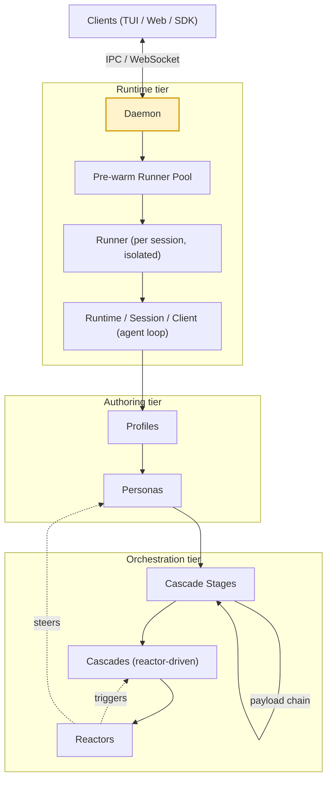

# Jaato Framework — Architecture Overview (the whole stack)

> **One-sentence definition.** Jaato ("just another agentic tool orchestrator") is a server-first
> framework for running LLM agents with tools: a long-lived daemon hosts isolated per-session
> runner subprocesses, each running a provider-agnostic agent runtime configured by profiles and
> personas, and orchestrated into multi-stage cascades and event-driven reactors.
> **Layer (bottom→top):** this is the map of every layer. · **Lives in:** `jaato/jaato-server/` (public) + `jaato-premium/jaato_premium/` (premium).

## What it is

Jaato turns "an LLM that can call tools" into a production substrate. Rather than embedding the agent
inside one client app, the core logic runs as a **daemon** that many clients (TUI, web, SDK) connect
to over IPC or WebSocket. Each conversation is a **session**, and each session runs inside its own
isolated **runner** subprocess so that one agent's tools, file access and crashes can't touch
another's. To keep session startup fast, the daemon keeps a **pool** of pre-warmed runner processes.

Inside a runner sits the **agent runtime**: a shared `JaatoRuntime` (provider config, plugin registry,
permissions, token ledger) plus a per-agent `JaatoSession` that drives the function-calling loop.
Capabilities are **plugins** (tools, enrichment, GC, persistence) and every LLM backend is itself a
**model-provider plugin**, so the agent loop is vendor-neutral.

On top of that runtime sit the *authoring* concepts. A **profile** is the technical config of an agent
(model, provider, plugin list, GC, and the typed input/output schemas). A **persona** is the agent's
identity — its instructions, voice and knowledge — authored as Markdown. Personas pull in **pre-fetch
scripts** to gather context before the first turn (the input boundary) and declare a **completion
schema** for their final structured output (the output boundary), which **completion processors** then
post-process. Finally, **cascades** chain many agent sessions (**stages**) into a workflow, and
**reactors** watch events and fire actions (including launching cascades) — the reactive top tier.

## The layers, bottom → top

| # | Layer | One-liner | Home |
|---|-------|-----------|------|
| 1 | **Daemon** | Long-lived `jaato-server` (console script; `python -m server` equivalent); hosts sessions, serves IPC/WS, owns lifecycle | `server/__main__.py`, `core.py`, `session_manager.py` |
| 2 | **Pool runner** | Pre-warmed runner subprocesses forked from a template to skip cold-start | `server/runner_pool.py`, `runner_template.py` |
| 3 | **Runners** | Per-session isolated subprocess (AppArmor-confined) hosting one agent | `server/runner/`, `runner_spawn.py`, `runner_rpc_*.py` |
| 4 | **Runtime / Session / Client** | Shared env + per-agent state + the function-call loop | `shared/jaato_runtime.py`, `jaato_session.py`, `jaato_client.py` |
| 5 | **Plugins** | Tools, enrichment, GC, persistence — discovered & wired into the runtime | `shared/plugins/base.py`, `registry.py` |
| 6 | **Model providers** | One protocol over every LLM backend (cloud, local, gateway, CLI) | `shared/plugins/model_provider/` |
| 7 | **Profiles** | Declarative agent config (model/provider/plugins/GC/schemas) | `shared/plugins/subagent/config.py` |
| 8 | **Personas** | Agent identity as Markdown (`.jaato/agents/*.md`) → system instructions | `.jaato/agents/`, `dynamic_instructions.py` |
| 9 | **Pre-fetch scripts** | `{{!py:...}}` scripts run at bootstrap to inject context (input boundary) | `shared/script_loader.py`, `dynamic_instructions.py` |
| 10 | **Completion schemas** | Typed JSON schema the agent's final payload must satisfy (output boundary) | `shared/completion_schema_loader.py` |
| 11 | **Completion processors** | Post-process the validated completion payload (persist/validate/route) | `shared/completion_processors.py` |
| 12 | **Cascade stages** | One step = one headless agent session, spawned by a reactor on the prior stage's completion event | `.jaato/reactors.json` handlers + `create_headless_session` |
| 13 | **Cascades** | An async, reactor-driven chain of stages; a driver observes events and a `cascade_after`-style reactor fires the next stage | `jaato_premium/reactors/` + `docs/design/cascade-as-client.md` + deployment driver |
| 14 | **Reactors** | Event→condition→action rules in the daemon; the engine that fires each stage transition | `jaato_premium/reactors/` |

**Cross-cutting (docs 15–19):** these are not single layers — they span the stack. The **Workspace**
(doc `15`) is the per-session working root that simultaneously scopes filesystem access, anchors each
session's generated **AppArmor** profile (`jaato-ws-{session_id}`), and keys **warm-runner reuse**; its
enforced profile is *composed* from a base/workspace rule set + per-plugin default fragments +
cascade/profile custom fragments. The **Lifecycle & event protocol** (doc `16`) is the temporal spine —
the ~110 typed SDK `Event` classes and the order they fire across a session's life (connect → turn →
tool-call → completion → slot-return → teardown); it is what reactors and cascade drivers observe, and
it is why a cascade hands off on `SlotSettledEvent` rather than `AgentCompletedEvent`. **Telemetry**
(doc `17`) is the opt-in OpenTelemetry tracing layer that emits OpenInference spans to a backend like a
self-hosted Arize Phoenix — free when off, a `session→agent→turn→llm/tool` span tree when on.
**Anonymization** (doc `18`) is the PREMIUM pseudonymization subsystem — **Presidio** recognizes PII and
**NaCl** encrypts a session-scoped placeholder↔raw table, wired at **four seats** (history, tool dispatch,
user output, telemetry) so the model and traces see masked placeholders while trusted tools and the
user's own display get the real values swapped back. **Secrets** (doc `19`) is the inbound mirror: `scheme://path#key` secret URIs
resolved daemon-side by pluggable backends, per-provider auth plugins, and an `AuthAttempt` that records
provenance but never the secret value.

**Subsystem (doc 20):** **Memory / "The School"** (doc `20`) is the authoring-and-curation lifecycle — any
agent writes **raw** memories (quarantined, never surfaced); a **curator** reactor drains and
validates/escalates/dismisses them; only active curated memories are indexed and hinted back into future
prompts.

**Cross-cutting (doc 21):** **Resilience — behavior-drift detection & steering** (doc `21`) is the
anti-drift loop: the premium **drift monitor** reactor embeds the agent's reasoning against the active
plan-step goal (`all-MiniLM-L6-v2` cosine; adaptive/static/trajectory flags) and nudges on drift; the
**reliability** mechanism (its dead in-process plugin migrating to an event-driven reactor) detects
behavioral drift (flaky-tool trust escalation, loop/stall/prerequisite patterns) and steers via a
non-blocking nudge, with **presentation-aware enforcement** (interactive forced-prompt; headless async
deny→notify→T3 approval-gate); **memory continuity scopes** (project/universal) persist intent across
sessions; and the **tag/embedding** enrichers re-surface the right reference/memory mid-session.

**Cross-cutting (doc 22):** **Gossip — daemon federation** (doc `22`) is the PREMIUM multi-server layer:
independent jaato **daemons** discover each other from a `servers.json` peer list, exchange periodic
**health heartbeats** (liveness `HEALTHY`/`DEGRADED`/`UNREACHABLE`), **delegate subagents to remote
peers** (`spawn_subagent(server="gpu-box")`) on a **git-synced workspace**, and present one dashboard —
all carried over the public SDK's `peer.*` events, behind mTLS/SSO. Inert without `servers.json`.

**Tooling (doc 23):** **jaato-scaffold** (doc `23`) is the authoring CLI that sits *beside* the stack — it
**introspects the installed framework build** (providers, plugins, GC, the profile schema, env, model
tiers) and exposes three verbs over one core: **`explain`** (what does this build offer?), **`validate`**
(check a hand-authored profile/set against it — reusing the framework's own `discover_profiles()`
resolution so it checks the *effective* profile the daemon would build), and **`new`** (scaffold a
profile-set or SDK-client archetype, then run it straight back through `validate` — valid by
construction). Its reason to exist: turn the **silent-ignore** asset failures (a mistyped knob/plugin/
provider dropped without a word at runtime) into loud, machine-coded errors.

## How a request flows (bottom→top, then back)

1. A client connects to the **daemon** and sends a message for a session.
2. The daemon (via `SessionManager`) claims a warm **pool** slot — or cold-spawns — to get a **runner**.
3. The runner bootstraps the **runtime/session**, loading the session's **profile** (which picks a
   **model provider** and a set of **plugins**) and its **persona** instructions.
4. **Pre-fetch scripts** run during bootstrap, injecting fetched context into the system prompt.
5. The **session** runs the function-call loop: model → tool calls (executed via plugins, permission-checked) → results → model, until the model emits its final answer.
6. If the persona declares a **completion schema**, the agent ends by calling `signal_completion`; the payload is validated against the schema, then **completion processors** run on it.
7. In a **cascade**, that completion fires an `AgentCompletedEvent` — but to reuse the warm runner the handler only *persists* the next-stage spawn; the actual spawn fires on the **`slot.settled`** event (once the prior stage's runner slot returns), landing the next **stage** in that warm slot with the prior payload forwarded as its input.
8. Throughout, **reactors** observe the event stream and may fire actions — including launching a new cascade or steering a persona.

## Key terminology notes (grounded in source)

- **Persona ≠ Profile.** A *profile* (`SubagentProfile`) is technical config and is where the
  `spawn_payload_schema` and `completion_payload_schema` actually live. A *persona* is the identity,
  authored as Markdown under `.jaato/agents/<name>.md`; it reaches a profile's schemas via a
  `default_profile` reference. There is no `Persona` Python class.
- **Cascades are reactor-driven.** A cascade is an *asynchronous, event-reactive* chain: each stage is a
  headless agent session, and a reactor rule (matching `agent.completed` with a `where` on the prior
  stage's payload) spawns the next stage. Sessions in one cascade share a `cascade_driver_id`.
- **cascade-as-client is shipped (the design doc header is stale).** Promoting `cascade_driver_id` to a
  first-class observer client identity (`_cascade:{cid}`) is **implemented and tested** in jaato-server —
  the cascade-client registry (`_cascade_clients`, `session_manager.py`), `register_in_process_client`,
  the `cascade.register`/`unregister`/`cancel` IPC verbs (`command_router.py`,
  `_cascade:{cid}:{client_id}`), `cancel_cascade`, and `test_cascade_as_client_phase1.py` /
  `phase2.py` — even though `docs/design/cascade-as-client.md` still reads "Phase 0". This is **separate**
  from how stage sessions are identified: reactor-spawned **stage** sessions attach under the synthetic
  `_HEADLESS_CLIENT_ID` (`session_manager.py`), and their events are bridged to the `_cascade:{cid}`
  owner via `_dispatch_to_cascade_clients`. The two coexist by design — the CID/observer identity is
  production, and keeping the stage placeholder is intentional, not a sign of "not yet shipped".
  (Production-confirmed by the kb-orchestrator's cascade driver, which subscribes via
  `client.cascade_events(cid)` with `cid == cascade_driver_id` and tears down with `cascade.cancel(cid)`.)

## Diagram

## Diagram brief (for illustration)

- **Layout:** a single vertical **layered stack**, bottom→top, that doubles as the deck's title /
  architecture slide. Group into three colored bands: **Runtime tier** (layers 1–6, cool blue),
  **Authoring tier** (layers 7–11, warm amber), **Orchestration tier** (layers 12–14, green).
- **Boxes (bottom→top):** `Daemon` → `Pre-warm Runner Pool` → `Runner (per session, isolated)` →
  `Runtime / Session / Client (agent loop)` → a side-by-side pair `Plugins` + `Model Providers` →
  `Profiles` → `Personas` → `Pre-fetch scripts` (left, "input boundary") + `Completion schemas` (right,
  "output boundary") + `Completion processors` (right) → `Cascade Stages` → `Cascades (reactor-driven)` →
  `Reactors`.
- **Arrows:**
  - Upward solid arrow running through the whole stack labeled "hosts / configures".
  - `Clients (TUI · Web · SDK)` drawn to the LEFT of the Daemon with a bidirectional arrow labeled "IPC / WebSocket".
  - From `Reactors` a curved arrow back down to `Cascades` labeled "triggers", and another to `Personas` labeled "steers".
  - From `Cascade Stages` a left-to-right chain arrow labeled "spawn payload → completion payload".
  - Small inward arrows: `Pre-fetch` → `Persona` ("injects context"); `Completion schema` → `Completion processors` ("validated payload").
- **Emphasis:** the three band labels (Runtime / Authoring / Orchestration) and the single vertical "hosts / configures" spine.
- **Caption:** "Jaato: a server-first agent stack — a daemon hosts isolated runners; profiles + personas configure each agent; cascades and reactors orchestrate many."

## Source references

- `jaato/docs/architecture.md` — server-first architecture, runtime vs session, data-flow diagrams.
- `jaato/CLAUDE.md` — "Pre-warm Runner Pool", plugin system, profiles, provider catalog.
- `jaato/jaato-server/server/__main__.py`, `session_manager.py` — daemon + session orchestration.
- `jaato/jaato-server/shared/jaato_runtime.py`, `jaato_session.py` — the agent runtime core.
- `jaato-premium/jaato_premium/reactors/` + `jaato/docs/design/cascade-as-client.md` + the runnable reference cascade `examples/python-sdk/.jaato/reactors/cascade.json` — the reactor-driven cascade machinery (docs `09`/`10`).
- Companion docs: `components/01`–`14` cover each layer in depth (this file is the map).
