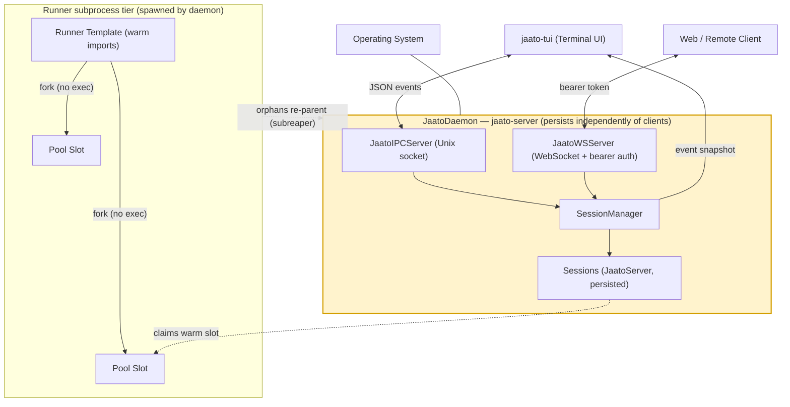

# The Daemon

> **The long-lived `jaato` server process — a single background daemon that holds all agent sessions in memory, persists them to disk, and lets many clients connect, share, and reconnect without ever losing state.**
> **Layer (bottom→top):** the bottommost runtime tier — only the OS is below it; the runner subprocesses it spawns are the tier directly **above** it, and clients connect to it from outside · **Lives in:** PUBLIC `jaato/jaato-server/server/` (entry point `__main__.py`, core `core.py`, orchestration `session_manager.py`, transports `ipc.py` + `websocket.py`, event protocol via the SDK `jaato-sdk/jaato_sdk/events.py`)

## What it is

The daemon is the jaato framework's **server-first** foundation: instead of a CLI tool that starts the agent, runs one conversation, and exits, jaato runs the agent logic as a persistent background process and has clients attach to it over a socket. You start it with the installed **`jaato-server`** console command — the entry point declared in `jaato-server/pyproject.toml` (`[project.scripts]` → `server.__main__:main`, see `jaato-server/server/__main__.py`); the `python -m server` module form is equivalent. Add `--daemon` and it double-forks into the background, writes a PID file, and keeps running independently of any client.

This solves three problems at once. **Persistence:** sessions (conversation history, agent state, token accounting) survive client disconnects, terminal closes, and crashes, because they live in the daemon, not in the client. **Multi-client:** several clients — a terminal UI over a local socket, a web client over WebSocket — can connect to the same daemon and the same sessions concurrently. **Cheap reconnect:** a client that drops can re-attach and immediately get a full snapshot of where things stand. The daemon is also where the cost-saving runner pre-warm pool lives, so each new session can fork a warm subprocess instead of paying a cold-start penalty.

The orchestration class `JaatoDaemon` (`__main__.py`) owns the whole lifecycle: it wires up a `SessionManager`, the transport servers, daemon extensions, and the runner template + pool, then runs until a shutdown signal.

## Where it sits in the stack

The daemon is the **bottom** runtime tier — only the OS sits below it. The **runner subprocesses** it spawns (a pre-warm *template* process and N pool *slots* forked from it — see "spawns the pool at startup") are the tier **directly above** it: they host the per-session agent runtime that executes tools under confinement. (Mind the two axes here: in the OS *process tree* the daemon is the parent and the runners are its children, but in the architecture's bottom→top *layering* the runners sit **above** the daemon because they host the higher-level agent runtime — the daemon, as the foundation, spawns and supervises them.) **Clients** — the terminal UI (`jaato-tui`) over the IPC socket and web/remote clients over WebSocket — attach from **outside**: they never run agent logic, they only send request events and render the events the daemon emits back. **Sideways**, the daemon loads **daemon extensions** (e.g. jaato-premium clustering) via the `jaato.extensions` entry-point group, giving them hooks into sessions and transports without modifying the public code.

## Responsibilities

- **Process lifecycle:** daemonize (Unix double-fork in `daemonize()`, `__main__.py`), PID-file management (`check_running`, `stop_server`), and the `--status` / `--stop` / `--restart` control verbs.
- **Transports:** stand up `JaatoIPCServer` (local Unix socket / Windows named pipe) and/or `JaatoWSServer` (remote WebSocket), per the `--ipc-socket` / `--web-socket` flags.
- **Authentication:** bearer-token auth on the WebSocket transport (the IPC socket is unauthenticated, guarded only by Unix file permissions via `--socket-mode`).
- **Session orchestration:** delegate all multi-session create/attach/persist work to `SessionManager`.
- **Event fan-out:** route server→client events across whichever transports are connected via a `CompositeEventSink`.
- **Runner pool:** spawn the runner template and pool slots at startup, and act as **subreaper** so orphaned descendants re-parent to the daemon.
- **Extensions:** discover and run `jaato.extensions` lifecycle objects.

## Key concepts & structure

### `JaatoDaemon` — the orchestrator
Built in `main()` and run with `asyncio.run(daemon.start())` (`__main__.py`). `start()` (`__main__.py`) executes a fixed wiring sequence: write PID/config files early (so a racing client doesn't auto-start a second daemon), create `SessionManager`, discover daemon-level plugins, start the configured transports, build the `CompositeEventSink`, create the `CommandRouter`, load extensions, claim the subreaper role, spawn the template + pool, then `await self._shutdown_event.wait()`.

### `JaatoServer` — the UI-agnostic core (`core.py`)
One per session. It wraps the agent client with **event emission instead of callbacks** — permission requests, tool execution, and streaming all become events. It is deliberately UI-agnostic: "Clients subscribe to events via the `on_event` callback and send requests via the public methods."

### `SessionManager` — multi-session orchestration (`session_manager.py`)
"Manages multiple named sessions with persistence." Each named session gets its own isolated `JaatoServer` (own history, agent state, plugin state, token accounting) while persistence is handled through the Session plugin, with on-disk storage resolved per-workspace under `.jaato/sessions`. It supports create / attach (loading from disk on demand) / list (memory + disk) / checkpoint.

### Transports: IPC vs WebSocket
- **`JaatoIPCServer`** (`ipc.py`): Unix domain socket (or Windows named pipe), **length-prefixed framing** — "4-byte length (big-endian) + JSON payload" — for local clients (the TUI, IDE extensions). It is local and **unauthenticated**; the socket file mode (default `0o660`) is the only access gate, set with `--socket-mode`.
- **`JaatoWSServer`** (`websocket.py`): WebSocket for remote/web clients, with optional TLS and **bearer-token auth**.

### Bearer auth (WS only)
The daemon resolves a required token in `_resolve_ws_token()` (`__main__.py`): `--ws-unsafe-no-auth` disables it (with a startup WARNING); `--ws-token TOKEN` sets it inline (discouraged); `--ws-token-file PATH` reads it from a mode-0600 file; otherwise it reads/creates `~/.jaato/ws.token`. The server stores only the SHA-256 digest and compares with `hmac.compare_digest` (`websocket.py`); a bad token gets an immediate WebSocket **1008 (Policy Violation)** close (`websocket.py`). Clients present `Authorization: Bearer <token>` or `?token=<token>` for browsers.

### Event protocol
Typed, JSON-serializable events keyed by `EventType` (defined in the SDK at `jaato-sdk/jaato_sdk/events.py`), shared identically by both transports. Rather than enumerate all ~25+, the families are: **session** (`session.info`, `session.list`, `session.terminated`), **agent** (`agent.created`, `agent.output`, `agent.status_changed`, `agent.completed`), **tool** (`tool.call_start`, `tool.call_end`, `tool.output`), **permission** and **clarification** (request / input-mode / resolved / response), **plan** (`plan.updated`, `plan.step_updated`), **context/turn accounting** (`context.updated`, `turn.completed`), and **client→server requests** (`message.send`, `permission.response`, `session.stop`, `command.execute`).

### `--apparmor`
There is no `--apparmor` flag on the **`jaato-server` daemon entry point** — `__main__.py`'s parser exposes only `--ipc-socket`, `--web-socket`, `--ws-token(-file)`, `--ws-unsafe-no-auth`, `--socket-mode`, `--dashboard-port`, `--server-name`, `--daemon`, `--status`, `--stop`, `--restart`, `--pid-file`, `--log-file`, `--verbose`. But `--apparmor` / `--no-apparmor` **are** real flags — they live on the **standalone WebSocket server** (`python -m server.websocket`, defined at `websocket.py`; usage in `docs/apparmor-setup.md`), which auto-detects confinement and lets you force it on or off. There is also a **client-side** opt-in: IPC clients pass `IPCClient(apparmor=True)` (SDK `jaato-sdk/jaato_sdk/client/ipc.py`), and the TUI carries an `--apparmor` user setting on the wire (`session_manager.py`). The `JAATO_REQUIRE_APPARMOR` env var is the daemon-level equivalent of the WS `--apparmor`. However it is requested, confinement is **enforced in the per-session runner subprocess** (`aa_change_profile` at bootstrap), not in the daemon process itself (`__main__.py`).

## Lifecycle / flow

1. **Launch.** `jaato-server --ipc-socket /tmp/jaato.sock [--web-socket :8080] [--daemon]`. With `--daemon`, the process double-forks (`daemonize()`) and redirects stdio to the log file.
2. **Guard against duplicates.** `check_running()` reads the PID file; if a live daemon exists, the new one exits with an error.
3. **Start & wire.** `JaatoDaemon.start()` writes the PID + config files, creates the `SessionManager`, starts the configured transports, builds the `CompositeEventSink`, and wires the `CommandRouter` into every transport.
4. **Subreaper + pool.** `_configure_subreaper()` calls `prctl(PR_SET_CHILD_SUBREAPER, 1)` (Linux-only, `__main__.py`); then `TemplateManager.spawn()` starts the warm template and `PoolManager.spawn_initial_slots()` forks the idle pool slots.
5. **Serve.** A client connects; the daemon authenticates (WS only), assigns a `client_id`, and the `SessionManager` sends a **`SessionInfoEvent`** snapshot (`session_manager.py`). From then on it's purely event-driven: clients send request events, the daemon emits result events.
6. **Persist & reconnect.** Sessions stay resident; a disconnecting client is detached but its session lives on, ready for any client to re-attach and receive a fresh snapshot.
7. **Shutdown.** `--stop` snapshots the daemon's descendant PIDs, SIGTERMs the daemon, and reaps any orphaned runners; internally `start()` tears down pool slots **before** the template (order matters — slots are template children), then removes the PID file.

## Configuration / authoring

Configured entirely by CLI flags + a few env vars; defaults live in the temp dir (`/tmp/jaato.sock`, `/tmp/jaato.pid`, `/tmp/jaato.log`). The WS token defaults to `~/.jaato/ws.token` (auto-created, mode 0600). Pool size via `JAATO_RUNNER_POOL_SIZE` (default 2); pool toggle via `JAATO_RUNNER_POOL_ENABLED`.

```bash
# Local + remote daemon, background, default auto-generated WS token
jaato-server --ipc-socket /tmp/jaato.sock --web-socket :8080 --daemon

jaato-server --status     # → "Jaato server is running (PID: 12345)"
jaato-server --stop       # graceful SIGTERM + orphan-runner reap
jaato-server --restart    # re-launch from saved /tmp/jaato.config.json
```

### Auto-start (zero-config: the daemon usually starts itself)
In practice you rarely run `jaato-server` by hand — **clients auto-start the daemon on first connect**. The SDK `IPCClient` defaults to `auto_start=True` (`jaato-sdk/jaato_sdk/client/ipc.py`), as does the recovery client (`recovery.py`), and the TUI threads it through (`backend.py`). On `connect()`, the client first does a short probe (≈2s when auto-start is on, `ipc.py`); if no live daemon is found — no PID file, or only a **stale socket** left by a crashed daemon — it removes the stale socket and launches the daemon itself with **default values**: `python -m server --ipc-socket <socket_path> --daemon` (`ipc.py`), then waits up to 10s for the socket to appear (`_wait_for_socket`, `ipc.py`). The socket path defaults to `/tmp/jaato.sock`.

Two deliberate properties: (1) the **env file is *not* passed on the auto-start command line** — the daemon is provider-agnostic, so each client ships its own configuration via a `ClientConfigRequest` *after* connecting (consistent with per-session env isolation), and (2) **races are safe** — the daemon writes its PID/config files early in `start()`, so a second client firing at the same moment finds the running daemon instead of spawning a duplicate. Auto-start can be turned off with `auto_start=False` (e.g. the recovery client disables it mid-reconnect, `recovery.py`), in which case a missing daemon is a hard connection error.

## Relationship to neighboring components

The daemon is the host process for the **`SessionManager`** and, per session, a **`JaatoServer`** core. It **spawns and supervises** the **runner template + pool** of subprocesses that actually execute tools under confinement — the tier **directly above** it in the stack. (It is their process-*parent* and, as **subreaper**, keeps custody of any that get orphaned; in the layering they are nonetheless the tier above, since they host the agent runtime.) **Clients** (the `jaato-tui` terminal UI over IPC, web clients over WebSocket) connect from outside, drive sessions with request events, and render the daemon's emitted events — they hold no durable agent state of their own. Sideways, **daemon extensions** (e.g. jaato-premium) plug in through the `jaato.extensions` entry-point group to add session hooks, WS interceptors, and custom verbs.

## Example

A developer runs `jaato-server --ipc-socket /tmp/jaato.sock --daemon`. The daemon double-forks, writes `/tmp/jaato.pid`, claims the subreaper role, spawns the warm runner template and two idle pool slots, and starts listening on the Unix socket. The TUI connects with `python jaato-tui/rich_client.py --connect /tmp/jaato.sock`; the `SessionManager` creates a session, forks a pool slot for its runner, and emits a `SessionInfoEvent` snapshot (current session id/name/model + the list of sessions, tools, and models). The developer chats, then closes the terminal — but the daemon and the session keep running. Hours later they reconnect from a different client, get a fresh `SessionInfoEvent`, and resume mid-conversation. `jaato-server --stop` later SIGTERMs the daemon and reaps any orphaned runners left behind by sessions killed mid-cascade.

## Diagram



## Diagram brief (for illustration)

- **Layout:** a **bottom-to-top** layered stack (matching the deck's bottom→top ordering). A thin `Operating System` strip at the very bottom; the **Daemon** as a large emphasized container band sitting on it; the **runner subprocess tier the daemon spawns drawn directly *above* the daemon**; and **clients** drawn off to the **left**, attaching over the sockets (they are external consumers, not a stack layer).
- **Boxes:**
  - Bottom strip: `Operating System`.
  - Daemon band (emphasized, labeled **"JaatoDaemon — `jaato-server` (persists independently of clients)"**) containing, left-to-right: a transports sub-row `JaatoIPCServer (Unix socket, unauthenticated)` and `JaatoWSServer (WebSocket + bearer auth)`; below that `SessionManager`; and inside `SessionManager` three stacked session boxes each labeled `Session → JaatoServer → .jaato/sessions (persisted)`. Place a small side box inside the band labeled `Daemon Extensions (jaato.extensions)` and another labeled `CompositeEventSink`.
  - Tier **above** the daemon (subprocesses it spawns): `Runner Template (warm imports)` and two `Pool Slot` boxes forked from it.
  - Left side (external clients): `jaato-tui (Terminal UI)` and `Web / Remote Client`.
- **Arrows:**
  - `jaato-tui` ⇄ `JaatoIPCServer` labeled "length-prefixed JSON events".
  - `Web Client` ⇄ `JaatoWSServer` labeled "Bearer token; 1008 on auth fail".
  - Both transports → `SessionManager` labeled "request events".
  - `SessionManager` → clients (a single arrow back out through CompositeEventSink) labeled "SessionInfoEvent snapshot + agent/tool/permission events".
  - `Runner Template` → each `Pool Slot` labeled "fork (no exec)".
  - A dashed arrow from each `Session` (in the daemon band) **up** to a `Pool Slot` labeled "claims a warm slot at session start; drives it over RPC".
  - A curved dashed arrow from the runner tier back **down** into the Daemon band labeled "PR_SET_CHILD_SUBREAPER → orphans re-parent to daemon".
- **Emphasis:** highlight the entire Daemon band (bold border / accent fill) — it is the subject and the bottom tier; keep clients and the runner tier visually secondary. The runner tier sits **above** the daemon (the daemon spawns it) — do **not** draw the runners below the daemon.
- **Caption:** "The Daemon: the bottom runtime tier — one long-lived process holding all sessions in memory, serving many clients over IPC and WebSocket, and spawning + supervising the warm runner-subprocess tier above it."

## Source references
- `jaato-server/server/__main__.py` — `JaatoDaemon` class; `start()` wiring sequence.
- `jaato-server/server/__main__.py` — `prctl(PR_SET_CHILD_SUBREAPER, 1)` subreaper setup; template/pool spawn.
- `jaato-server/server/__main__.py` — `_resolve_ws_token()` token resolution order; CLI flags defined in the parser.
- `jaato-server/server/core.py` — `JaatoServer`, the UI-agnostic per-session core (event emission instead of callbacks).
- `jaato-server/server/session_manager.py` — `SessionManager` (multi-session + persistence); `SessionInfoEvent` emitted.
- `jaato-server/server/ipc.py` — `JaatoIPCServer`, length-prefixed framing, unauthenticated local socket.
- `jaato-server/server/websocket.py` — SHA-256 + `hmac.compare_digest` bearer check; 1008 close.
- `jaato-sdk/jaato_sdk/events.py` — `EventType` enum (the shared event protocol families).
- `jaato/docs/architecture.md` — "Server-First Architecture" overview + `SessionInfoEvent` snapshot-on-connect.
- `jaato-sdk/jaato_sdk/client/ipc.py` (`auto_start=True` default; `_auto_start_server`: PID/stale-socket check → `python -m server --ipc-socket <path> --daemon`, env not on CLI) — client-side daemon auto-start with defaults.
