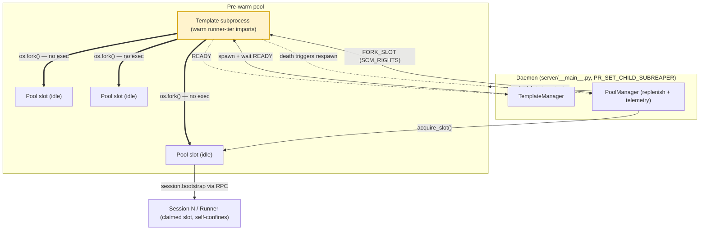

# The Pre-warm Runner Pool

> **A pool of pre-warmed subprocesses kept hot by the daemon so a new session can claim one instantly instead of paying the cold-start cost of forking, importing every runner-tier plugin, and walking plugin discovery.**
> **Layer (bottom→top):** sits just above the Daemon; the per-session Runners are claimed out of it · **Lives in:** PUBLIC repo — `jaato/jaato-server/server/runner_pool.py`, `runner_template.py`, `runner_spawn.py`

## What it is

When a jaato session starts, it needs a runner subprocess: a Python process that imports the runner-tier plugins (`cli`, `file_edit`, `mcp`, `template`, `references`, …) and walks `PluginRegistry` discovery. Doing that fresh per session is expensive — measured at ~30s of bootstrap on a cascade workload (Python startup + plugin imports + discovery + provider INIT) (`runner_prewarm_pool_plan.md`). A 2026-05-13 cascade step-6 stall was traced to this cost tipping over a 30s RPC timeout.

The pre-warm pool pays that cost **once**. At daemon startup a single **template subprocess** (`python -m server.runner --template-mode`) imports all the runner-tier plugins and populates the registry, then sits idle on a control pipe (`runner_template.py`). The daemon then asks the template to `os.fork()` itself — *no exec* — producing N **pool slots** that inherit the template's warm-imports memory image for free (`runner_prewarm_pool_plan.md`). When a session arrives, the daemon claims an idle slot and dispatches the same `session.bootstrap` RPC it would send a cold-spawned runner. Result: pool-routed bootstrap lands at ~7s instead of ~30s — a 5x reduction (`runner_prewarm_pool_plan.md`).

The key insight (decision log): the daemon process itself imports only *daemon-tier* plugins, so it can't be the fork source. A dedicated template subprocess fills that gap; the daemon orchestrates it but never serves a session from the template directly.

## Where it sits in the stack

Directly **below** is the **Daemon** (`server/__main__.py`), which constructs the `TemplateManager` and `PoolManager` at startup, sets the subreaper bit, and calls `start_replenishment()`. Directly **above** are the per-session **Runners**: a pool slot, once claimed, *becomes* a session's runner. The pool talks **sideways** to the template subprocess over a control socketpair (FORK_SLOT / FORKED / SHUTDOWN / READY) and to each slot over its own per-slot RPC socket. The routing decision — pool slot vs. fresh cold-spawn — is made in `spawn_session_runner` (`runner_spawn.py`).

## Responsibilities

- Own the template subprocess lifecycle: spawn, READY-handshake, shutdown, watchdog-respawn on death (`runner_template.py`).
- Maintain N idle pre-forked slots and replenish them in the background (`runner_pool.py`).
- Hand an idle slot to the daemon on session arrival; return it (Phase 2 cascade-sharing) or tear it down after the session ends.
- Reap slot/template PIDs cleanly via the daemon's subreaper bit.
- Expose pool health telemetry counters.

## Key concepts & structure

### `TemplateManager` (`runner_template.py`)
Owns the single template subprocess for the daemon's lifetime. `spawn()` creates a socketpair, forks, dup2's the child socket onto fd 3, and execs `python -m server.runner --template-mode`. It then blocks in `_wait_for_ready()` for the template's `"READY\n"` line (30s cap, `_DEFAULT_READY_TIMEOUT`) — this replaced an earlier fixed 2s sleep. `request_fork_slot()` is the fork-slot protocol: send `FORK_SLOT\n` plus a fresh socket FD via `SCM_RIGHTS`, await a `FORKED:<pid>\n` reply, return `(slot_pid, daemon_end)`. `is_alive()` does a non-blocking `waitpid(WNOHANG)`.

### `PoolManager` (`runner_pool.py`)
Holds the list of idle `PoolSlot`s and the replenishment thread. `target_size` defaults to 2; `<= 0` disables the pool. `spawn_initial_slots()` forks the initial batch at startup. `acquire_slot()` pops an idle slot, with cascade-affinity routing. `start_replenishment()` launches a daemon thread named `jaato-pool-replenish` running `_replenish_loop()`, which on each tick (default 0.5s) watchdogs the template, sweeps cascade-idle slots, and tops the pool up by one slot if below target.

### `PoolSlot` (`runner_pool.py`)
The daemon's handle on a template-forked child: `.pid`, `.sock` (daemon-side RPC socket; closing it EOFs the slot), plus cascade-sharing bookkeeping (`cascade_id`, `last_session_end_ts`, `last_session_id`, `rpc`).

### Operational properties
- **Subreaper:** the daemon calls `prctl(PR_SET_CHILD_SUBREAPER, 1)` at startup so slots — which are *template* children, not daemon children — re-parent to the daemon when the template dies, making `waitpid` work (`runner_pool.py`, CLAUDE.md "Subreaper").
- **Watchdog:** `_handle_template_death()` drains orphaned idle slots, then respawns the template via `template_manager.spawn()`.
- **READY handshake:** template sends `"READY\n"` after discovery; daemon blocks on it instead of sleeping (`runner_template.py`).
- **Telemetry counters** (`get_telemetry()`): `pool_slot_acquired_total`, `pool_acquire_miss_total`, `pool_replenish_success_total`, `pool_replenish_failures_total`, `template_respawn_attempts_total`, `template_respawn_failures_total` (plus Phase 2 cascade counters `cascade_slot_reuse_hits_total`, `cascade_slot_reuse_misses_total`, `cascade_slots_idle_torndown_total`).

### Why fork (no exec) — and where isolation actually comes from
A common misconception: fork is *not* the isolation mechanism. **Fork-no-exec exists for one reason — to inherit the template's already-warm imports** (the imported runner-tier plugin modules + the populated `PluginRegistry`) so each session skips the ~30s import + discovery cost. A deliberate **module-global fork-safety audit** (`runner_prewarm_pool_plan.md`) verified this is safe across the runner-tier plugin set with no per-plugin opt-in: module state is read-only (regex compilations, frozensets, constants), thread-locals are empty on the child, and no lock is held at template-fork time.

**Isolation and leak-avoidance are a *separate* property, owned by the per-session *subprocess* model** — not by fork. Each session runs in its own subprocess for "kernel-enforced AppArmor + cgroup attach, crash isolation, workspace boundary cleanliness" (`runner_prewarm_pool_plan.md`). Because fork *inherits* the template's memory (the opposite of a blank slate), clean per-session state is guaranteed three ways: (1) the **template holds only import-level state**, never any session's data, so every forked slot starts session-clean; (2) in the baseline design a slot is **single-use** — "Slot exits when session ends. No state reuse — clean isolation" — and a fresh slot is forked to replace it; (3) on the cascade-**reuse** path (where a slot deliberately survives across same-cascade sessions to stay warm), the daemon calls **`reset_for_slot_reuse`** on the runner (`core.py`) to clear per-session state before the next session, which is what prevents cross-session leaks there. So: fork → speed; subprocess + confinement + single-use/reset → isolation.

### Staying warm — and going cold (idle lifecycle)
A slot is "warm" because it is an already-forked process holding the template's imported modules resident in memory; "cold" means no such process exists and a session must pay the full ~30s fork + import + discovery.

- **General idle slots stay warm indefinitely.** The `_replenish_loop` keeps exactly `target_size` idle slots pre-forked; a warm slot simply *waits* until a session claims it. There is **no age/TTL expiry** on a general idle slot — it does not decay to cold just from sitting unused. A general slot only disappears on **template death** (the watchdog drains the now-orphaned idle slots, `_handle_template_death`, `runner_pool.py`) or **daemon shutdown**.
- **An empty pool means the next session goes cold.** If a session arrives and no idle slot is available, `acquire_slot()` returns `None`, `pool_acquire_miss_total++`, and that one session cold-spawns (~30s) while the replenish thread forks a fresh warm slot for the *next* arrival. So "cold" is per-session-on-a-miss, not a property of the pool decaying.
- **Cascade-affinity slots *do* go cold if unused.** This is the one place a warm slot is deliberately *reserved* and then expired: when a slot finishes a cascade stage it can be **returned** rather than torn down (`return_slot_after_session`, `runner_pool.py`), becoming `IDLE_FOR_CASCADE` — held warm and tagged with its `cascade_id` + a `last_session_end_ts` so the *next same-cascade* session reuses the exact warm process. But a reserved slot can't sit forever: every replenish tick `_sweep_cascade_idle()` (`runner_pool.py`) tears down any IDLE_FOR_CASCADE slot whose `last_session_end_ts` is older than `cascade_idle_timeout_seconds` (default `DEFAULT_CASCADE_IDLE_TIMEOUT_SECONDS = 300.0`) — it **goes cold** (`cascade_slots_idle_torndown_total++`), freeing the process so the pool isn't pinned by an abandoned cascade. A later session in that cascade then either claims a general warm slot or cold-spawns.

## Lifecycle / flow

1. **Daemon startup:** `TemplateManager.spawn()` → template imports runner-tier plugins, walks discovery, sends `READY\n`.
2. `PoolManager.spawn_initial_slots()` forks `target_size` slots from the template; each sits idle on its RPC socket.
3. `start_replenishment()` launches the background top-up + watchdog thread.
4. **Session arrives:** `spawn_session_runner` calls `acquire_slot()`. On hit, the slot's socket is wrapped in a `SpawnedRunner` and the daemon dispatches `session.bootstrap` via `RunnerRPCClient` (`runner_spawn.py`). The slot self-confines to the session's AppArmor profile in bootstrap step 1c via `aa_change_profile` before plugin init (`runner_spawn.py`, CLAUDE.md).
5. **Replenishment** refills the drained pool in the background.
6. **Session end:** slot is either returned to the pool (cascade reuse, `return_slot_after_session`) or torn down.
7. **Daemon shutdown:** `shutdown_all()` stops the thread, EOFs each idle slot, reaps PIDs.

## Configuration / authoring

- `JAATO_RUNNER_POOL_ENABLED` — enable pool routing. **Default-on** since PR 5e; disable with `false`/`0`/`no`/`off` (`runner_spawn.py`).
- `JAATO_RUNNER_POOL_SIZE` — number of idle slots to keep warm (default 2). Raise it only when sessions start **concurrently** — i.e. a cascade that **fans out** stages in parallel, where each simultaneous stage needs its *own* warm slot. It does **not** speed up a cascade of **sequential** stages: there the next stage reuses the *same* warm slot via the `slot.settled` handoff (the reactor fires the next stage on slot-availability), so a single warm slot suffices no matter how many steps run back-to-back. Grounding: `runner_pool.py` correctly says raise it for "many **concurrent** sessions"; the CLAUDE.md phrasing "many sessions in tight succession" is misleading and should be corrected to "concurrent".

```bash
# Larger pool for a cascade harness; disable later for A/B vs cold-spawn.
JAATO_RUNNER_POOL_ENABLED=true JAATO_RUNNER_POOL_SIZE=6 \
  .venv/bin/jaato-server --ipc-socket /tmp/jaato.sock --daemon
```

### Pool routing gates (`spawn_session_runner`, `runner_spawn.py`)
The pool is consulted **iff all** hold:
- `pool_manager is not None` (wired by the daemon), **AND**
- `_pool_enabled()` (env flag), **AND**
- `cgroup_attach is None` (mid-life cgroup migration for a template-child is follow-up work).

Note: AppArmor opt-in sessions **are** eligible — the earlier `disable_confine` gate was removed in PR 5a because the slot self-confines to `envelope.profile_name` itself (`runner_spawn.py`). Any gate failure → unchanged cold-spawn path.

## Relationship to neighboring components

The **Daemon** below owns the `TemplateManager`/`PoolManager` instances and sets the subreaper bit. The per-session **Runners** above are not a separate spawn when pool-served — a claimed `PoolSlot` *is* the runner, reached through the identical `RunnerRPCClient` + `session.bootstrap` path as a cold-spawned runner, so no parallel code path exists (`runner_spawn.py`). **Cascade** workloads are the primary beneficiary and drive the cascade-affinity reuse logic in `acquire_slot`.

## Example

**Sequential cascade (the common case — pool size barely matters).** A linear `discovery → context → … → build_judge` cascade runs one stage at a time and **reuses a single warm slot** across stages via the two-event `slot.settled` handoff: each stage's runner returns to the pool, and the next stage's reactor immediately claims that *same* warm slot. So no matter how many steps run back-to-back, `JAATO_RUNNER_POOL_SIZE=1` is enough; raising it just leaves extra slots idle. Every step still bootstraps in ~7s instead of ~30s (`runner_prewarm_pool_plan.md`).

**Fan-out cascade (where pool size actually matters).** A stage that spawns, say, 4 sub-stages **in parallel** needs 4 warm slots *at once*. With `JAATO_RUNNER_POOL_SIZE=4` all four start warm; with the default 2, two of them get `acquire_slot → None` (`pool_acquire_miss_total++`) and cold-spawn (~30s). So size the pool to the cascade's **peak stage concurrency**, not its step count.

## Diagram



## Diagram brief (for illustration)

- **Layout:** layered/hub diagram. A horizontal **Daemon** bar across the bottom. Above-left, a single **Template subprocess** box. To its right, a row of N **Pool slot** boxes. Above the slots, a **Session / Runner** box on the right.
- **Boxes:**
  - `Daemon (server/__main__.py)` — bottom bar; small annotation "PR_SET_CHILD_SUBREAPER".
  - `TemplateManager` — small box inside/attached to the daemon.
  - `Template subprocess — python -m server.runner --template-mode (warm runner-tier imports)`.
  - `PoolManager` — small box inside/attached to the daemon, annotation "replenish thread + telemetry".
  - Three `Pool slot (PoolSlot: pid + sock)` boxes labeled "idle".
  - `Session N → Runner (claimed slot, self-confines via aa_change_profile)`.
- **Arrows:**
  - Daemon → Template subprocess, label "spawn() + wait READY".
  - Template subprocess → Daemon, dashed, label "READY\n".
  - PoolManager → Template subprocess, label "FORK_SLOT (SCM_RIGHTS)".
  - Template subprocess → Pool slots, label "os.fork() — no exec (inherit warm imports)".
  - PoolManager ⟳ self-loop on the slot row, label "replenish to target_size".
  - Daemon → one Pool slot, label "acquire_slot()".
  - That slot → Session/Runner box, label "session.bootstrap via RunnerRPCClient".
  - Template subprocess → Daemon, dotted, label "death → watchdog respawn".
- **Emphasis:** highlight the Template subprocess + the row of Pool slots (this is the component); make the "os.fork() — no exec" arrow the visual focal point.
- **Caption:** "Pay the import cost once: the template warms runner-tier plugins, pool slots fork from it, and the daemon hands a warm slot to each new session — ~30s cold-start down to ~7s."

## Source references
- `jaato-server/server/runner_template.py` — `TemplateManager.spawn` (fork+exec `--template-mode`) + READY-wait.
- `jaato-server/server/runner_template.py` — `request_fork_slot` (FORK_SLOT + SCM_RIGHTS → FORKED:<pid>).
- `jaato-server/server/runner_pool.py` — `PoolManager` init, target_size, telemetry counter set.
- `jaato-server/server/runner_pool.py` — `_replenish_loop`, cascade-idle sweep, `_handle_template_death` watchdog (subreaper).
- `jaato-server/server/runner_pool.py` (`DEFAULT_CASCADE_IDLE_TIMEOUT_SECONDS = 300.0`; `return_slot_after_session` stamps `last_session_end_ts`; `_sweep_cascade_idle` tears down expired IDLE_FOR_CASCADE slots) — the warm→cold idle lifecycle. General idle slots have **no** age TTL; only cascade-reserved slots expire.
- `jaato-server/server/runner_spawn.py` — `_pool_enabled` (env var, default-on).
- `jaato-server/server/runner_spawn.py` — three pool routing gates + slot→`SpawnedRunner` wrap.
- `jaato/docs/design/runner_prewarm_pool_plan.md` — measured 5x speedup, fork-from-template flow, decision log.
- `jaato/docs/design/runner_prewarm_pool_plan.md` (subprocess isolation rationale: AppArmor/cgroup/crash/workspace; fork-safety audit; "single-use slot — clean isolation") + `jaato-server/server/core.py` (`reset_for_slot_reuse` clears per-session state on the cascade-reuse path) — why fork ≠ isolation.
- `jaato/CLAUDE.md` "Pre-warm Runner Pool" — env vars, subreaper, READY, telemetry, routing gates.
