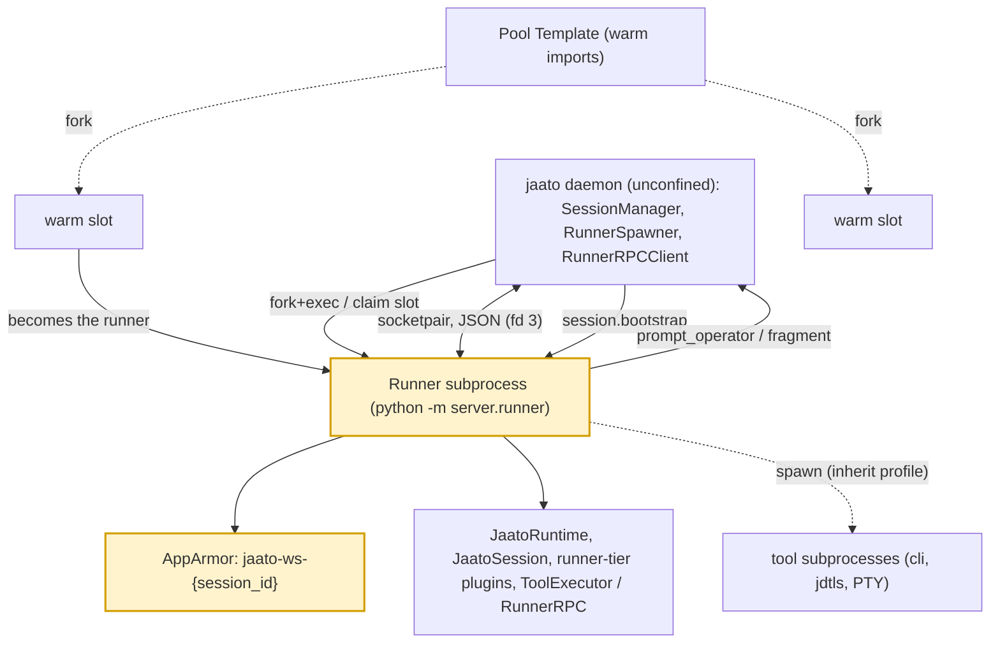

# Runners (per-session runner subprocesses)

> **A runner is the isolated `python -m server.runner` subprocess that hosts one session's agent runtime, self-confines to that session's AppArmor profile, and talks to the daemon over a length-prefixed JSON RPC socketpair.**
> **Layer (bottom→top):** above the pre-warm runner pool that hands it warm slots · below the daemon/SessionManager that orchestrates it over RPC · **Lives in:** PUBLIC repo `jaato/jaato-server/server/runner/`, `server/runner_spawn.py`, `server/runner_spawner.py`, `server/runner_rpc_client.py`, `server/runner_rpc_server.py`, `server/runner_rpc_handlers/`, and `shared/plugins/{runner_forwarding.py, permission/runner_rpc_channel.py}`

## What it is

The jaato **daemon** is a single long-lived process that serves many sessions, possibly from many different workspaces. If the daemon itself ran the model's tools (shell commands, file edits, LSP servers), one buggy plugin or a model-driven `cli` subprocess in workspace A could read workspace B's files — the kernel would allow it, because a process can only carry one AppArmor profile and the daemon serves them all (`per_session_confined_runner.md`). The runner solves this by moving each session's *runtime* out of the daemon and into its own subprocess that confines itself to a **per-session** AppArmor profile named `jaato-ws-{session_id}`.

A runner is therefore a per-session isolation boundary. It starts unconfined, calls `aa_change_profile("jaato-ws-{session_id}")` via libapparmor before importing any plugin code, and refuses to proceed if confinement fails — there is no fall-back-to-unconfined path (`runner/bootstrap.py`, `runner/__main__.py`). Every tool subprocess it spawns thereafter inherits that profile by fork+exec, so kernel-enforced isolation reaches subprocess tools, not just in-process ones (`shared/subprocess_runner.py`).

Inside the confined process lives the real session: a `JaatoRuntime`, the runner-tier plugins, and the `JaatoSession` conversation host (`runner/session.py`). The daemon keeps the transports, provider clients, auth tokens, and orchestration, and drives the runner over RPC.

## Where it sits in the stack

Directly **below** the runner is the **pre-warm runner pool**: a template subprocess that imports all runner-tier plugins once at daemon startup, plus N idle "slots" forked from it. A session either claims a warm pool slot or cold-spawns a fresh runner — both end up as the same kind of runner (`runner_spawn.py`). Directly **above** is the **daemon** (`SessionManager` / `JaatoServer`), which spawns the runner, owns the parent end of the socket, and dispatches session work. **Sideways**, the runner calls *back* into the daemon for capabilities only the daemon owns — operator permission prompts, AppArmor fragment grants, cross-session introspection (`runner_rpc_server.py`).

## Responsibilities

- Self-confine to the session's AppArmor profile before loading any plugin code, or hard-exit code 2 (`runner/__main__.py`).
- Adopt the RPC socketpair on fd 3 and serve `RunnerRPC` until the daemon closes the socket (`runner/__main__.py`).
- Bootstrap the runner-side `JaatoSession` from the daemon's `session.bootstrap` envelope (`runner/session.py`).
- Execute the session's tools (cli, file_edit, lsp, mcp, …) inside the confined process (`runner/cli_runner.py`).
- Forward daemon-only operations back over RPC: permission ASKs, UI hooks, isolated-subagent spawns, apparmor fragments (`runner_rpc_handlers/`).
- Lead its own process group (`os.setsid()`) so the daemon can SIGKILL the whole subtree at teardown without orphaning jdtls/MCP/PTY children (`runner_spawner.py`).

## Key concepts & structure

### `RunnerSpawner` / `SpawnedRunner` (daemon side)
`RunnerSpawner.spawn` does the cold-spawn: it asserts the daemon is *not* itself confined to a `jaato-ws-*` profile (§6.1 trap), creates a Unix `socketpair`, `os.fork()`s, and in the child does `setsid` → optional cgroup attach → dup the child socket to fd 3 → close inherited fds → `execvpe(python, ["-m", "server.runner"])` (`runner_spawner.py`). Per-session config crosses via env (`JAATO_RUNNER_PROFILE`, `JAATO_RUNNER_SESSION_ID`, `JAATO_RUNNER_WORKSPACE`, `TMPDIR=/tmp/jaato-{session_id}`, …) (`runner_spawner.py`). The result is a `SpawnedRunner` dataclass holding the pid, parent socket, profile name, and (when pool-served) the `pool_slot` (`runner_spawner.py`).

### `spawn_session_runner` — cold vs pool path
The single entry point (`runner_spawn.py`). When a `pool_manager` is wired, `JAATO_RUNNER_POOL_ENABLED` is truthy (default on, `runner_spawn.py`), and no `cgroup_attach` is needed, it calls `pool_manager.acquire_slot(cascade_driver_id=...)` and wraps the warm slot's socket in a `SpawnedRunner`; the slot self-confines later, in bootstrap. Otherwise it cold-spawns via `RunnerSpawner`. **Either way the rest is identical** — by design, so there's no parallel code path to maintain (`runner_spawn.py`). It then opens a `RunnerRPCClient`, starts its asyncio read-loop, and attaches the handle via `server.set_runner_rpc(rpc, spawned)`.

### Runner entry point — `python -m server.runner`
`main()` dispatches `--template-mode` (the pool template, `runner/__main__.py`) vs session mode. Session mode runs the §4.6 order: read env → `confine_to_profile` → **then** import plugin code → adopt fd 3 → build `ToolExecutor` + `RunnerRPC` → `rpc.serve()` (`runner/__main__.py`). Pool slots reach the same steady state via `_run_slot_mode` after forking from the template (`runner/__main__.py`).

### Bootstrap — `bootstrap_session` / `RunnerSessionHost`
The daemon builds a `SessionInitEnvelope` (`build_session_envelope`, `runner_spawn.py`) carrying provider/model, plugin specs + resolved `plugin_configs`, the **fully-resolved** `session_env` (secrets resolved daemon-side, never re-resolved under confinement, `runner/session.py`), `cascade_driver_id`, completion schema, etc. It dispatches `session.bootstrap` (`dispatch_bootstrap_envelope`, `runner_spawn.py`). Runner-side, `bootstrap_session` mirrors the daemon's nine-step plugin load but with `tier_filter="runner"`, `ledger=None`, and per-slot `aa_change_profile` step 1c (`runner/session.py`, `_maybe_self_confine` at `runner/session.py`).

### RPC surface — `RunnerRPCClient` / `RunnerRPCServer` / `RunnerRPC`
The channel is bidirectional. The daemon-side `RunnerRPCClient` (asyncio) owns the parent socket, sends `tool.execute` / `session.bootstrap`, resolves request futures, streams output chunks to per-call `on_output` callbacks, and bridges asyncio↔blocking via `call_threadsafe` (`runner_rpc_client.py`). The runner serves the symmetric `RunnerRPC` on fd 3 (`runner/rpc.py`). For the **runner→daemon** direction, `RunnerRPCServer` is a per-client handler registry (`runner_rpc_server.py`); handlers are registered at `set_runner_rpc` time in `server/core.py`.

### Runner→daemon handlers (`runner_rpc_handlers/`)
- `client.prompt_operator` — relays an ASK to the connected client and awaits the response (`runner_rpc_handlers/prompt_operator.py`).
- `apparmor.add_reference_fragment` — loads a kernel path-grant fragment for the live session profile (`runner_rpc_handlers/apparmor_fragment.py`).
- `daemon.plugin_execute` — runs a cross-tier (`daemon_callable`) plugin body daemon-side (`runner_rpc_handlers/daemon_plugin_execute.py`).
- `subagent.spawn_isolated_runner` — opt-in primitive to spawn a *separate* runner for an isolated subagent (currently a validated stub, `runner_rpc_handlers/spawn_isolated_runner.py`).

### Forwarding mixins & the permission channel
Daemon-side, runner-tier plugins become thin stubs via `RunnerForwardingMixin`, whose wrapped executors forward each call over `RunnerRPCClient` when `registry.runner_rpc` is set, else run in-process (`runner_forwarding.py`). For permissions, when a tool returns "ASK" the runner-side `RunnerRPCChannel` builds a `PromptPayload` and relays it via `prompt_operator` instead of trying to reach a client it cannot see, then maps the operator's reply key back to a `ChannelDecision` (`permission/runner_rpc_channel.py`).

## Lifecycle / flow

1. A `session.new` request arrives; **the daemon provisions the session's AppArmor profile** — `AppArmorManager.provision_profile` (`apparmor.py`) *renders* `jaato-ws-{session_id}` from the base template **plus the plugin-contributed rules**, then `apparmor_parser`-**loads it into the kernel** (`apparmor.py`). The runner does **not** author this profile; the daemon does, before the runner exists. The session id in the name is the literal session id (timestamp form), so the profile ↔ session mapping is 1:1 and visible in the name.
2. `spawn_session_runner` claims a warm pool slot **or** cold-spawns via `RunnerSpawner.spawn`, passing the profile name in the bootstrap envelope (`envelope.profile_name`, already loaded in the kernel by step 1) (`runner_spawn.py`).
3. The runner **self-confines *into* that daemon-provisioned `jaato-ws-{session_id}` profile** — it calls `aa_change_profile("jaato-ws-{session_id}")` to *transition itself into* the already-loaded profile (then verifies `/proc/self/attr/current`), and only then imports plugins, now under the profile (`runner/__main__.py`). "Self-confine" means the runner enters a profile the daemon prepared for it — it never creates its own. *(Empirically confirmed: runner pid `1822007` showed `/proc/<pid>/attr/current = jaato-ws-20260615_205335 (enforce)`, and on slot reuse re-confined into the next session's `jaato-ws-20260615_205419 (enforce)` — see doc 15.)*
4. The daemon opens a `RunnerRPCClient`, starts the read-loop, and attaches it (`runner_spawn.py`).
5. The daemon dispatches `session.bootstrap`; the runner builds `JaatoRuntime` + runner-tier plugins + `JaatoSession` (`runner/session.py`).
6. Steady state: model output streams over the socket; tool calls execute inside the runner; permission ASKs / fragment grants / isolated spawns travel back via the runner→daemon handlers.
7. Teardown: the daemon closes the parent socket → runner sees EOF and exits; otherwise SIGTERM after 5s, SIGKILL after 2s more; the whole process group is swept so jdtls/MCP/PTY children don't orphan (`runner_rpc_client.py`, `runner_spawner.py`). A pool-served runner is *returned* to the pool after a clean `session_end`.

## Configuration / authoring

Runners are not directly authored, but operators tune them:

- `JAATO_RUNNER_POOL_ENABLED` — default `true`; `false`/`0`/`no`/`off` forces cold-spawn (`runner_spawn.py`).
- `JAATO_RUNNER_POOL_SIZE` — number of idle warm slots (default 2).
- `JAATO_RUNNER_DISABLE_CONFINE=1` — developer pdb escape hatch; runs unconfined and is *not* a supported deployment (`runner/__main__.py`).
- `JAATO_REQUIRE_APPARMOR`, per-session `runtime_limits` (→ `JAATO_RUNNER_MAX_OUTPUT_CHARS` / `JAATO_RUNNER_TOOL_TIMEOUT_SECONDS`) propagate via env (`runner_spawn.py`).

## Relationship to neighboring components

The **pool** below provides warm slots forked from a template, turning the per-session ~30-50s plugin-import cost into a one-time daemon-startup cost; a claimed slot becomes an ordinary runner via the same bootstrap (`runner_spawn.py`). The **daemon** above orchestrates: it spawns the runner, holds provider clients and auth/secret resolution, and relays the runner's callbacks to clients. The **runtime / session / client core** runs *inside* the runner — the same `JaatoRuntime` and `JaatoSession` classes that exist daemon-side, just loaded with `tier_filter="runner"`. **Cascades** can make several sessions share one runner: passing the same `cascade_driver_id` keeps a slot warm (with live LSP/MCP connections) across a multi-stage pipeline, the runner transitioning between per-session profiles via `aa_change_profile` on each `session.bootstrap` (`runner-cascade-sharing.md`; `runner_spawn.py`).

## Example

A Java cascade runs `discovery → context → codegen` as one logical unit. The client supplies `cascade_driver_id=C` on every `session.new`. The first session claims an idle pool slot, the slot self-confines to `jaato-ws-S1`, initializes the `lsp` plugin which spawns one `jdtls` (a 30-60s cost), and serves the stage. At session end the slot returns to `IDLE_FOR_CASCADE(C)` and `lsp.reset_for_next_session()` is a no-op so `_connected_servers` survives. The next stage re-claims the *same* slot, transitions `aa_change_profile(jaato-ws-S2)` (permitted by the template rule `change_profile -> jaato-ws-*,`), and reuses the warm jdtls — so the 30-60s tax is paid once per cascade, not once per stage, and enrichment markdown surfaces on later stages because the LSP connection is shared (`runner-cascade-sharing.md`).

## Diagram

## Diagram brief (for illustration)

- **Layout:** Two stacked process boxes connected by a single vertical pipe, with a small "pool" cluster feeding the lower box from the left. Hub-and-spoke detail inside the lower box.
- **Boxes:**
  - Top: **"jaato daemon (unconfined)"** — sub-labels: "SessionManager / JaatoServer", "provider clients + auth/secrets", "RunnerSpawner", "RunnerRPCClient (asyncio)".
  - Left cluster feeding bottom box: **"Runner Pool"** with a **"Template (warm imports)"** box and two **"warm slot"** boxes forked from it (dashed fork arrows).
  - Bottom (emphasized, bold border, colored fill): **"Runner subprocess — `python -m server.runner`"**, confinement badge **"AppArmor: jaato-ws-{session_id}"**, inner nodes: "JaatoRuntime", "JaatoSession", "runner-tier plugins (cli, file_edit, lsp, mcp…)", "ToolExecutor / RunnerRPC".
  - Below the runner: small children **"tool subprocesses (cli, jdtls, PTY)"** in a dotted group labeled "inherit profile via fork+exec".
- **Arrows:**
  - Daemon → Runner: **"fork+exec / claim slot (spawn_session_runner)"** (down).
  - Daemon ⇄ Runner: **"Unix socketpair, length-prefixed JSON (fd 3)"** (bidirectional, the main pipe).
  - Daemon → Runner: **"session.bootstrap (SessionInitEnvelope)"** and **"tool.execute / stream"** (down, on the pipe).
  - Runner → Daemon: **"client.prompt_operator (permission ASK)"**, **"apparmor.add_reference_fragment"**, **"daemon.plugin_execute"** (up, on the pipe).
  - Template → slots: **"fork (inherit warm imports)"** (dashed).
  - Slot/spawner → Runner box: **"becomes the runner"**.
  - Runner → tool subprocesses: **"spawn (inherit AppArmor profile)"** (down, dotted).
- **Emphasis:** Highlight the bottom Runner subprocess box and its AppArmor confinement badge — that is the component this doc describes.
- **Caption:** "Each session runs in its own AppArmor-confined runner subprocess; the daemon orchestrates it over an fd-3 socketpair, and warm pool slots cut its startup cost."

## Source references
- `jaato-server/server/runner_spawner.py` — cold-spawn: unconfined-daemon assert, socketpair, fork, setsid, fd-3 dup, `execvpe -m server.runner`.
- `jaato-server/server/runner_spawn.py` — pool-vs-cold routing, `acquire_slot`, identical post-spawn `RunnerRPCClient` wiring + `set_runner_rpc`.
- `jaato-server/server/runner/__main__.py` — session-mode bootstrap order: confine → import plugins → adopt fd 3 → serve RPC; template/slot modes.
- `jaato-server/server/runner/bootstrap.py` — `confine_to_profile`: `aa_change_profile` + `/proc/self/attr/current` cross-check, no fallback to unconfined.
- `jaato-server/server/apparmor.py` (`AppArmorManager.provision_profile` — daemon renders `jaato-ws-{session_id}` from template + plugin-contributed rules and `apparmor_parser`-loads it; naming + load + profile body) — the profile the runner self-confines *into* is daemon-provisioned, not runner-authored.
- `jaato-server/server/runner/session.py` — runner-side `bootstrap_session` (tier-filtered plugin load, `ledger=None`, permission init) + envelope-env apply + `_maybe_self_confine`.
- `jaato-server/server/runner_rpc_client.py` / `runner_rpc_server.py` — daemon-side bidirectional RPC: client read-loop + streaming + `call_threadsafe`; server handler registry.
- `jaato-server/server/runner_rpc_handlers/{prompt_operator.py, apparmor_fragment.py, daemon_plugin_execute.py, spawn_isolated_runner.py}` — the four runner→daemon callbacks.
- `jaato-server/shared/plugins/permission/runner_rpc_channel.py` & `shared/plugins/runner_forwarding.py` — permission ASK relay + daemon-side forwarding stubs.
- `jaato/docs/design/per_session_confined_runner.md` & `docs/design/runner-cascade-sharing.md` — architectural target + cascade runner sharing with cross-session `aa_change_profile`.
