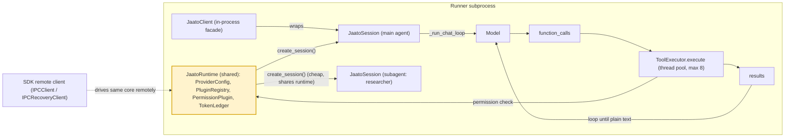

# The Runtime / Session / Client Core

> **The agent-runtime heart that a Runner subprocess hosts: a shared `JaatoRuntime` (provider config, plugins, permissions, token ledger) from which cheap per-agent `JaatoSession` objects are spun up to run the function-calling loop, fronted by a backwards-compatible `JaatoClient` facade.**
> **Layer (bottom→top):** sits *inside* a Runner subprocess, *above* the process plumbing that spawns it, *below* the plugins/tools and model providers it wires together. · **Lives in:** `jaato/jaato-server/shared/jaato_runtime.py`, `jaato_session.py`, `jaato_client.py`, `ai_tool_runner.py`, `token_accounting.py`; SDK remote clients in `jaato/jaato-sdk/jaato_sdk/client/ipc.py` (`IPCClient`) + `recovery.py` (`IPCRecoveryClient`)

## What it is

When a jaato Runner subprocess boots, the thing it actually hosts is this core: a runtime environment plus one or more conversation sessions. The split exists to solve a concrete problem — an agent often needs to spawn *subagents* (a researcher, a reviewer) cheaply, and re-establishing provider connections, re-discovering plugins, and re-loading permissions for each one would be slow and wasteful.

`JaatoRuntime` is the **shared environment**: it holds the provider configuration, the discovered `PluginRegistry`, the `PermissionPlugin`, and the `TokenLedger` — resources that are identical for every agent in the process (`jaato_runtime.py:200`). `JaatoSession` is the **per-agent state**: its own conversation history, model, tool subset, `ToolExecutor`, turn accounting, and the chat/function-call loop (`jaato_session.py:187`). A subagent therefore *shares the runtime but owns its session* — spawning one is just `runtime.create_session(...)`, which is lightweight because nothing shared is rebuilt (`jaato_runtime.py:900`).

`JaatoClient` is a thin **backwards-compatible facade** that wraps one runtime and its main session so older `connect()` / `configure_tools()` / `send_message()` code keeps working (`jaato_client.py:55`). It also exposes `get_runtime()` so callers can reach the shared runtime to create subagent sessions. Note this is the **in-process** client (the *embedded* API — the agent runs in the caller's own process); it is a different thing from the SDK **remote** clients (`IPCClient` / `IPCRecoveryClient`) that connect *to* a daemon — see "in-process vs remote clients" below.

## Where it sits in the stack

Directly **below** it is the Runner subprocess and its process plumbing (the pre-warm pool slot / cold-spawned process that imports plugin modules and dispatches `session.bootstrap`). Directly **above/beside** it are the things it drives: the **plugins/tools** (via `PluginRegistry` and `ToolExecutor`) and the **model providers** (created through `runtime.create_provider()`). The `JaatoServer` daemon talks to this core indirectly, configuring it and turning its callbacks into typed events.

## Responsibilities

- **Runtime:** own provider config (`connect()`), discover-once plugin registry, permission plugin, and token ledger; cache tool schemas/executors and assembled system instructions; mint sessions and providers (`configure_plugins()`, `create_session()`, `create_provider()`).
- **Session:** hold conversation `_history`, model, tool subset, `ToolExecutor`; drive the function-calling loop; manage streaming, cancellation (`CancelToken`), per-turn token accounting (`_turn_accounting`), and proactive garbage collection.
- **Client:** present a stable single-object API; route `send_message`/`stop`/`is_processing` to the session; expose the shared runtime.
- **ToolExecutor:** map tool names → callables, check permissions, and execute tools (sequentially or in a thread pool).

## Key concepts & structure

### `JaatoRuntime` — the shared environment
Created and connected once (`connect(project, location)` builds a `ProviderConfig` and flips `_connected`, `jaato_runtime.py:592`). `configure_plugins(registry, permission_plugin, ledger, reliability_plugin)` stores the shared plugins and caches tool schemas/executors and system instructions (`jaato_runtime.py:714`). `create_session(model, plugins=..., system_instructions=..., provider_name=..., agent_id=...)` constructs a `JaatoSession` against `self` and calls `session.configure(...)` (`jaato_runtime.py:900`). It even supports cross-provider subagents (`register_provider()`, `provider_name` override). The `plugins=` argument is a list of **plugin** names to expose — e.g. `["cli", "web_search"]` enables those plugins (whose individual tools, like `cli_based_tool`, the model then calls); `None` exposes all registry plugins. (This parameter was historically misnamed `tools=`; it was renamed to `plugins=` in server #292 / `6f941428`, with `tools=` kept as a deprecated alias — `plugins` wins if both are given.) Restricting to specific *tools within* a plugin is a separate mechanism: the `tool_scopes=` argument, or a profile entry like `"file_edit(tools:[readFile,writeFile])"`.

### `JaatoSession` — per-agent state
Each session keeps its own `_history`, `_cancel_token`, `_is_running` flag, `_turn_index`, `_turn_accounting`, and optional `_gc_plugin`/`_gc_config` (`jaato_session.py:430`, `:482`). It has its own `ToolExecutor` and a provider instance (lazily created on first `send_message` via `_ensure_provider()`, `jaato_session.py:3486`).

### `ToolExecutor` — registry + permissions + execution
`execute(name, args, tool_output_callback, call_id, cancel_token)` resolves an executor, runs the permission check (when a `PermissionPlugin` is set), and returns `(success, result)` (`ai_tool_runner.py:831`). The `cancel_token` and per-call output callback are stashed in **thread-local** storage so parallel tool runs stay isolated (`ai_tool_runner.py:866`).

### `TokenLedger` — accounting
Records token events per generation and retries transient quota / rate-limit errors (HTTP 429 / `ResourceExhausted`) with backoff; `summarize()` reports retry/rate-limit counts and `write_ledger()` dumps JSONL (`token_accounting.py:35`, `:44`, `:143`).

### `JaatoClient` (in-process) vs the SDK remote clients (`IPCClient` / `IPCRecoveryClient`)
Two distinct things are called a "client" in jaato, sitting on opposite sides of the daemon:

- **`JaatoClient`** (`jaato_client.py:55`) is the **in-process facade** documented above — it wraps *this* runtime + main session directly, so the agent runs in the **caller's own process** with no daemon involved (the embedded API). Inside the daemon, `JaatoServer` itself wraps a `JaatoClient`, which is how a server-side session reuses this exact runtime/session core.
- **`IPCClient`** (`jaato-sdk/jaato_sdk/client/ipc.py:204`) is the SDK's **remote** client: it hosts no runtime — it **connects to a daemon** over the IPC socket, sends request events (`SendMessageRequest`, `PermissionResponseRequest`, …), and consumes the daemon's event stream. It defaults to `auto_start=True` (spins up a daemon if none is running — see doc 01) and enforces a `MIN_SERVER_VERSION` check against the daemon's reported `server_version`, refusing an incompatible daemon with `IncompatibleServerError`.
- **`IPCRecoveryClient`** (`recovery.py:131`) **wraps `IPCClient`** to add **automatic reconnection** across daemon restarts/drops — it recreates the inner `IPCClient` on each reconnect (`recovery.py:303`) and classifies failures as transient (retry with backoff) vs permanent (`IncompatibleServerError` → no retry). This is the client the **TUI uses by default** (`use_recovery=True`; `jaato-tui/command_mode.py:51`, `backend.py:282`); the cascade driver instead uses a plain `IPCClient` + `cascade_events(cid)` (doc 09).

Mental model: `JaatoClient` = "run the runtime/session **here, in my process**"; `IPCClient`/`IPCRecoveryClient` = "**drive a runtime/session that lives in the daemon's runner**, over the socket" — the *same* conversational surface (send a message, receive events, answer permission/clarification), different locus (embedded vs server-connected). The recoverable wrapper exists because a long-lived TUI must survive a daemon restart without losing its session.

## Lifecycle / flow

1. Runner boots → `JaatoRuntime()` created, `connect(project, location)`, `configure_plugins(registry, permission, ledger)`.
2. Main agent: `runtime.create_session(model=...)` → `JaatoSession.configure(...)`.
3. **Function-calling loop** (`_run_chat_loop`, `jaato_session.py:4423`): a fresh `CancelToken` is made and `_is_running=True` (`:4448`); the user message is appended to `_history`; the provider is called (streaming or batched). While the response contains function calls — `while any(p.function_call for p in response.parts ...)` (`:4671`) — the session collects each function-call group, hands it to the `ToolExecutor`, feeds the `ToolResult`s back to the model, and loops. It exits when the model returns plain text with no function calls (`:4743`).
4. **Parallel tool execution:** if parallel tools are enabled and a group has >1 call, `_execute_function_calls_parallel` submits them to a `ThreadPoolExecutor` capped at 8 — `max_workers = min(len(function_calls), 8)` — collecting results via `as_completed` and re-ordering to the original order (`jaato_session.py:5193`, `:5223`).
5. **Cancellation:** `request_stop(reason)` calls `_cancel_token.cancel(...)` if running (`jaato_session.py:1507`). The loop checks `_is_cancelled()` at multiple points — before start (`:4499`), before processing each tool group (`:4673`) — and cooperatively returns a cancelled `TurnResult`.
6. **Proactive GC:** during streaming a usage callback flips `_gc_threshold_crossed` when context crosses the configured threshold; after the turn `_maybe_collect_after_turn()` runs the GC plugin's `collect(...)` to free tokens (`jaato_session.py:3704`, `:3743`).
7. Subagents: at any point a tool can call `runtime.create_session(...)` to spawn a peer session that shares all the runtime resources.

## Configuration / authoring

Behavior of this core is tuned by environment variables (read in `jaato_runtime.py`):

- `JAATO_PARALLEL_TOOLS` (default `true`) — enable thread-pool parallel tool execution (`jaato_runtime.py:178`).
- `JAATO_DEFERRED_TOOLS` (default `true`) — load only `core` tools into the initial context; others are discovered on demand (`jaato_runtime.py:185`).

Sessions are typically created from an agent **profile** (`SubagentProfile`) that supplies `model`, `provider`, `plugins`, and a `gc` strategy — the agent's instructions come from its `.jaato/agents/*.md` persona (over the `.jaato/instructions/` base), not the profile; these map onto `create_session(...)` arguments (whose runtime `system_instructions=` param carries the rendered persona text).

## Relationship to neighboring components

The **Runner** (process layer below) hosts exactly one `JaatoRuntime` and the sessions created from it. The **`JaatoServer`/daemon** wraps a `JaatoClient`, turning the session's `on_output` callbacks into typed events and relaying permission requests. Above/beside this core, the **PluginRegistry + tool plugins** supply the tools the loop calls through `ToolExecutor`, and the **model-provider plugins** supply the LLM the loop talks to. Subagents are not separate processes — they are extra `JaatoSession` objects sharing this one runtime.

## Example

A main agent receives a request and decides to research and review in parallel. Inside the Runner:

```python
runtime = JaatoRuntime()
runtime.connect(project, location)
runtime.configure_plugins(registry, permission_plugin, ledger)

main = runtime.create_session(model="gemini-2.5-flash")

# A tool spawns a subagent — cheap, shares runtime resources:
researcher = runtime.create_session(
    model="claude-sonnet-4-20250514",
    provider_name="anthropic",            # cross-provider subagent
    plugins=["cli", "web_search"],        # plugin names — exposes the cli + web_search *plugins*,
                                          # whose tools (cli_based_tool, web_search, …) the model calls.
                                          # (Param renamed from tools= in #292; tools= still works, deprecated.)
                                          # None = all exposed plugins; tool_scopes=… restricts within a plugin.
    system_instructions="You are a research analyst.",
)
```

`main.send_message(...)` enters `_run_chat_loop`: model → function calls → `ToolExecutor.execute` (up to 8 in parallel) → results → model, until plain text. The shared `TokenLedger` aggregates every call's usage; the shared `PermissionPlugin` gates every tool.

## Diagram



## Diagram brief (for illustration)

- **Layout:** hub-and-spoke on the left, horizontal sequence on the right. Wrap everything in a rounded container labeled **"Runner subprocess"** to show this whole core lives inside one process.
- **Boxes:**
  - Hub (center-left, emphasized, bold border): **`JaatoRuntime` (shared)** with a stacked list inside: *ProviderConfig · PluginRegistry · PermissionPlugin · TokenLedger*.
  - Spoke 1: **`JaatoSession` — main agent** (with sub-label *history · model · ToolExecutor · turn loop*).
  - Spoke 2: **`JaatoSession` — subagent (researcher)** (same sub-label, faded to show it's a peer).
  - Facade box overlapping the main session: **`JaatoClient` (in-process facade)**.
  - *Outside* the Runner container (top-left, faded "context" style): a small box **"SDK remote client — `IPCClient` / `IPCRecoveryClient` (recoverable; TUI/web)"** with a dashed arrow pointing **through the daemon** into the Runner container, labeled *"drives the same core remotely over the IPC socket (vs `JaatoClient` embedding it in-process)"*. Keep it visually secondary — it's there to show the two entry paths, not to shift focus off the runtime hub.
  - Right side, a horizontal mini-sequence of 4 boxes for the function-call loop: **Model** → **function_calls** → **`ToolExecutor.execute` (thread pool, max 8)** → **results**, with a curved arrow from **results** back to **Model** labeled *"loop until plain text"*.
  - Small chip attached to the loop labeled **`CancelToken`** and another labeled **proactive GC**.
- **Arrows:**
  - `JaatoRuntime` → main `JaatoSession`, edge label **"create_session()"**.
  - `JaatoRuntime` → subagent `JaatoSession`, edge label **"create_session() (cheap, shares runtime)"**.
  - main `JaatoSession` ⇄ right-side loop, edge label **"_run_chat_loop"**.
  - `ToolExecutor.execute` → `PermissionPlugin` (inside the runtime), edge label **"permission check"**.
  - loop → `TokenLedger`, edge label **"usage accounting"**.
  - `CancelToken` → loop, dashed edge label **"request_stop()"**.
- **Emphasis:** Highlight the `JaatoRuntime` hub (shared) and the *one-runtime → many-sessions* fan-out — that is the architectural point. Use a distinct accent color for the shared runtime vs. the per-agent sessions.
- **Caption:** *One shared runtime, many cheap per-agent sessions: subagents share provider/plugins/permissions/ledger and only own their conversation loop.*

## Source references

- `jaato/jaato-server/shared/jaato_runtime.py:200` — `JaatoRuntime` class: shared provider config, registry, permission plugin, ledger.
- `jaato/jaato-server/shared/jaato_runtime.py:900` — `create_session()`: mints a `JaatoSession` against the shared runtime (cheap subagent spawn).
- `jaato/jaato-server/shared/jaato_session.py:4423` — `_run_chat_loop`: the function-calling loop with streaming + cancellation.
- `jaato/jaato-server/shared/jaato_session.py:4671` / `:4743` — loop body: iterate while function calls exist; exit on plain text.
- `jaato/jaato-server/shared/jaato_session.py:5193` / `:5223` — `_execute_function_calls_parallel`: `ThreadPoolExecutor`, `max_workers = min(len(function_calls), 8)`.
- `jaato/jaato-server/shared/jaato_session.py:1507` / `:3704` — `request_stop` (CancelToken) and `_maybe_collect_after_turn` (proactive GC).
- `jaato/jaato-server/shared/ai_tool_runner.py:831` — `ToolExecutor.execute`: registry lookup + permission check + thread-local cancel/output.
- `jaato/jaato-server/shared/jaato_client.py:55` / `:178` — `JaatoClient` facade wrapping runtime+session; `get_runtime()` for subagent creation.
- `jaato/jaato-sdk/jaato_sdk/client/ipc.py:204` — `IPCClient`: SDK remote client to the daemon (auto-start, request events, event stream, `MIN_SERVER_VERSION` / `IncompatibleServerError`). Distinct from the in-process `JaatoClient`.
- `jaato/jaato-sdk/jaato_sdk/client/recovery.py:131` (`IPCRecoveryClient` wraps `IPCClient`), `:303` (recreates inner client on reconnect) — the recoverable client the TUI uses (`jaato-tui/command_mode.py:51`, `backend.py:282`).
- `jaato/jaato-server/shared/token_accounting.py:35` — `TokenLedger`: token events + rate-limit retry + JSONL ledger.
