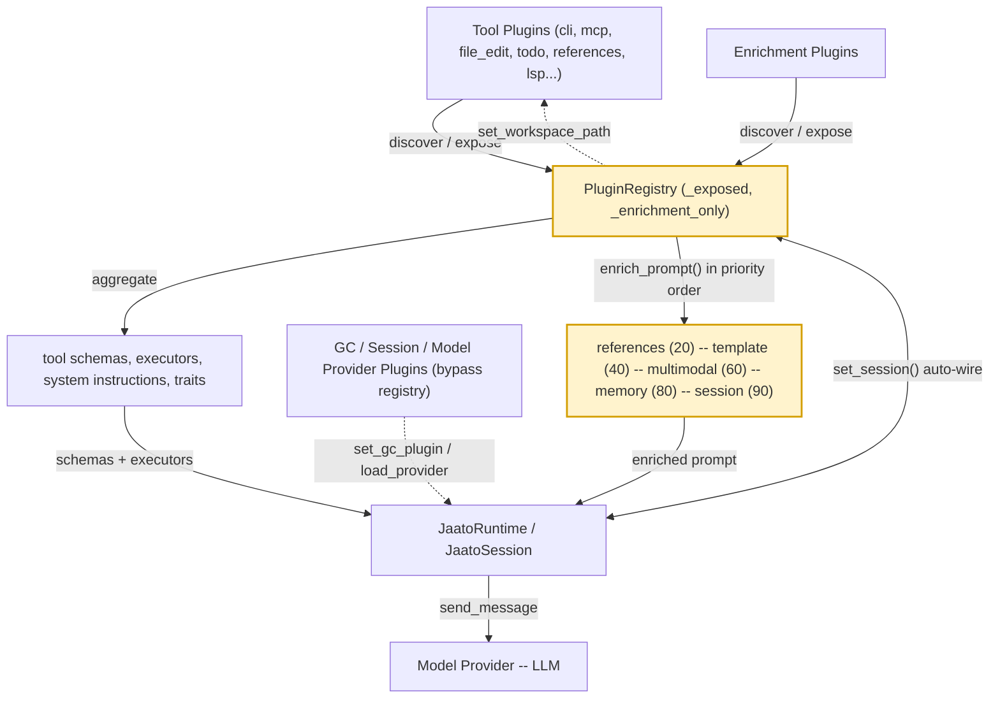

# The Plugin System

> **The capability layer of the jaato agent framework: a discovery-and-exposure mechanism that hands the runtime its tools, prompt enrichment, context garbage-collection strategies, persistence, and the provider abstraction that talks to the actual LLM.**
> **Layer (bottom→top):** sits directly above the model providers and is wired into the runtime/session; below it is the host (daemon/runner) that invokes plugins · **Lives in:** `jaato/jaato-server/shared/plugins/` (registry, plugin dirs) + `jaato/jaato-sdk/jaato_sdk/plugins/base.py` (protocols)

## What it is

A bare LLM can only emit text. Everything that makes jaato an *agent* — running shell commands, editing files, calling MCP servers, remembering context, summarizing history when the context window fills, persisting a conversation, even reaching the model itself — is delivered by a plugin. The Plugin System is how jaato discovers those capabilities and decides which ones a given session can see.

There are **four plugin kinds**, declared by a mandatory `PLUGIN_KIND` constant in each plugin's `__init__.py` (`"tool"`, `"gc"`, `"session"`, `"model_provider"`), plus a fifth lightweight variant, **enrichment plugins** (`PLUGIN_KIND = "enrichment"`), which only participate in the prompt-enrichment pipeline (`architecture.md`, `plugins/CLAUDE.md` "Critical: PLUGIN_KIND"). A module without `PLUGIN_KIND` is silently skipped during discovery — the registry's directory scan does `if getattr(module, 'PLUGIN_KIND', None) != plugin_kind: continue` (`registry.py`).

Crucially, only **tool plugins and enrichment plugins are managed by `PluginRegistry`**. GC plugins, session plugins, and model-provider plugins are *separate systems* with their own discovery/loading (`discover_gc_plugins`, `discover_providers`, `set_gc_plugin`/`set_session_plugin` on the client) — they wire directly into the runtime/session, not into the registry's expose/enrich machinery (`architecture.md`).

## Where it sits in the stack

Directly **below** the Plugin System are the **model providers** — themselves a plugin kind (`PLUGIN_KIND = "model_provider"`), but documented separately because they abstract the SDK call to Gemini / Claude / GPT and are loaded by their own `load_provider()` rather than by the registry. Directly **above** are the **`JaatoRuntime`** (which owns one `PluginRegistry` and shares it across sessions) and **`JaatoSession`** (which consumes the registry's tool schemas, executors, and enrichment results each turn). Sideways, plugins talk to the **permission system** (auto-approval lists, `format_permission_request`) and to **each other** via the registry (`set_plugin_registry` cross-plugin access).

## Responsibilities

- Discover plugins via entry points and directory scan, filtered by `PLUGIN_KIND` and optionally by `PLUGIN_TIER` (daemon vs runner).
- Expose/unexpose tool plugins, running their `initialize()`/`shutdown()` lifecycle.
- Aggregate the model-facing surface: tool schemas, executors, system instructions, user commands, auto-approved tools.
- Run the priority-ordered **prompt / system-instruction / tool-result enrichment pipeline**.
- Support **deferred tool loading** (core vs discoverable tools) and **traits** (tool-level + plugin-level).
- **Auto-wire** plugins to the registry, session, and workspace path.
- Enforce per-plugin **model requirements** (glob patterns) and isolate failing plugins.

## Key concepts & structure

### `ToolPlugin` protocol (`base.py`)
What a tool plugin provides: `get_tool_schemas()` (provider-agnostic `ToolSchema` list), `get_executors()` (name→callable map), `initialize()`/`shutdown()`, `get_system_instructions()` (prose prepended to guide the model), `get_auto_approved_tools()`, and `get_user_commands()`. Optional extensions (recognized by duck-typing) include `get_model_requirements()`, the three enrichment subscription sets, `get_config_schema()`, `format_permission_request()`, `get_persistence_state()`/`restore_persistence_state()`, and the auto-wiring hooks (`base.py`).

### `EnrichmentPlugin` protocol (`base.py`)
The lightweight alternative: a plugin that provides *no* tools or commands, only enrichment. It needs just `name`, `initialize`, `shutdown`, and at least one of the three enrichment subscription pairs. The registry auto-registers any `PLUGIN_KIND = "enrichment"` plugin as enrichment-only (`registry.py`).

### The prompt-enrichment pipeline (priority-ordered)
Subscribers are sorted by `get_enrichment_priority()` (lower runs first; default 50) so later plugins see content injected by earlier ones (`registry.py`, `enrich_prompt` at `registry.py`). The documented standard order (`registry.py`, `architecture.md`):

| Priority | Plugin | Role |
|----------|--------|------|
| 20 | **references** | injects MODULE.md / SKILL.md content into the prompt |
| 40 | **template** | detects embedded templates in injected content, extracts to `.jaato/templates/` |
| 60 | **multimodal** | detects `@image.jpg` references, surfaces `viewImage` |
| 80 | **memory** | adds hints about relevant stored memories |
| 90 | **session** | adds session-description hints after N turns |

Two parallel pipelines exist for **system instructions** (`enrich_system_instructions`, `registry.py`) and **tool results** (`enrich_tool_result`), each with its own priority accessor.

> **Pipeline contract (valid-JSON on the full-dict path).** A result-enrichment plugin must emit a string the next stage can consume — in particular, on the full-dict (`file_writer` / greppable-content) path the session re-parses the output with `json.loads`, so an enricher on that path must return valid JSON. Emitting non-JSON makes the session discard it (stuffed under `_lsp_diagnostics`) and the result passes through *unfiltered*. Because enrichers run priority-ordered, this is a foot-gun across stages: e.g. an LSP enricher (priority 30) that appends markdown diagnostics to a result's JSON can make a *later* enricher (e.g. `result_grep`, priority 90) receive non-JSON and fall through — so any enricher on this path should always emit valid JSON regardless of its input's shape. (This was the root cause of framework task #289; that specific `result_grep` instance was fixed on `main` (605076c2) — it now always emits valid JSON — but the invariant remains the general contract for any future enricher on this path.)

### Deferred / discoverable tools
Each `ToolSchema` has a `discoverability` field: `"core"` (always in context) or `"discoverable"` (loaded on demand). `get_core_tool_schemas()` returns only `discoverability == 'core'` tools (`registry.py`); the model then uses introspection (`list_tools` → `get_tool_schemas`) to pull in the rest. Enabled by default (`JAATO_DEFERRED_TOOLS=true`); core set is introspection, file_edit, cli, filesystem_query, todo, clarification (CLAUDE.md "Deferred Tool Loading").

### Traits
**Tool traits** (`ToolSchema.traits`, a `FrozenSet[str]`) drive cross-cutting behavior without hardcoding tool names; e.g. `TRAIT_FILE_WRITER` makes the session route the result to LSP/artifact enrichment. The session queries `registry.get_tool_traits(name)` (`registry.py`). **Plugin-level traits** (`plugin_traits` class attr) identify *plugin* capabilities; `TRAIT_AUTH_PROVIDER` marks auth plugins, which must also expose a `provider_name` property so the server can match an auth plugin to its provider (`base.py`).

### Auto-wiring
Three injection points, all driven by `hasattr()` checks so they stay optional (CLAUDE.md "Plugin Auto-Wiring", `architecture.md`):

| Method | When | By |
|--------|------|-----|
| `set_plugin_registry(registry)` | during `expose_tool()` | PluginRegistry (`registry.py`) |
| `set_session(session)` | during `configure()` | JaatoSession |
| `set_workspace_path(path)` | after expose | PluginRegistry (`registry.py`, broadcast to all exposed plugins) |

## Lifecycle / flow

1. **Discover** — `registry.discover(plugin_kind="tool")` scans entry points then the plugins directory; discovering `"tool"` also auto-discovers `"enrichment"` plugins (`registry.py`).
2. **Expose** — `expose_all()` / `expose_tool(name, config)` runs each plugin's `initialize()`, adds it to `_exposed`, and auto-wires the registry. A broken plugin's `initialize()` failure is caught and recorded, not propagated (`registry.py`).
3. **Wire** — workspace path / config-root / session-id are broadcast or injected into each plugin's config (`_augment_plugin_config`, `registry.py`).
4. **Serve a turn** — the session pulls `get_core_tool_schemas()` (or enabled schemas), `get_enabled_executors()`, `get_system_instructions()`, then calls `enrich_prompt()` before sending to the model.
5. **Tear down** — `unexpose_tool()` / `unexpose_all()` call `shutdown()`; failures are logged but the plugin is still removed (`registry.py`).

## Configuration / authoring

A new plugin needs `__init__.py` declaring `PLUGIN_KIND` (and `PLUGIN_TIER`, plus `SESSION_INDEPENDENT = True` for auth plugins), a `plugin.py` with a `create_plugin()` factory, and a class implementing `ToolPlugin` or `EnrichmentPlugin` (`plugins/CLAUDE.md` checklist). Representative plugins shipped in `shared/plugins/`: `cli`, `mcp`, `file_edit`, `todo`, `references`, `subagent`, `permission`, `memory`, `web_search`, `interactive_shell`, `webhook`, `lsp`, `introspection`, `clarification`, `template`, `multimodal`.

```python
# shared/plugins/my_plugin/__init__.py
PLUGIN_KIND = "tool"
PLUGIN_TIER = "runner"
from .plugin import MyPlugin, create_plugin
__all__ = ["MyPlugin", "create_plugin", "PLUGIN_KIND", "PLUGIN_TIER"]
```

## Relationship to neighboring components

The **`JaatoRuntime`** constructs and owns the single `PluginRegistry`; **`JaatoSession`** consumes it each turn and provides itself via `set_session()`. **Model providers** are technically a plugin kind but bypass the registry (loaded by `load_provider`). The **GC** and **session** plugins likewise bypass the registry, attaching to the client through `set_gc_plugin()` / `set_session_plugin()` — though the session plugin *also* registers enrichment-only so its session-description hints flow through the same pipeline (`architecture.md`). The **permission** plugin reads the registry's auto-approved list and per-tool `format_permission_request` hooks.

## Example

A user sends `"Implement a circuit breaker using MODULE.md"`. `JaatoSession` calls `registry.enrich_prompt()`: the **references** plugin (priority 20) injects MODULE.md's content; **template** (40) spots `{{var}}` blocks in that injected text and extracts them to `.jaato/templates/`, annotating the prompt; **multimodal** (60) finds no images; **memory** (80) appends a hint about a related prior decision. The fully enriched prompt plus the core tool schemas (cli, file_edit, …) goes to the model. The model calls `updateFile`; because that tool's schema carries `TRAIT_FILE_WRITER`, the session routes the result through LSP-diagnostic and artifact-tracking enrichment before returning it. (`architecture.md`, CLAUDE.md "Tool Traits".)

## Diagram



## Diagram brief (for illustration)

- **Layout:** A central hub-and-spoke for the registry, stacked on top of a left-to-right enrichment flow band; model providers shown as a layer beneath. Read top-to-bottom: capabilities → registry → enrichment → runtime/session → provider → LLM.
- **Boxes:**
  - Top band (capabilities feeding the registry): "Tool Plugins (cli, mcp, file_edit, todo, references, lsp…)", "Enrichment Plugins".
  - Side boxes NOT in the registry (draw with a dashed border, off to the right): "GC Plugins (truncate / summarize / hybrid)", "Session Plugin (persistence)", "Model Provider Plugins (google_genai, anthropic, …)".
  - Center hub: **"PluginRegistry"** (highlighted) containing two small chips "_exposed" and "_enrichment_only".
  - Registry output chips: "tool schemas (core / discoverable)", "executors", "system instructions", "user commands", "traits".
  - Enrichment flow band (left→right, four to five chevrons): "references (20)" → "template (40)" → "multimodal (60)" → "memory (80)" → "session (90)".
  - Bottom layer: "JaatoRuntime / JaatoSession" then below it "Model Provider → LLM".
- **Arrows:**
  - Tool + Enrichment plugins → PluginRegistry, edge label "discover / expose".
  - PluginRegistry → output chips, label "aggregate".
  - PluginRegistry → enrichment flow band, label "enrich_prompt() in priority order".
  - Enrichment flow band → JaatoSession, label "enriched prompt".
  - Output chips → JaatoSession, label "schemas + executors".
  - JaatoSession ↔ PluginRegistry, label "set_session() auto-wire".
  - PluginRegistry → Tool plugins, label "set_plugin_registry / set_workspace_path".
  - GC / Session / Provider dashed boxes → JaatoRuntime/Session directly (NOT through registry), label "set_gc_plugin / set_session_plugin / load_provider".
  - JaatoSession → Model Provider → LLM, label "send_message".
- **Emphasis:** Highlight the **PluginRegistry** hub and the **priority-ordered enrichment chevrons**; visually separate (dashed) the three plugin kinds that bypass the registry.
- **Caption:** "The Plugin System: PluginRegistry discovers and exposes tool & enrichment plugins (with a priority-ordered enrichment pipeline), while GC, session, and model-provider plugins wire straight into the runtime."

## Source references
- `jaato-sdk/jaato_sdk/plugins/base.py` — `ToolPlugin` protocol: schemas, executors, system instructions, user commands, auto-approval.
- `jaato-sdk/jaato_sdk/plugins/base.py` — `EnrichmentPlugin` protocol (enrichment-only).
- `jaato-sdk/jaato_sdk/plugins/base.py` — `TRAIT_AUTH_PROVIDER` plugin-level trait + `provider_name` contract.
- `jaato-server/shared/plugins/registry.py` — enrichment priority (references 20 / template 40 / multimodal 60 / memory 80) and `enrich_prompt()`.
- `jaato-server/shared/plugins/registry.py` — `get_core_tool_schemas()` (core vs discoverable deferred loading); `get_tool_traits()`.
- `jaato-server/shared/plugins/registry.py` — auto-wiring (`set_plugin_registry`, `set_workspace_path`) and `expose_tool` lifecycle.
- `jaato/docs/architecture.md` — four plugin kinds; GC/session/provider are NOT managed by `PluginRegistry`.
- `jaato/docs/architecture.md` — enrichment pipeline (incl. session priority 90) and auto-wiring table.
