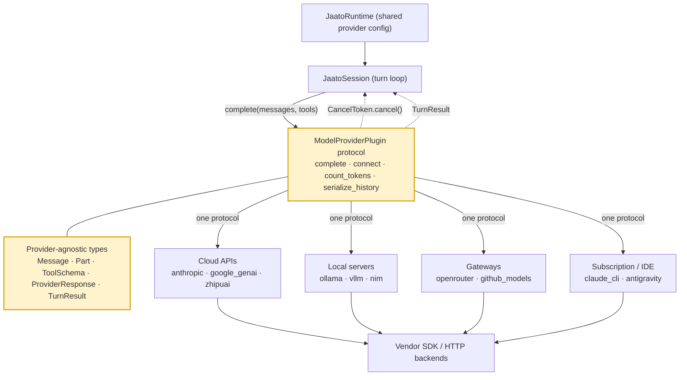

# Model Providers

> **The multi-provider SDK abstraction: one protocol that hides every LLM backend behind a uniform, provider-agnostic interface so the agent runtime never knows which vendor it is talking to.**
> **Layer (bottom→top):** the lowest plugin layer — it sits directly on top of vendor SDKs / HTTP APIs and is consumed by the runtime/session above it · **Lives in:** `jaato` (public) — protocol & types in `jaato-server/shared/plugins/model_provider/` and `jaato-sdk/jaato_sdk/plugins/model_provider/types.py`; one subdirectory per backend.

## What it is

Every LLM vendor ships its own SDK with its own types: Google's `google.genai.types.Content`, Anthropic's Messages API blocks, OpenAI's chat-completions JSON, and so on. If the agent loop spoke any one of those dialects directly, swapping models — or running a subagent on a *different* vendor than its parent — would mean rewriting the loop.

A **Model Provider** is a plugin kind (`PLUGIN_KIND = "model_provider"`, `jaato-server/shared/plugins/model_provider/__init__.py:35`) that solves this by defining a single Python `Protocol`, `ModelProviderPlugin` (`base.py:152`), that every backend implements. The protocol speaks only *provider-agnostic* types — `Message`, `Part`, `FunctionCall`, `ToolResult`, `ToolSchema`, `ProviderResponse` (all in `types.py`) — and each provider converts those to and from its own SDK internally. The provider's docstring states the intent plainly: providers "encapsulate all SDK-specific logic for interacting with AI models (Google GenAI, Anthropic, OpenAI, etc.)" (`base.py:4-5`).

A key design choice: providers are **stateless with respect to conversation history**. The session owns the canonical message list and passes it in full to `complete()` on every turn; providers hold only connection/auth state (`base.py:7-10`, `162-166`). This is what makes cross-provider subagents cheap — there is no per-conversation provider object to migrate.

## Where it sits in the stack

Directly **below** it are the raw vendor SDKs and HTTP endpoints (the Anthropic SDK, `google.genai`, OpenAI-compatible servers, local daemons). Directly **above** it is `JaatoSession`, which drives the turn loop and calls `complete()` for every model turn; `JaatoRuntime` holds the provider config and connection that all sessions share (`docs/architecture.md:247`, `253`). Sideways, it consumes the provider-agnostic type layer in `types.py` and is selected by a **Profile** (the `provider` field, e.g. `"anthropic"`), which is the same plugin-vs-profile relationship every other plugin kind has.

## Responsibilities

- Define one protocol (`ModelProviderPlugin`) every backend conforms to (`base.py:152`).
- Convert provider-agnostic types ↔ vendor SDK types, in both directions.
- Own connection & authentication state (`initialize`, `verify_auth`, `connect`).
- Execute a stateless turn via `complete()`, returning a classified `TurnResult` (`base.py:294-353`).
- Stream tokens and honor mid-turn cancellation via `CancelToken`.
- Count tokens, report the context-window limit, and serialize history for persistence.
- Classify errors as transient (retry) vs terminal so the retry layer can act (`base.py:504-549`).

## Key concepts & structure

### The protocol surface (`base.py:152`)
The prompt frames the surface as `create_session/send_message/send_tool_results/get_history`; the **current** source has consolidated that into a single stateless call plus lifecycle and management methods. The real surface is:
- **Lifecycle:** `initialize(config)`, `verify_auth(...)`, `shutdown()`, `get_auth_info()` (`base.py:191-255`).
- **Connection:** `connect(model, *, skip_model_test)`, `is_connected`, `model_name`, `list_models(prefix)` (`base.py:259-290`).
- **Stateless completion:** `complete(messages, system_instruction, tools, *, response_schema, cancel_token, on_chunk, on_usage_update, on_function_call, on_thinking, tool_choice) -> TurnResult` (`base.py:294-353`). This is the workhorse — the session passes the full message list each turn; the provider does *not* mutate internal state.
- **Token management:** `count_tokens(content)`, `get_context_limit()`, `get_token_usage()` (`base.py:357-382`).
- **Serialization:** `serialize_history(history)` / `deserialize_history(data)`, used by the session for disk persistence in a provider-independent (JSON) format (`base.py:387-410`).
- **Capabilities:** `supports_structured_output()`, `supports_streaming()`, `supports_stop()`, `supports_thinking()` (`base.py:414-482`).

(The `docs/architecture.md:359-372` sequence diagram still narrates the older `send_message`/`send_tool_results` shape — conceptually identical loop, but the authoritative method today is `complete()`.)

### The provider-agnostic type layer (`types.py`)
These replace SDK-specific types so the rest of jaato never imports a vendor SDK: `Role` (user/model/tool), `Message` (a list of `Part`s, plus `model`/`provider` fields so cross-provider history records each message's origin, `types.py:305-327`), `Part` (text / `function_call` / `function_response` / `thought` / inline data), `FunctionCall`, `ToolResult`, `ToolSchema` (provider-agnostic function declaration, `types.py:160`), `ProviderResponse` (unified response with ordered `parts`, `usage`, `finish_reason`, optional `structured_output`/`thinking`), `TokenUsage`, `FinishReason`, and `TurnResult`/`TurnOutcome` (the discriminated turn outcome the loop pattern-matches on, `types.py:449-519`).

### Streaming & cancellation
When `complete()` is given an `on_chunk` callback it streams token-by-token; without it, it returns in batch (`base.py:313-314`). `CancelToken` (`types.py:673`) is a thread-safe signal: the session calls `token.cancel()`, the streaming loop breaks, and the turn resolves to `FinishReason.CANCELLED` → `TurnOutcome.CANCELLED`. Provider capability is advertised via `supports_stop()` (requires streaming, `base.py:437-446`).

### Error classification for retry
Providers MUST return `TurnResult.from_provider_response()` on success, return `TurnResult.from_exception()` for **non-transient** errors (auth, context limit, safety), and **raise** transient errors (rate limit, overload) so the `with_retry` layer retries (`base.py:316-322`). `classify_error()` and `get_retry_after()` let each provider apply vendor-specific knowledge (`base.py:504-549`).

### The provider catalog
The repo ships one subdirectory per backend (`ls jaato-server/shared/plugins/model_provider/`), spanning four shapes:
- **Cloud vendor APIs:** `anthropic/` (Claude), `google_genai/` (Gemini / Vertex AI), `zhipuai/`, `zhipuai_openai/`.
- **Local inference servers:** `ollama/`, `lmstudio/`, `vllm/`, `tensorrt_llm/`, `triton/`, plus `nim/` (NVIDIA, hosted or self-hosted).
- **Gateways / aggregators:** `openrouter/` (300+ models behind one OpenAI-compatible API), `github_models/`.
- **Subscription-CLI / IDE backends:** `claude_cli/` (drives the Claude Code CLI, using a Pro/Max subscription rather than API credits) and `antigravity/` (Google IDE backend, Gemini 3 + Claude via Google OAuth).

### Discovery & loading
`discover_providers()` finds backends two ways: the `jaato.model_providers` entry-point group, then a directory scan that imports each subdir and calls its `create_provider`/`create_plugin` factory (`__init__.py:67-157`). `load_provider(name, config)` instantiates one by name and optionally calls `initialize()` (`__init__.py:169-203`). The provider's own `name` property (e.g. `"anthropic"`, `anthropic/provider.py:201-203`) is the identity used in Profiles.

## Lifecycle / flow

1. A Profile names `provider` (e.g. `"anthropic"`) and `model`. The runtime calls `verify_auth()` on a **fresh, uninitialized** instance to confirm credentials exist *before* spinning up a session.
2. `load_provider(name)` → `initialize(ProviderConfig)` builds the SDK client / auth.
3. `connect(model)` pins the model (optionally `skip_model_test=True` during bootstrap).
4. For each turn, `JaatoSession` calls `complete(messages, system_instruction, tools, ...)`, passing the full history; the provider converts to SDK form, calls the API (streaming if `on_chunk` is set), converts the response back, and returns a `TurnResult`.
5. On tool calls (`FinishReason.TOOL_USE`), the session executes tools, appends `ToolResult` parts to history, and calls `complete()` again — looping until a text-only `RESPONSE`.
6. `serialize_history()` persists the conversation; `shutdown()` releases resources.

## Configuration / authoring

A provider is selected per Profile (`.jaato/profiles/<name>.yaml`) via `provider` + `model`, with per-provider knobs under `plugin_configs.<provider>`. Knobs are **namespaced into layers**:

| Layer | Purpose |
|-------|---------|
| top-level | auth / identity (e.g. `api_key`, `oauth_token`) |
| `api_params` | request-body fields (`temperature`, `top_p`, `max_tokens`, `enable_thinking`, `thinking_budget`, …) |
| `routing` | gateway routing constraints (OpenRouter only — `order`, `sort`, `only`/`ignore`, `data_collection`, … via the provider extension) |
| `framework_overrides` | rare escape hatches (e.g. `context_length`, `base_url`) |

Anthropic has no `routing` layer because its API has no gateway routing extension (`jaato/CLAUDE.md`, Anthropic profile-knobs section). OpenRouter uses all four (`jaato/CLAUDE.md`, OpenRouter section).

```yaml
name: researcher
model: claude-sonnet-4-5-20250929
provider: anthropic
plugin_configs:
  anthropic:
    api_params:
      temperature: 0.0
      max_tokens: 4096
      enable_thinking: true
      thinking_budget: 10000
```

`ProviderConfig` (`base.py:68-103`) carries the auth-side fields (`project`, `location`, `api_key`, `credentials_path`, `use_vertex_ai`, `auth_method`, `target_service_account`, plus `extra` for provider-specific config). Context-window size resolves by a uniform precedence — provider auto-detect → per-profile `context_length` → env var — via `resolve_context_window()` (`base.py:106-149`).

## Relationship to neighboring components

`JaatoRuntime` holds the provider config and connection shared by every agent; `JaatoSession` calls `complete()` for each turn (`docs/architecture.md:247`). Because the protocol is uniform and history is provider-agnostic, a **subagent can run on a different provider than its parent** — the parent stays on Anthropic while a subagent's Profile selects `google_genai` (`docs/architecture.md:518-541`). The Model Provider is one of jaato's plugin kinds (alongside tool, enrichment, gc, session) and, like the others, is chosen declaratively by a Profile rather than wired in code.

## Example

A Profile sets `"provider": "anthropic"`, `"model": "claude-sonnet-4-5-20250929"`. At session start the runtime calls `AnthropicProvider().verify_auth()` (checking PKCE/OAuth/API-key without touching `self._client`), then `initialize()` builds the SDK client and `connect(model)` pins it. On a turn the session calls `complete(messages=<full history>, system_instruction=..., tools=[ToolSchema(...)], on_chunk=stream_cb, cancel_token=tok)`. The provider translates the agnostic `Message`/`ToolSchema` list to Anthropic blocks, streams tokens through `stream_cb`, and — if the model emits a `tool_use` — returns a `TurnResult` whose `ProviderResponse.parts` carry a `FunctionCall`. The session runs the tool, appends a `ToolResult` part, and calls `complete()` again. Switching this Profile's `provider` to `"openrouter"` or `"ollama"` changes nothing in the loop.

## Diagram



## Diagram brief (for illustration)

- **Layout:** hub-and-spoke with a thin layered band on top. Top band = "Agent runtime" (two stacked boxes: `JaatoSession` over `JaatoRuntime`). Center hub = the abstraction. Spokes fan downward to the concrete providers, which themselves point to external vendor logos/labels.
- **Boxes:**
  - Top band: `JaatoSession (turn loop)`, `JaatoRuntime (shared provider config)`.
  - Center hub (emphasized): `ModelProviderPlugin protocol` with a small sub-caption listing the surface: `complete() · connect() · count_tokens() · serialize_history()`.
  - A side card attached to the hub labeled `Provider-agnostic types` listing: `Message · Part · FunctionCall · ToolResult · ToolSchema · ProviderResponse · TurnResult · CancelToken`.
  - Provider spoke boxes grouped into four clusters, each cluster boxed and labeled:
    - **Cloud APIs:** `anthropic`, `google_genai`, `zhipuai`
    - **Local servers:** `ollama`, `lmstudio`, `vllm`, `tensorrt_llm`, `nim`
    - **Gateways:** `openrouter (300+ models)`, `github_models`
    - **Subscription / IDE:** `claude_cli`, `antigravity`
- **Arrows:**
  - `JaatoSession` → hub, labeled `complete(messages, tools, cancel_token)` (down).
  - hub → each provider cluster, labeled `one protocol` (down, fan-out).
  - each provider → its external backend, labeled `vendor SDK / HTTP` (down).
  - A return arrow provider → hub → session labeled `TurnResult / ProviderResponse` (up, dashed).
  - A small curved arrow from `JaatoSession` to the hub labeled `CancelToken.cancel()` (to show streaming cancellation).
- **Emphasis:** highlight the center `ModelProviderPlugin protocol` hub and the `Provider-agnostic types` side card — these are the component this doc is about. De-emphasize (lighter shade) the external vendor backends.
- **Caption:** "One protocol, many backends: the runtime speaks provider-agnostic types; each Model Provider plugin translates to its own SDK — so swapping models (even per-subagent) never touches the agent loop."

## Source references
- `jaato-server/shared/plugins/model_provider/__init__.py:35` — `PLUGIN_KIND = "model_provider"`; `:67-203` discovery (`discover_providers`, `_discover_via_directory`, `load_provider`).
- `jaato-server/shared/plugins/model_provider/base.py:152-353` — `ModelProviderPlugin` protocol: lifecycle, `connect`, and the stateless `complete()` contract (success vs raise-transient).
- `jaato-server/shared/plugins/model_provider/base.py:68-149` — `ProviderConfig` and `resolve_context_window()` precedence.
- `jaato-sdk/jaato_sdk/plugins/model_provider/types.py:106-519` — provider-agnostic types (`Role`, `Message`, `Part`, `FunctionCall`, `ToolResult`, `ToolSchema`, `ProviderResponse`, `TokenUsage`, `FinishReason`, `TurnResult`).
- `jaato-sdk/jaato_sdk/plugins/model_provider/types.py:665-805` — `CancelledException` and `CancelToken` (streaming cancellation).
- `jaato-server/shared/plugins/model_provider/anthropic/provider.py:201-203` — example provider `name` property; canonical implementation.
- `jaato/docs/architecture.md:247-267, 518-541` — runtime/session ownership and cross-provider subagent support.
- `jaato/CLAUDE.md` (Anthropic & OpenRouter profile-knob sections) — `plugin_configs.<provider>` layering: top-level / `api_params` / `routing` / `framework_overrides`.
