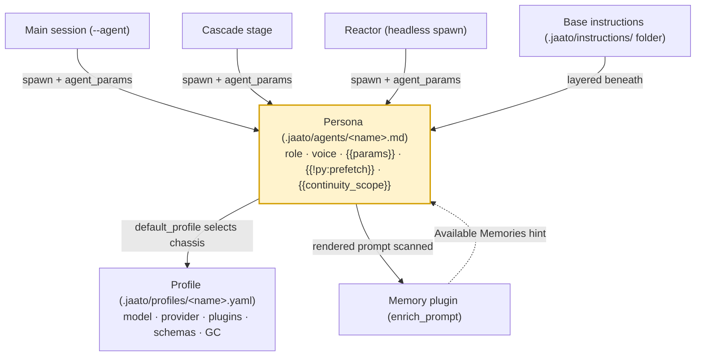

# Personas

> **A persona is the *identity* of a jaato agent — its role, voice, knowledge and lifecycle behaviour — authored as a Markdown file under `.jaato/agents/<name>.md` whose rendered text becomes the session's system instructions.**
> **Layer (bottom→top):** sits *above* the Profile (the technical config) and *below* the cascade stages / reactors that invoke agents · **Lives in:** `jaato` (rendered by `jaato-server/server/session_manager.py`, expanded by `jaato-server/shared/dynamic_instructions.py`; persona files live in `.jaato/agents/`)

## What it is

A jaato **Profile** answers *"what can this agent do and with what knobs?"* — model, provider, plugin list, GC strategy, schemas. A **persona** answers the orthogonal question *"who is this agent?"* — its role declaration, tone, domain knowledge, and what it should do at the start and end of a run. In jaato the persona is **not a Python class**. It is the agent's **system instructions**, authored as Markdown.

The key split: a persona is authored as its own Markdown file under `.jaato/agents/<name>.md`, separate from the Profile, which holds runtime config only. When a session names an agent via `--agent`, the framework renders that agent's Markdown and applies it as the session's system instructions (`config.py:889-891`). Identity lives in the agent file; configuration lives in the Profile — deliberately split so each is authored, versioned, and reused on its own. The persona does not stand alone, either: it layers on top of a project-wide **base-instruction hierarchy** (the `.jaato/instructions/` folder, below) shared by every agent in the workspace.

Because the persona is plain Markdown rendered into the prompt, it can be enriched at render time: it carries `{{param}}` placeholders (filled from caller-supplied `agent_params`) and `{{!py:script.py}}` **prefetch** placeholders that run framework-authority scripts whose output is embedded before the agent's first turn (`dynamic_instructions.py:1-39`). The persona thus *bundles together*, at the authoring layer, the role prose, the prefetched live context, and — by convention — the continuity behaviour, while the matching **Profile** supplies the spawn schema and completion schema that bracket the agent's input and output.

## Where it sits in the stack

Directly **below** a persona is its **Profile** (`.jaato/profiles/<name>.yaml`, schema `SubagentProfile`), which supplies the technical substrate: model, provider, plugins, `spawn_payload_schema`, `completion_payload_schema`, GC. An agent Markdown file may name its substrate via a `default_profile` frontmatter key. Directly **above**, personas are consumed by whatever drives a session: the main session via `session.new --agent <name>`, cascade stages, and **reactors** that spawn headless sessions. Sideways, the persona's text is read by enrichment plugins — most importantly the **memory** plugin, which scans the rendered prompt for tags (the basis of cross-session continuity).

## Responsibilities

- Define the agent's **role, voice and domain knowledge** as system-instruction prose.
- Declare authoring-time **`{{param}}` placeholders** and optional `params` frontmatter (with `required` / `default` / `enum`).
- Optionally embed **prefetch** (`{{!py:script.py}}`) to inject mandatory live context at session start.
- Carry the **continuity** convention (`{{continuity_scope}}` + a store/retrieve postamble) when the agent should remember prior runs.
- Optionally name a **`default_profile`** so the persona pulls in the right technical substrate when no `--profile` is given.

## Key concepts & structure

### Persona file: `.jaato/agents/<name>.md`
A persona is a single `<name>.md` (or a directory `<name>/PROMPT.md` / `SKILL.md`) resolved by `SessionManager._resolve_agent()` (`session_manager.py:423`). The search path is, in order: a `config_root` override, then `<workspace>/.jaato/agents/` and `.../prompts/`, then `~/.jaato/agents/` and `.../prompts/` (`session_manager.py:451-460`).

### Optional YAML frontmatter
If the file starts with `---`, a YAML block is parsed (`session_manager.py:491-499`). Recognised keys: `params` (placeholder definitions with `default`/`required`/`enum`), `description`, and `default_profile` (`session_manager.py:503-512, 550-551`). Note: spawn/completion **schemas are NOT in the persona frontmatter** — they live on the Profile (`SubagentProfile.spawn_payload_schema`, `.completion_payload_schema`, `config.py:967-968`); the persona reaches them via `default_profile`.

### Prefetch placeholders
`{{!py:script.py args}}` runs a kb-authored `render(context, args)` script on the framework's authority *before* the first turn, embedding its output into the prompt (`dynamic_instructions.py:1-39, 68`). Strict by default — a failed prefetch aborts session creation; the `?` form (`{{!py?:...}}`) is best-effort (`dynamic_instructions.py:59-67`).

### Continuity scope
`{{continuity_scope}}` is **not** a special framework token — it is an ordinary `{{param}}` plus the memory plugin's `enrich_prompt`. The caller passes a stable scope-id via `agent_params`; the literal value lands in the prompt; the memory plugin paragraph-coherently matches it against stored tags and surfaces an `💡 Available Memories` hint (`agent-continuity.md:49-101`). A persona postamble nudges the agent to `store_memory` under the same tag before completing, closing the loop across sessions.

### Base instructions — the `.jaato/instructions/` folder (complementary to the persona)
The persona is *per-agent* identity. Beneath it sits a *project-wide* layer the framework loads for **every** session and on top of which the persona is layered: the **`.jaato/instructions/` folder**, a multi-tier hierarchy of Markdown files. `JaatoRuntime._load_base_system_instructions()` reads two tiers in precedence — workspace `<workspace>/.jaato/instructions/` first, then user `~/.jaato/instructions/` — and takes **all `*.md` files in the chosen folder, sorted by filename, concatenated** (`README*.md` is skipped, since it documents the folder rather than instructs). A single legacy file `.jaato/system_instructions.md` is the fallback when no folder exists (`jaato_runtime.py:342-444`).

These base instructions form the **`BASE` tier** of the instruction budget — **LOCKED**: always first in the assembled prompt and never garbage-collected, unlike plugin or conversation content (`instruction_budget.py:56`). The division of labor is deliberate and complementary: the `.jaato/instructions/` folder carries **project-wide** behavior shared by *all* agents (house style, guardrails, domain conventions, output norms), while each persona's `.jaato/agents/<name>.md` carries the **role-specific** identity layered on top. A session's system prompt is the composition — base-instruction folder → persona Markdown → plugin `get_system_instructions()` → dynamic `{{!py:}}` prefetch — so authors split a rule by scope: everyone-rules go in the folder, this-agent-rules go in the persona.

A profile can **drop** that base layer for a specific agent with the field **`suppress_base_instructions: true`** (`config.py:949-960`): the `.jaato/instructions/` base plus the framework's always-on baseline are omitted from this session's prompt, while plugin and persona instructions still apply. It is meant for narrow, body-wired agents (echo specialists, single-purpose narrators) that don't benefit from general-purpose guidance and would rather reclaim the ~3–5k tokens/turn — which can decide whether a small model fits its context window. Inheritance is **OR-semantics** (once any ancestor sets it, it stays suppressed; a child can't silently re-enable a parent's suppression — a security primitive — `config.py:1645-1657`).

That flag is also how you **override** the base rather than merely layer on it: set `suppress_base_instructions: true` to remove the framework/project base, and the agent's `.jaato/agents/<name>.md` persona then stands as the session's instructions in full. So the two profile knobs over base instructions are **drop** (`suppress_base_instructions` alone — keep only plugin + persona text) and **override** (`suppress_base_instructions` + a persona that supplies the complete replacement).

## Lifecycle / flow

1. Caller invokes `session.new --agent code-reviewer continuity_scope=acme-customer-api`; the `key=value` tail becomes `agent_params` (`agent-continuity.md:157-163`).
2. `_resolve_agent()` finds `.jaato/agents/code-reviewer.md`, parses frontmatter, applies `params` defaults, substitutes `{{param}}` placeholders, and returns the rendered instructions + `default_profile` (`session_manager.py:423-447, 501-551`).
3. If no explicit `--profile` was given, the persona's `default_profile` selects the Profile; the rendered persona Markdown becomes the session's system instructions, layered over the `.jaato/instructions/` base (`session_manager.py:4414-4437`).
4. During `JaatoSession.configure()`, the framework assembles the full system prompt and runs `expand_py_placeholders()` to execute any `{{!py:...}}` prefetch (`dynamic_instructions.py:33-38`).
5. Memory enrichment scans the assembled prompt; matching memories surface as a hint.
6. The agent runs; on completion it stores a continuity memory and calls `signal_completion` (validated against the Profile's `completion_payload_schema`).

## Configuration / authoring

```markdown
---
description: Reviews PRs with project-level memory
default_profile: code-reviewer
params:
  continuity_scope:
    required: true
    description: Stable scope id (repo slug, ticket)
---
You are the code-reviewer agent.

Your continuity scope is `{{continuity_scope}}`.  If memory hints
surface under that tag, retrieve them — they carry prior conventions
and known anti-patterns for this scope.

## Before signal_completion
Store a memory tagged `{{continuity_scope}}` summarising new
decisions and recurring issues, then call signal_completion.
```
(Pattern and worked example: `agent-continuity.md:445-509`.)

## Relationship to neighboring components

A persona is built **on** a Profile: the Profile is the chassis (model, plugins, schemas) and the persona is the driver's identity painted on top — the two are bound when `_resolve_agent` applies the rendered Markdown as the session's system instructions. Personas are **consumed by** cascade stages and reactors, which spawn sessions naming an agent and passing `agent_params`. They **use** the prefetch mechanism (`dynamic_instructions.py`, documented separately) for input-side context and the completion-schema / `signal_completion` mechanism (in `lifecycle_tools.py`) for the output boundary — both of which the persona's prose can reference and reinforce.

## Example

The NIM smoke-test ships a real persona, `nim-tools.md`: a no-frontmatter Markdown body that declares the role ("smoke-test responder for an NVIDIA NIM endpoint exercising tool-calling + schema-driven completion"), prescribes a workflow (call one tool, summarise, then `signal_completion` with a payload matching the profile's `completion_payload_schema` whose fields are `summary`, `status` enum, optional `word_count`). The persona prose names the schema fields, but the schema itself is enforced by the Profile — a clean illustration of the identity/config split.

## Diagram



## Diagram brief (for illustration)

- **Layout:** a vertical layered stack with one side-pointing arrow to a plugin, and a horizontal session timeline at the bottom.
- **Boxes (bottom→top of the stack):**
  - `Profile (.jaato/profiles/<name>.yaml)` — sub-label "model · provider · plugins · spawn_payload_schema · completion_payload_schema · GC". This is the chassis.
  - `Persona (.jaato/agents/<name>.md)` — HIGHLIGHTED box. Sub-label "role · voice · knowledge · {{params}} · {{!py:prefetch}} · {{continuity_scope}}".
  - Above the persona, three small consumer boxes side by side: `Main session (--agent)`, `Cascade stage`, `Reactor (headless spawn)`.
  - To the right of the Persona box, a separate box `Memory plugin (enrich_prompt)`.
- **Arrows:**
  - From each consumer box DOWN into Persona, edge label "spawn + agent_params".
  - From Persona DOWN to Profile, edge label "default_profile selects the chassis".
  - From Persona RIGHT to Memory plugin, edge label "rendered prompt scanned for {{continuity_scope}} tag".
  - From Memory plugin back LEFT to Persona, edge label "💡 Available Memories hint".
  - A bottom timeline arrow left→right with three ticks: "render persona ({{param}} + {{!py:prefetch}})" → "agent runs" → "store_memory + signal_completion (validated vs completion_payload_schema)".
- **Emphasis:** the Persona box (identity layer) is the focus — bold border / accent colour; the Profile box is muted to show it is the substrate beneath.
- **Caption:** "Persona = the agent's identity (authored Markdown), rendered onto the Profile's chassis and enriched at runtime with params, prefetch and cross-session memory."

## Source references
- `jaato-server/shared/plugins/subagent/config.py:889-891` — persona authored under `.jaato/agents/`; the rendered Markdown is applied as the session's system instructions via `--agent` (the Profile holds runtime config only).
- `jaato-server/shared/jaato_runtime.py:342-444` — `_load_base_system_instructions()` / `_load_instruction_files()`: the `.jaato/instructions/` folder hierarchy (workspace then user tier, all `*.md` sorted + concatenated, `README*` skipped, legacy single-file `.jaato/system_instructions.md` fallback).
- `jaato-server/shared/instruction_budget.py:56` — the `BASE` instruction tier (the `.jaato/instructions/*.md` content) is LOCKED: first in the prompt, never garbage-collected.
- `jaato-server/server/session_manager.py:423-499` — `_resolve_agent()`: search path (`.jaato/agents/`, `prompts/`, user tier), `<name>.md` / `PROMPT.md` / `SKILL.md`, YAML frontmatter parse.
- `jaato-server/server/session_manager.py:503-551` — frontmatter `params`/`default_profile`/`description`; `{{param}}` substitution; returns the rendered instructions.
- `jaato-server/server/session_manager.py:4414-4437` — persona's rendered Markdown applied as the session's system instructions; `default_profile` selection.
- `jaato-server/shared/dynamic_instructions.py:1-39, 59-68` — input-side `{{!py:script.py}}` prefetch expansion, strict-vs-best-effort, run during `configure()`.
- `jaato/docs/design/agent-continuity.md:49-101, 445-509` — `{{continuity_scope}}` as param + memory `enrich_prompt`; persona-level continuity pattern and worked example.
- `jaato-server/shared/plugins/subagent/config.py:967-968` — `spawn_payload_schema` / `completion_payload_schema` live on the Profile, not the persona frontmatter.
