# Cascades

> **A cascade is an asynchronous, event-reactive chain of headless agent sessions: each stage finishes (`signal_completion`), the daemon emits an `agent.completed` event, and a server-side reactor spawns the next stage — threading the prior stage's typed payload forward. A driver process observes the whole chain as a first-class client rather than walking it synchronously. Production cascades add a *warm-slot* optimization (spawn on the `slot.settled` event instead, so the next stage lands in the just-freed runner — ~7s vs ~30s cold).**
> **Layer (bottom→top):** spans the framework (daemon + reactor engine + headless sessions) *and* the deployment (a workspace's `.jaato/reactors/*.json` rules + `.jaato/scripts/` handlers + a driver/trigger) · **Lives in:** PUBLIC `jaato/jaato-server/server/` (session_manager, command_router, runner_pool) + `jaato/jaato-sdk/jaato_sdk/events.py`; the reactor **engine** that matches events to handlers is premium (`jaato_premium/reactors/`). The runnable reference deployment is **`examples/python-sdk/`** in this repo — a 3-stage `extract → summarize → verify` cascade.

## What it is

A cascade is how jaato runs a *multi-stage* agent workflow. The runnable reference here is the **`examples/python-sdk/` cascade** — three chained agent personas, `extract → summarize → verify`, each an independent headless session, wired together by *events* rather than by a function that calls the next one. It is **not** a synchronous loop a controller walks stage by stage; it is an **asynchronous chain** where each stage's completion *triggers* the next.

The chain advances by a single rule: when a stage's agent calls `signal_completion`, the daemon emits an `agent.completed` event (`AgentCompletedEvent`, `jaato/jaato-sdk/jaato_sdk/events.py:385`). A **reactor handler** — a server-side rule matched against that event — decides and spawns the *next* stage as a brand-new headless session, threading the prior stage's structured completion payload forward. No human and no client code sits in the loop; the daemon reacts to its own sessions' completions. In the reference cascade the two rules are (`examples/python-sdk/.jaato/reactors/cascade.json`):

```json
{
  "version": 1,
  "rules": [
    { "id": "cascade.after_extract",
      "match": { "event_type": "agent.completed", "where": "source_agent == 'extract'" },
      "action": { "script": "scripts/spawn_summarize.py" } },
    { "id": "cascade.after_summarize",
      "match": { "event_type": "agent.completed", "where": "source_agent == 'summarize'" },
      "action": { "script": "scripts/spawn_verify.py" } }
  ]
}
```

Sitting alongside (not above) the chain is the **driver**: a first-class client of the daemon. It kicks off only the *first* stage and then becomes an **observer** — it does not spawn the later stages. In the reference cascade the trigger is `examples/python-sdk/ex09_cascade.py`: it opens the `extract` session with a `cascade_driver_id` and sends stage 1's first message, then the rest runs **decoupled in the daemon** (it survives the client disconnecting); an observer can watch the whole arc with one `s.client.cascade_events(cid, …)` subscription.

```python
# examples/python-sdk/ex09_cascade.py — the client triggers ONLY stage 1
cid = uuid.uuid4().hex
async with IPCClient.session(agent="extract", profile="extract",   # persona (soul) + profile (substrate)
                             cascade_driver_id=cid) as s:
    await s.complete("Extract the facts from this doc: …")          # stage 1's first message (its task)
# stage 1 done; the cascade continues in the daemon (summarize → verify) with no client attached
```

Crucially, a cascade is realized **partly at the framework level** (reactor engine + headless sessions + the cascade-as-client identity, in jaato-server and the premium reactor engine) and **partly at the deployment level** (the concrete reactor rules, handler scripts, personas, schemas, and the trigger). The `examples/python-sdk/` cascade is the concrete, runnable reference of both halves.

> This is distinct from a *subagent* (a child session spawned mid-turn under a parent). A cascade chains *top-level* sessions via reactors.

## Where it sits in the stack

Below a cascade are **headless agent sessions** (each a `JaatoSession` + runner, AppArmor-confinable per stage), the **reactor engine** that matches events to handlers, and the **daemon's SessionManager** that owns session lifecycle and event fan-out. Above it is the **driver / tenant application** that initiates and observes the run. Sideways it talks to **personas** (`.jaato/agents/*.md` — `extract.md`, `summarize.md`, `verify.md`), **completion schemas** (each stage's typed output, declared as `completion_payload_schema` on the profile), **profiles** (`.jaato/profiles/<stage>.json` — model/provider/plugins/schema), and the **pre-warm runner pool**, which a production cascade reuses warm across stages.

## Responsibilities

- Define a multi-stage agent workflow as an *event-driven* chain rather than a synchronous walk.
- Hand each stage's structured output forward to the next stage's input (a **typed handoff** — see below).
- Let a driver kick off stage 1 and then observe the entire chain asynchronously (it survives the client disconnecting).
- Carry a shared `cascade_driver_id` so all stages of one run correlate and can reuse one warm runner slot.
- Give the driver/owner a first-class identity (`_cascade:{cid}`) so it can subscribe to events from every session in the cascade and own lifecycle decisions. Fail-fast on terminal error can be enforced **server-side** too: a reactor rule matching `event_type == "session.terminated"` aborts the cascade without the driver having to poll for it.
- Support **non-linear control flow** when a deployment needs it — per-step fan-out/fan-in, conditional iteration loops, a cross-cascade memory loop (see *Advanced control-flow*).

## Key concepts & structure

### Stages chain via reactor rules on `agent.completed`

Each transition is a reactor rule: `match.event_type == "agent.completed"` plus a `where` clause selecting the finishing stage (by `source_agent`), and an action script that advances the chain. The handler `execute(params, event, ctx)` runs **inside the daemon** on that event and spawns the next stage (`examples/python-sdk/.jaato/scripts/spawn_summarize.py:30`):

```python
# .jaato/scripts/spawn_summarize.py — runs inside the daemon on agent.completed (source_agent=='extract')
def execute(params, event, ctx):
    facts = event.get("facts")                          # the prior stage's typed payload (see below)
    managed = ctx.session_manager.get_session(ctx.session_id)
    cid = getattr(managed, "cascade_driver_id", None) if managed else None   # warm-slot reuse; None is fine
    ctx.create_session(
        agent="summarize", profile="summarize",         # the next stage's persona (soul) + profile (runtime)
        initial_prompt=f"Summarise these findings: {facts}",   # its FIRST MESSAGE (task) — injected here; no human types it
        cascade_driver_id=cid)
```

The later stages need a **first message** the same way stage 1 did — but no human types it: the reactor *injects* it from the prior stage's output. `spawn_verify.py` is the same shape one rung up (`summary = event.get("summary")`).

### The typed handoff (`completion_payload_schema` + `event.get(<field>)`)

The handoff is **typed**, and that's what makes `event.get("facts")` work. Each *producing* stage's profile declares a `completion_payload_schema` whose **top-level properties become flat `signal_completion` args** — so the `extract` agent calls `signal_completion(facts="…")`, not `signal_completion(payload={…})` (`examples/python-sdk/.jaato/profiles/extract.json`):

```json
{ "name": "extract", "model": "…", "provider": "…",
  "completion_payload_schema": {
    "type": "object", "additionalProperties": false,
    "required": ["facts"],
    "properties": { "facts": { "type": "string", "description": "The extracted facts." } } } }
```

The daemon validates that payload server-side and **hoists it onto the `agent.completed` event** the reactor receives, so the consumer reads it as `event.get("facts")`. Two things are required and easy to miss: **(1)** the schema on the *producer* (without it, `signal_completion` is a legacy summary and the payload is `None`); **(2)** a server that hoists the validated payload onto the bus event — this is `jaato` PR #414, which the reference cascade surfaced (before it, the payload sat one level too deep and `event.get("facts")` was `None`). With both, the chain threads real data: `summarize` gets the real facts, `verify` the real summary. The three stages are `facts → summary → verdict`.

A **durable alternative** the typed event-handoff doesn't replace: a producer can also write its output to an on-disk artifact (e.g. `.jaato/cascade_state/<x>.json`) that the next stage's pre-fetch reads. On-disk state survives the event entirely (and a daemon restart), which is why long production cascades often prefer it; the typed event-payload handoff is the lighter, event-native path.

### `cascade_driver_id` + warm runner reuse

The trigger generates one `uuid.uuid4().hex` per cascade run and threads it into the first session; each reactor reads it off the **originating managed session** and stamps it onto the stage it spawns (`ctx.session_manager.get_session(ctx.session_id).cascade_driver_id` — exactly how the reactor engine resolves it). Sessions stamped with the same id are routed to **reuse one warm pool slot**, so warm imports, plugin state, and tool connections survive across stages (`jaato/jaato-server/server/runner_pool.py:285`, best-effort warm affinity then idle then cold). Threading the cid is purely a **warm-slot optimization** — passing `None` yields a correct standalone next stage, just cold-spawned. Per-stage runners can be AppArmor-confined per the stage's profile.

### Two-event warm-slot handoff (a production optimization)

Firing `ctx.create_session` immediately on `agent.completed` *races* the just-finished session's runner slot returning to the pool, so it often misses the warm slot and cold-spawns. A production cascade can split the handoff across **two events**: the `agent.completed` handler **persists** the next-stage spawn spec instead of spawning, and a separate **`slot.settled`** reactor (matching `event_type == "slot.settled"`, gated on `cascade_driver_id`) fires once the slot returns, **claims** the spec, and does the `create_session` — landing the next stage in the warm slot. The reference cascade keeps it simple (it spawns directly on `agent.completed`); the two-event handoff is the optimization layer for latency-sensitive pipelines (`SlotSettledEvent`, `jaato/jaato-sdk/jaato_sdk/events.py:455`).

### Driver vs stage client identity

- **Driver / owner identity is first-class**: `_cascade:{cid}`. For an external SDK observer the id is `_cascade:{cid}:{connection_client_id}` so disconnect cleans it up (`server/command_router.py:540`). The owner subscribes to events from every session stamped with that cid.
- **Reactor-spawned stage sessions attach under `_HEADLESS_CLIENT_ID`** (`= "_headless"`, `session_manager.py:4688`). Their events still reach the cascade owner because `_emit_to_session` fans out *additionally* to the cascade-client registry by cid (`_dispatch_to_cascade_clients`, `session_manager.py:3329`).

### Advanced control-flow (what makes it more than a linear pipeline)

The reference cascade is linear, but the same event/reactor machinery supports richer shapes — these are deployment-level patterns built on the same primitives, not separate features:

- **(a) Per-step fan-out → fan-in.** A planning stage can write a list of work items; a reactor advances one item per session and only spawns the join stage when none remain (a `where`/handler condition like "next step == none"). So a fan-in stage runs exactly once, after all the fanned-out steps complete.
- **(b) Conditional branch-back / iteration.** A verify/judge stage can emit a `verdict`-style payload; a handler reads it and, on failure, computes a reduced worklist and starts another iteration — bounded, converging when the verdict passes. (The reference cascade's `verify` stage produces exactly such a `verdict` payload; wiring a branch-back is a handler decision.)
- **(c) Cross-cascade memory loop.** A stage can write memories (`scope=project`) that a later curator stage validates; the memory plugin then surfaces validated memories into *future* cascades' relevant stages — so each run can teach the next.

## Lifecycle / flow

1. **Kickoff (trigger/driver).** The client generates `cascade_driver_id`, opens stage 1's session, and sends its first message (`ex09_cascade.py`).
2. **Stage runs.** The headless session runs its persona/profile until the agent calls `signal_completion(<fields>)`.
3. **Completion event.** Daemon validates the typed payload against the producer's `completion_payload_schema`, emits `AgentCompletedEvent`, and hoists the payload onto the bus event.
4. **Reactor matches + spawns.** The matching rule's handler reads `event.get(<field>)`, resolves the cid off the originating session, and `create_session`s the next stage with an injected first message.
5. **Repeat to the terminal stage.** `extract → summarize → verify`; the terminal stage signals 'done' and no rule matches it, so the chain ends.
6. **(Production) warm-slot + branch.** Optionally spawn on `slot.settled` for warm reuse; optionally branch-back on a judge verdict; optionally curate memories for future runs.

## Configuration / authoring

- `.jaato/reactors/cascade.json` — the `agent.completed` rules (`version: 1`, each rule = `id` + `match{event_type, where}` + `action.script`).
- `.jaato/scripts/spawn_<stage>.py` — the handlers (each exports `execute(params, event, ctx)`; reads `event.get(<field>)`, resolves the cid, calls `ctx.create_session(agent=, profile=, initial_prompt=, cascade_driver_id=)`).
- `.jaato/agents/<stage>.md` — the personas; `.jaato/profiles/<stage>.json` — model/provider/plugins + the `completion_payload_schema` that types the handoff.
- Client-side: a trigger that opens stage 1 with a `cascade_driver_id` (`ex09_cascade.py`); an observer can `cascade_events(cid, …)` for the whole arc.

## Relationship to neighboring components

A cascade composes the rest of jaato: each **stage** is a headless **session** running a **persona** under a **profile**; the **reactor** engine is the wiring that turns one stage's completion into the next stage's spawn; **completion schemas** make the handoff typed (so handlers read precise fields); the **runner pool** is what `cascade_driver_id` reuses warm. The **driver** is the first-class client/observer that initiates and watches the whole thing.

## Example

The `examples/python-sdk/` run, end-to-end. The client (`ex09_cascade.py`) generates a `cid` and opens the `extract` session with a real document as stage 1's first message; `extract` reads it and calls `signal_completion(facts="Tide pools form in the rocky intertidal zone; they host anemones, starfish, and crabs; …")`. The daemon validates `facts` against `extract.json`'s schema, emits `agent.completed`, and hoists `{facts: …}` onto the event. The `cascade.after_extract` rule fires `spawn_summarize.py`, which reads `event.get("facts")`, resolves the `cid` off the originating session, and `create_session`s `summarize` with the injected first message "Summarise these findings: …". `summarize` signals `summary="…"`; `cascade.after_summarize` fires `spawn_verify.py`; `verify` checks the summary and signals `verdict="pass"`. The client only ever triggered `extract` — reactors spawned `summarize` and `verify`, decoupled in the daemon, after the client returned.

## Diagram

```mermaid
flowchart LR
  driver["Trigger / observer (_cascade:{cid})"]
  extract["extract (stage 1)"]
  summarize["summarize (stage 2)"]
  verify["verify (stage 3, terminal)"]
  done["DONE"]

  driver -->|"create_session(extract) — kickoff only"| extract
  extract -->|"agent.completed {facts}"| r1["reactor: after_extract"]
  r1 -->|"spawn_summarize (inject facts)"| summarize
  summarize -->|"agent.completed {summary}"| r2["reactor: after_summarize"]
  r2 -->|"spawn_verify (inject summary)"| verify
  verify -->|"signal_completion {verdict}"| done

  style r1 fill:#fff3cd,stroke:#d39e00,stroke-width:2px
  style r2 fill:#fff3cd,stroke:#d39e00,stroke-width:2px
```



## Diagram brief (for illustration)

- **Layout:** left-to-right pipeline of three agent stages along the bottom, with an elevated "trigger/observer" lane across the top. Between each pair of stages, a highlighted **reactor** box. Event arrows go *up* to the observer lane; spawn arrows arc *forward* from each reactor into the next stage.
- **Boxes:**
  - Top lane: one wide box **"Trigger / observer (first-class client `_cascade:{cid}`)"** — sub-label "opens stage 1 only · watches `cascade_events(cid)` · then can disconnect".
  - Bottom row, left→right: **"extract (stage 1)"**, **"summarize (stage 2)"**, **"verify (stage 3 · terminal)"**. Each labeled "headless session · persona+profile · `_headless` · completion-gated".
  - Between each gap, a highlighted reactor box: **"reactor: `agent.completed` (source_agent==X) → spawn next, inject typed payload"**.
  - A faint horizontal band behind the stages labeled **"Pre-warm runner pool — one warm slot reused by `cascade_driver_id` (optimization)"**.
- **Arrows:**
  - From "Trigger" down to extract, label **"create_session(extract) — kickoff only"**.
  - From each stage *up* to the observer lane, label **"AgentCompletedEvent {typed payload} (observed)"** (drawn lighter).
  - From each stage into its reactor box labeled **"`agent.completed` {facts} / {summary}"**; from the reactor forward into the next stage labeled **"spawn next + inject first message"**.
- **Emphasis:** highlight that (1) the client triggers **only** stage 1, (2) *reactors* — not the client — create stages 2 and 3, and (3) the handoff is a **typed payload** (`facts → summary → verdict`) threaded `signal_completion` → `event.get(field)`.
- **Caption:** "A cascade: each stage `signal_completion`s a typed payload; a reactor reacts and spawns the next stage with that payload injected as its first message — decoupled in the daemon, no client in the loop."

## Source references

- `examples/python-sdk/ex09_cascade.py` — the client trigger: opens stage 1 (`agent="extract"`, `cascade_driver_id=cid`) and sends its first message; the rest runs decoupled in the daemon.
- `examples/python-sdk/.jaato/reactors/cascade.json` — the two `agent.completed` rules (`after_extract` → `spawn_summarize.py`, `after_summarize` → `spawn_verify.py`).
- `examples/python-sdk/.jaato/scripts/spawn_summarize.py` / `spawn_verify.py` — the handlers: `event.get(<field>)`, cid off the originating session (`ctx.session_manager.get_session(ctx.session_id).cascade_driver_id`), `ctx.create_session(...)` with an injected first message.
- `examples/python-sdk/.jaato/profiles/{extract,summarize,verify}.json` — each producing stage's `completion_payload_schema` (`facts` / `summary` / `verdict`) that types the handoff (top-level props = flat `signal_completion` args).
- `examples/python-sdk/.jaato/agents/{extract,summarize,verify}.md` — the three stage personas.
- `jaato/jaato-sdk/jaato_sdk/events.py:385` / `:455` — `AgentCompletedEvent` (typed `payload`, hoisted onto the event per jaato PR #414) + `SlotSettledEvent` (`was_warm`) for the production warm-slot handoff.
- `jaato/jaato-server/server/session_manager.py:4688` / `:3329` — `_HEADLESS_CLIENT_ID` stage identity + `_dispatch_to_cascade_clients` event bridging to the `_cascade:{cid}` owner.
- `jaato/jaato-server/server/runner_pool.py:285` — `acquire_slot(cascade_driver_id=...)` best-effort warm affinity.
- `jaato/jaato-sdk/jaato_sdk/events.py:385` (`AgentCompletedEvent.payload`) — typed payload is attached only when the producer profile declares a `completion_payload_schema`; otherwise `None` (legacy summary).
