# Cascades

> **A cascade is an asynchronous, event-reactive chain of headless agent sessions: each stage finishes and a server-side reactor spawns the next stage — preferentially on the *slot-return* event (`slot.settled`), not on `agent.completed`, so the next stage lands in the just-freed warm runner (~7s vs ~30s cold). A driver process observes the whole chain as a first-class client rather than walking it synchronously.**
> **Layer (bottom→top):** spans the framework (daemon + reactor engine + headless sessions) *and* the deployment (the workspace's `.jaato/reactors/*.json` handlers + a driver script) · **Lives in:** PUBLIC `jaato/jaato-server/server/` (session_manager, command_router, runner_spawn) + `jaato/jaato-sdk/jaato_sdk/events.py`; PREMIUM `jaato_premium/reactors/` (engine, action_context); reference deployment `kb-enablement-2.0/.jaato/reactors/orchestrator-cascade.json` + `kb-enablement-2.0/orchestrator/` + `kb-enablement-2.0/tests/v1_orchestrator/cascade_develop.py`

## What it is

A cascade is how jaato runs a *multi-stage* agent workflow. The reference deployment here is **kb-enablement-2.0** — the active production cascade that turns a user's input docs into a compiling Java/Spring project, learning from its own build failures. Its linear spine is **eight chained agent personas** — `discovery → context → host_validator → codegen[N steps] → transform[N steps] → build_descriptor → build_judge → memory_curator` — with a **daemon-side `mvn` build step** between `build_descriptor` and `build_judge` (run inside the `slot.settled` reactor via `_build_handoff.run_build_executor`; it is *not* an agent — there is no `build.md`). The deployment ships a **ninth persona, `introspector`, that sits *off* the linear chain**: it is an ad-hoc post-hoc interrogation agent (it forwards a question to a target session via `interrogate_session` and returns the answer verbatim), invoked out-of-band by the develop driver / `inspect_session.py` — there is no `after_introspector` reactor rule. It is **not** a synchronous loop that a controller walks stage by stage. It is an **asynchronous chain**: each on-chain stage is an independent headless agent session, and stages are wired together by *events*, not by a function that calls the next one.

The chain advances by a single rule: when a stage's agent calls `signal_completion`, the daemon emits an `agent.completed` event (`AgentCompletedEvent`, `jaato/jaato-sdk/jaato_sdk/events.py:385`). A **reactor handler** — a server-side rule matched against that event — decides and spawns the *next* stage as a brand-new headless session, threading the prior stage's structured completion payload forward (in kb-enablement-2.0, via on-disk `cascade_state/` artifacts rather than prompt templating). No human and no client code sits in the loop; the daemon reacts to its own sessions' completions.

Sitting alongside (not above) the chain is the **driver**: a first-class client of the daemon. It kicks off only the *first* stage (`discovery`), then becomes an **observer** of the cascade's events. In kb-enablement-2.0 the driver is `tests/v1_orchestrator/cascade_develop.py`, built on the SDK isolation layer `orchestrator/sdk_harness.py`. It spawns discovery via `run_session_on_client(...)` (`sdk_harness.py:166`), opens a single `client.cascade_events(cid, ...)` subscription for the whole arc (`watch_cascade_events`, `sdk_harness.py:267`), and waits on the terminal `cascade_state/cascade_complete.json` sentinel — without blocking per stage.

Crucially, a cascade is realized **partly at the framework level** (reactor engine + headless sessions + the cascade-as-client identity, in jaato-premium and jaato-server) and **partly at the deployment level** (the concrete reactor rules, handler scripts, personas, schemas, and the driver). kb-enablement-2.0 is the concrete reference deployment of both halves.

> This is distinct from a *subagent* (a child session spawned mid-turn under a parent). A cascade chains *top-level* sessions via reactors.

## Where it sits in the stack

Below a cascade are **headless agent sessions** (each a `JaatoSession` + runner, AppArmor-confined per stage), the **reactor engine** that matches events to handlers, and the **daemon's SessionManager** that owns session lifecycle and event fan-out. Above it is the **driver / tenant application** that initiates and observes the run. Sideways it talks to **personas** (`.jaato/agents/*.md` — 9 files: 8 on the linear chain + the off-chain `introspector`), **completion schemas** (each stage's typed output, `.jaato/completion_schemas/` — 10 of them), **profiles** (`.jaato/profiles/_base_<stage>.yaml` + per-set overlays selected by `JAATO_PROFILE_SET`), and the **pre-warm runner pool**, which it reuses warm across stages.

## Responsibilities

- Define a multi-stage agent workflow as an *event-driven* chain rather than a synchronous walk.
- Hand each stage's structured output forward to the next stage's input (typed handoff, persisted under `cascade_state/`).
- Let a driver kick off stage 1 and then observe the entire chain asynchronously.
- Carry a shared `cascade_driver_id` so all stages of one run correlate and reuse one warm runner slot.
- Give the driver/owner a first-class identity (`_cascade:{cid}`) so it can subscribe to events from every session in the cascade and own lifecycle decisions. Fail-fast on terminal error is enforced **server-side** too: a reactor rule `orchestrator.cascade.on_session_error` matches `event_type == "session.terminated"` and runs `scripts/reactors/cascade_on_session_error.py` — so a stage crash aborts the cascade without the driver having to poll for it.
- Support **non-linear control flow**: a per-step fan-out/fan-in, a conditional iteration loop driven by build results, and a cross-cascade memory loop (see below).

## Key concepts & structure

### Stages chain via reactor rules on `agent.completed`

Each transition is a reactor rule: `match.event_type == "agent.completed"` plus a `where` clause selecting the finishing stage, and an action script that advances the chain. In `kb-enablement-2.0/.jaato/reactors/orchestrator-cascade.json` the rules are keyed by completing `agent_id` — e.g. `orchestrator.cascade.after_discovery` (`where: "agent_id == 'discovery'"` → `scripts/reactors/cascade_after_discovery.py`), `after_codegen`, `after_transform`, `after_build_judge`, `after_memory_curator`. A real rule (`orchestrator-cascade.json:30`):

```json
{
  "id": "orchestrator.cascade.after_codegen",
  "match": { "event_type": "agent.completed", "where": "agent_id == 'codegen'" },
  "action": { "script": "scripts/reactors/cascade_after_codegen.py", "params": {} }
}
```

Unlike a string-templated handoff, each handler reads the prior payload from `event.payload`, persists it to `cascade_state/` (e.g. `step_<N>_result.json`), then computes the next spawn from on-disk state via a `compute_next_spawn(workspace)` function — a single source of truth shared with the develop driver's `--from` mode (`cascade_after_codegen.py:93`).

### Two-event warm-slot handoff (the spawn doesn't happen on `agent.completed`)

A subtle but central design point: firing `ctx.create_session` immediately on `agent.completed` *races* the just-finished session's runner slot returning to the pool, so it usually misses the warm slot and cold-spawns (~30s vs warm ~7s). kb-enablement-2.0 splits the handoff across two events (`_pending_spawn.py:1`):

1. The `agent.completed` handler **persists** the next-stage spawn spec to `cascade_state/pending_spawn/<session_id>.json` instead of spawning (`persist_pending_spawn`, `_pending_spawn.py:37`).
2. A separate **`slot.settled`** reactor (`orchestrator.cascade.on_slot_settled`, matching `event_type == "slot.settled"` → `cascade_after_slot_settled.py`) fires once per stage at the end of `JaatoServer.shutdown`, *after* the slot returns, on all paths (warm/cold/torn-down), gated on `cascade_driver_id`. It **claims** the spec via an atomic `os.rename` (`claim_pending_spawn`, `_pending_spawn.py:65`) and does the `ctx.create_session` — landing the next stage in the warm slot. Terminal stages persist no spec → no-op.

Two hops bypass the persist step and run their production work *inside* the `slot.settled` reactor (daemon-side, unconfined): `context → host_validator` runs the execution-plan build + host probes (`_context_handoff.build_plan_and_run_probes`, `_context_handoff.py:158`), and `build_descriptor → build_judge` runs the `mvn` build executor (`_build_handoff.run_build_executor`, `_build_handoff.py:84`). Both moved here to fix a TOCTOU race where slow inline work (~3s) delayed the spec past the one-shot `slot.settled`.

### `cascade_driver_id` + warm runner reuse (grounded in a real deployment)

The driver generates one `uuid.uuid4().hex` per cascade run, persists it to `cascade_state/cascade_driver_id.txt`, and threads it into every `create_session` (`_cascade_driver_id.read_cascade_driver_id`, `_cascade_driver_id.py:31`). All sessions stamped with the same id are routed to reuse one warm pool slot, so warm imports, plugin state, and LSP connections survive across stages (`runner_pool.py:285`, best-effort `IDLE_FOR_CASCADE(C)` affinity then idle then cold). Per-stage runners are AppArmor-confined (`_base_kb_pipeline.yaml`: `apparmor: true`, `apparmor_fragments: [jaato-kb-enablement-2]`); `host_validator` swaps in a fragment that grants `java`/`mvn` exec without leaking those grants to the other stages.

### Driver vs stage client identity

- **Driver / owner identity is first-class**: `_cascade:{cid}`. For an external SDK observer the id is `_cascade:{cid}:{connection_client_id}` so disconnect cleans it up (`server/command_router.py:540`). The owner subscribes to events from every session stamped with that cid.
- **Reactor-spawned stage sessions still attach under `_HEADLESS_CLIENT_ID`** (`= "_headless"`, `session_manager.py:4688`). Their events still reach the cascade owner because `_emit_to_session` fans out *additionally* to the cascade-client registry by cid (`_dispatch_to_cascade_clients`, `session_manager.py:3329`).

### Advanced control-flow (what makes it more than a linear pipeline)

- **(a) Per-step fan-out → fan-in.** The plan stage (`_context_handoff.build_plan_and_run_probes`) writes `cascade_state/execution_plan.json` with `phases[].steps[]`. Codegen/transform then run as a *sequence* of per-step sessions: each `cascade_after_codegen`/`cascade_after_transform` advances to the next plan step (`_find_next_step` finds the lowest `step > current_step` — gap-friendly for filtered worklists, `cascade_after_codegen.py:76`). The **fan-in** is the join: only when no plan step remains (`next_step == -1`) does the handler spawn `build_descriptor` (`cascade_after_codegen.py:121`). So `build_descriptor` runs exactly once, after *all* codegen+transform steps complete. As each step lands, `collect_module_deps` merges that module's kb-declared deps into `cascade_state/collected_kb_deps.json` (`_kb_deps.py`), which `build_descriptor` later reads as its baseline.

- **(b) Conditional branch-back / iteration loop.** `build_judge` inspects the `mvn` result (`cascade_state/build_result.json`) and emits a `build_judgment_result` payload with `build_status` ∈ {`pass`,`fail`} plus clustered `root_patterns_identified` (`build_judgment_result.schema.json`). The **terminal** stage `memory_curator` then computes the next iteration's worklist (`compute_next_worklist`, `handlers/compute_next_worklist.py:87`): on `build_status == 'pass'` the worklist is empty and the loop **converges** (`convergence: "converged"`); on `fail` it collects the `module_ids` referenced by the memories build_judge just wrote (plus memory_ids cited in the judge summary), takes a dependency closure over dependent transforms, and emits `steps_to_run`. The driver reads the sentinel's `next_worklist`, and if non-empty starts a *new* discovery iteration; `_context_handoff` then filters `execution_plan.json` to just those modules (`pending_worklist.json`, `_context_handoff.py:198`). The loop is bounded (~10 iterations) and exits early if `fail` yields no resolvable scope.

- **(c) Cross-cascade memory loop.** `build_judge` writes raw `scope=project` memories for each novel build-failure root pattern (`store_memory`); `memory_curator` then validates / dismisses / merges / adjusts those raws plus accumulated raws from prior cascades (`cascade_after_memory_curator.py`). Validated memories are surfaced by the memory plugin's `enrich_prompt` keyword match into *future* cascades' `build_descriptor`/`build_judge` sessions — so each run teaches the next.

- **(d) Warm-slot handoff.** As above, `context → host_validator` and `build_descriptor → build_judge` fire on the `slot.settled` reactor, reusing one runner slot across the pipeline instead of cold-spawning.

## Lifecycle / flow

1. **Kickoff (driver).** `cascade_develop.py` runs `preflight()` (kb-artifact freshness, `cascade_entry.py:33`), writes `cascade_driver_id.txt`, connects as an IPC client, spawns the `discovery` session, and opens `cascade_events(cid)`.
2. **Stage runs.** The headless session runs its persona/profile until the agent calls `signal_completion`.
3. **Completion event.** Daemon emits `AgentCompletedEvent` with the stage's validated `payload`.
4. **Reactor matches + persists.** The matching `cascade_after_<stage>` handler persists the payload to `cascade_state/` and persists the next-stage spawn spec (`compute_next_spawn`).
5. **Slot settles → next stage spawned.** The `slot.settled` reactor claims the spec and `create_session`s the next stage into the warm slot (or runs the context/build handoff production inline first).
6. **Fan-in / branch.** Codegen/transform loop per plan step; `build_descriptor` runs at the join; `build_judge` + `memory_curator` decide converge-vs-iterate.
7. **Termination.** `cascade_after_memory_curator` writes `cascade_complete.json` (with `build_status` + `next_worklist`). The driver reads it; if `next_worklist` is non-empty it runs another iteration, else it converges and disconnects.

## Configuration / authoring

- `.jaato/reactors/orchestrator-cascade.json` — the `agent.completed` + `slot.settled` rules (`version: 1`, each rule = `id` + `match` + `action.script`).
- `.jaato/scripts/reactors/*.py` — the handlers (`cascade_after_<stage>.py` each export `execute(params, event, ctx)` + `compute_next_spawn(workspace)`; shared helpers `_pending_spawn.py`, `_session_chain.py`, `_cascade_driver_id.py`, `_context_handoff.py`, `_build_handoff.py`, `_kb_deps.py`).
- `.jaato/scripts/handlers/compute_next_worklist.py` — the deterministic iteration-loop convergence logic.
- `.jaato/agents/<stage>.md`, `.jaato/completion_schemas/<stage>_result.schema.json`, `.jaato/profiles/_base_<stage>.yaml` (+ a per-set overlay like `zhipuai_glm5/<stage>.yaml`, selected by `JAATO_PROFILE_SET`).
- Driver-side: `orchestrator/sdk_harness.py` (SDK boundary) + `tests/v1_orchestrator/cascade_develop.py` (iterative driver; `--from <stage>` re-runs a single stage reusing on-disk `cascade_state` and lets the reactor chain carry through to the sentinel).

## Relationship to neighboring components

A cascade composes the rest of jaato: each **stage** is a headless **session** running a **persona** under a **profile**; the **reactor** engine is the wiring that turns one stage's completion into the next stage's spawn; **completion schemas** make the handoff typed (so handlers route precisely); the **runner pool** is what `cascade_driver_id` reuses warm. The **driver** is the first-class client/observer that initiates and watches the whole thing.

## Example

A kb-enablement-2.0 run that converges in two iterations. The driver spawns `discovery`; `context` derives `generation_context.json` + an 8-step `execution_plan.json`; `host_validator` confirms `java`/`mvn`. Codegen/transform then run as 8 per-step sessions (each `agent.completed` → persist `step_<N>_result.json` → persist next spawn → `slot.settled` spawns the next step into the warm slot). After the last step, `cascade_after_codegen` sees `next_step == -1` and spawns `build_descriptor` (the **fan-in**), which combines `collected_kb_deps.json` with registry lookups and renders `pom.xml`. On `slot.settled` the daemon runs `mvn` → `build_result.json` and spawns `build_judge`, which finds 51 compile errors clustering into 3 root patterns, writes 3 raw memories, and signals `build_status: fail`. `memory_curator` curates the raws and `compute_next_worklist` resolves the 3 affected module_ids (+1 dependent transform) → `steps_to_run`. The driver reads `cascade_complete.json`, sees a non-empty `next_worklist`, and runs **iteration 2** — `context` filters the plan to just those modules, the loop re-runs only them, `mvn` now passes, `build_judge` reports `build_status: pass`, `compute_next_worklist` returns `convergence: "converged"`, and the driver exits. The driver only ever spawned `discovery` (twice); reactors spawned everything else.

## Diagram

```mermaid
flowchart LR
  driver["Driver (_cascade:{cid}) observer"]
  discovery["discovery"]
  context["context"]
  host["host_validator"]
  codegen["codegen / transform (N per-step sessions)"]
  build_desc["build_descriptor (FAN-IN: runs once)"]
  mvn["build (mvn) daemon-side"]
  judge["build_judge"]
  curator["memory_curator (TERMINAL)"]
  done["DONE (converged)"]
  memstore["Cross-cascade memory store"]

  driver -->|"kickoff only"| discovery
  discovery -->|"slot.settled spawn"| context
  context -->|"slot.settled spawn"| host
  host -->|"slot.settled spawn"| codegen
  codegen -->|"next plan step"| codegen
  codegen -->|"next_step == -1 fan-in"| build_desc
  build_desc -->|"slot.settled spawn"| mvn
  mvn --> judge
  judge -->|"slot.settled spawn"| curator
  curator -->|"build_status==pass"| done
  curator -.->|"build_status==fail next_worklist"| context
  judge -->|"store / curate"| memstore
  memstore -.->|"enrich future cascades"| build_desc

  style codegen fill:#fff3cd,stroke:#d39e00,stroke-width:2px
```



## Diagram brief (for illustration)

- **Layout:** left-to-right pipeline along the bottom, with an elevated "driver/observer" lane across the top, and a curved **branch-back loop** arc returning from the right end to the codegen/transform region. Event arrows go *up* to the driver lane; spawn arrows arc *forward*; the loop arc is the visual centerpiece.
- **Boxes:**
  - Top lane: one wide box **"Driver (first-class client `_cascade:{cid}` / observer)"** — sub-label "spawns discovery only · watches cascade_events(cid) · reads cascade_complete.json · re-iterates on next_worklist".
  - Bottom row, left→right: **"discovery"**, **"context"**, **"host_validator"**, then a stacked cluster **"codegen / transform — N per-step sessions (loop over execution_plan.steps[])"** drawn as 3-4 small overlapping step boxes, then **"build_descriptor (FAN-IN: runs once, after ALL steps)"**, then a small deterministic box **"build (mvn) — daemon-side"**, then **"build_judge"**, then **"memory_curator (TERMINAL)"**. Each agent box labeled "headless session · persona+profile · `_headless` · AppArmor-confined".
  - A small box under each gap labeled **"reactor: agent.completed → persist next-spawn"**, and a distinct band labeled **"reactor: slot.settled → claim + create_session into WARM slot"** spanning the whole pipeline.
  - A faint horizontal band behind the stages labeled **"Pre-warm runner pool — one warm slot reused by cascade_driver_id"**.
  - A side box **"cross-cascade memory store (curated.jsonl)"** above memory_curator, with a dashed arrow looping back to a faint "FUTURE cascade" ghost box.
- **Arrows:**
  - From "Driver" down to discovery, label **"create_session(discovery) — kickoff only"**.
  - From each stage *up* to the Driver lane, label **"AgentCompletedEvent (observed)"** (drawn lighter).
  - Forward arrows between stages labeled **"slot.settled → spawn next (warm)"**.
  - Within the codegen/transform cluster, a tight self-loop labeled **"next plan step"**; an arrow out of the cluster to build_descriptor labeled **"next_step == -1 → fan-in"**.
  - A bold curved **branch-back** arc from `memory_curator` back to `context`/codegen region, labeled **"build_status==fail → next_worklist.steps_to_run (≤ ~10 iterations)"**; a separate short arrow from `memory_curator` to a "DONE" terminator labeled **"build_status==pass → converged"**.
  - From `build_judge` and `memory_curator` to the memory-store box, label **"store / curate memories"**; dashed arc from the store to the FUTURE-cascade ghost labeled **"enrich_prompt surfaces validated memories"**.
- **Emphasis:** highlight (1) the codegen/transform fan-out → build_descriptor fan-in, (2) the bold build_judge/memory_curator branch-back loop, and (3) that *reactors* — not the driver — create every stage after discovery.
- **Caption:** "The kb-enablement-2.0 cascade: a per-step fan-out converges into build_descriptor + mvn; build_judge/memory_curator either converge or loop back, and curated memories feed future cascades."

## Source references

- `kb-enablement-2.0/.jaato/reactors/orchestrator-cascade.json:30` / `:79` / `:91` — the `after_codegen` rule (`where: agent_id == 'codegen'`), the `on_slot_settled` rule (`event_type == 'slot.settled'`) that actually spawns next stages, and the `on_session_error` rule (`event_type == 'session.terminated'` → `cascade_on_session_error.py`) for server-side fail-fast. Note there is **no** `after_introspector` rule (introspector is off-chain).
- `kb-enablement-2.0/.jaato/agents/introspector.md` + `.jaato/profiles/_base_introspector.yaml` — the off-chain `introspector` persona (ad-hoc `interrogate_session` → `signal_completion` transport agent; 9th persona file, not on the `agent.completed` chain).
- `kb-enablement-2.0/.jaato/scripts/reactors/cascade_after_codegen.py:93` / `:121` — `compute_next_spawn`; the `next_step == -1` fan-in to `build_descriptor`.
- `kb-enablement-2.0/.jaato/scripts/reactors/_pending_spawn.py:37` / `:65` — `persist_pending_spawn` / `claim_pending_spawn` (the two-event warm-slot handoff, atomic `os.rename`).
- `kb-enablement-2.0/.jaato/scripts/reactors/cascade_after_slot_settled.py:87` / `:105` — `context→host_validator` and `build_descriptor→build_judge` production-then-spawn hops.
- `kb-enablement-2.0/.jaato/scripts/handlers/compute_next_worklist.py:87` — the iterative branch-back: `build_status=='pass'` converges, else closure of failing module_ids → `steps_to_run`.
- `kb-enablement-2.0/.jaato/scripts/reactors/cascade_after_memory_curator.py:205` — terminal sentinel + `next_worklist` write (cross-cascade curation + loop decision).
- `kb-enablement-2.0/.jaato/scripts/reactors/_cascade_driver_id.py:31` — per-cascade cid for warm-slot reuse.
- `kb-enablement-2.0/orchestrator/sdk_harness.py:166` / `:267` — `run_session_on_client` (driver spawns discovery) + `watch_cascade_events` (single observer subscription).
- `jaato/jaato-sdk/jaato_sdk/events.py:385` / `:455` — `AgentCompletedEvent` (typed `payload`) + `SlotSettledEvent` (`was_warm`).
- `jaato/jaato-server/server/session_manager.py:4688` / `:3329` — `_HEADLESS_CLIENT_ID` stage identity + `_dispatch_to_cascade_clients` event bridging to the `_cascade:{cid}` owner.
- `jaato/jaato-server/server/runner_pool.py:285` — `acquire_slot(cascade_driver_id=...)` best-effort warm affinity.
