# A Cascade Stage (One Headless Agent Session)

> **A cascade stage is a single headless agent session: it is spawned (by a reactor handler reacting to the prior stage's `slot.settled`, or by the driver for stage 1), receives an input prompt + body-wired inputs derived from the prior stages' typed completion artifacts, runs its persona/profile to completion, emits a typed `signal_completion` payload, and that completion's `AgentCompletedEvent` is what drives the next stage's reactor.**
> **Layer (bottom→top):** the atom a cascade is built from — one stage *stands on* a headless session (session + runner) under a persona+profile, and many stages *chain into* a cascade (above) · **Lives in:** spawned via PREMIUM `jaato_premium/reactors/action_context.py` (`create_session`) + PUBLIC `jaato/jaato-server/server/session_manager.py` (`create_headless_session`); completes via `jaato/jaato-server/shared/lifecycle_tools.py` (`signal_completion`); reference instance: the `build_descriptor` stage in `kb-enablement-2.0/.jaato/`

## What it is

Zoom in on one link of a cascade. A cascade chains top-level agent sessions by events; a **stage** is *one* of those sessions. Concretely it is a **headless agent session** — a fully-functional `JaatoSession` running its own runner subprocess (AppArmor-confined), with no human client attached (its client-facing events go to the synthetic `_headless` sink, `session_manager.py:4688`). It has a clear **input boundary** (the prompt + body-wired inputs it is spawned with), an **execution body** (its persona + profile do the work), and an **output boundary** (`signal_completion` emits a typed payload). The stage is intentionally ignorant of the cascade: it just does its job and signals done. The *next* stage exists only because a reactor reacted to that "done".

We use the `build_descriptor` stage of the production **kb-enablement-2.0** cascade as the worked example. It runs once, *after* every codegen/transform step has rendered the project's source tree; it inspects the rendered imports + the kb-declared dependency baseline, resolves any unmatched imports against a package registry, and emits stack-neutral build-descriptor data that a downstream renderer turns into `pom.xml`.

A stage is created in one of two ways: stage 1 (`discovery`) is created directly by the **driver** (`run_session_on_client` over IPC, `kb-enablement-2.0/orchestrator/sdk_harness.py:166`), and every later stage — `build_descriptor` included — is created by a **reactor handler** calling `ActionContext.create_session(...)` inside the daemon.

## Where it sits in the stack

Below the stage: a **headless session** (`create_headless_session`) backed by a **runner** (a warm pool slot reused by `cascade_driver_id`, else a cold subprocess) running a **persona** (`.jaato/agents/build_descriptor.md`) under a **profile** (`.jaato/profiles/_base_build_descriptor.yaml` + a per-set overlay like `zhipuai_glm5/build_descriptor.yaml`). Above the stage: the **cascade** as a whole, and the **driver/observer** that watches it. Sideways: the **reactor engine** (which spawned this stage and will spawn the next), the **completion schema** (`.jaato/completion_schemas/build_descriptor_result.schema.json`, which types this stage's output), and **prefetch scripts / completion processors** that run at its boundaries.

## Responsibilities

- Run exactly one agent task to completion as an isolated, headless session.
- Read its input from body-wired prefetch built off the prior stages' typed artifacts under `cascade_state/`.
- Produce a structured, schema-validated output via `signal_completion`.
- Emit the `AgentCompletedEvent` that lets the next stage's reactor fire — i.e. be the *event source* for the next link, without knowing what that link is.

## Key concepts & structure

### How a stage is spawned (the two-event warm-slot handoff)

The previous stage's `agent.completed` handler does **not** spawn directly — it *persists* a spawn spec, and a separate `slot.settled` reactor claims it and spawns into the just-freed warm runner slot (avoiding the ~30s-cold vs ~7s-warm race). For `build_descriptor`, the last codegen/transform step's handler computes the spec (`cascade_after_codegen.py:121`, the `next_step == -1` branch) and persists it; the `slot.settled` reactor then spawns it (`cascade_after_slot_settled.py:120`, the "claim the persisted spec" path):

```python
spawn = ctx.create_session(
    profile=spec["profile"],          # "build_descriptor"
    agent=spec["agent"],              # "build_descriptor"
    workspace_path=str(workspace),    # propagate the sandbox forward
    session_name=spec.get("session_name"),
    initial_prompt=spec["initial_prompt"],   # the input boundary
    cascade_driver_id=read_cascade_driver_id(workspace),  # warm-slot reuse
)
append_to_chain(workspace, spawn.session_id)  # stale-cascade guard bookkeeping
```

`ActionContext.create_session` forwards to `session_manager.create_headless_session(...)`, which builds the new top-level session, sets `attached_clients = {"_headless"}`, stamps `cascade_driver_id`, and dispatches the `initial_prompt` as the session's first message. The new session id is appended to `cascade_state/session_chain.json` so a late completion from a *prior* cascade can't fire this cascade's handlers (`_session_chain.py`).

### Input boundary — body-wired inputs derived from prior stages' artifacts

A stage's input is the `initial_prompt` **plus** the body-wired prefetch the persona declares. `build_descriptor`'s prompt (from `cascade_after_codegen.compute_next_spawn`) is short — `"Your continuity scope is '<stack>,build_descriptor'. Read the body-wired build descriptor inputs above. For each rendered import not matched by the kb-declared baseline, use the per-stack import_resolver + call_service to look up the artifact … Combine baseline + resolved deps; emit a build_descriptor_result via signal_completion."` The substantive inputs are wired into the prompt body by the persona's prefetch directive (`build_descriptor.md:8`):

```
### Build descriptor inputs
{{!py:scripts/prefetch/prefetch_build_inputs.py}}
```

That prefetch loads the rendered workspace tree, per-file imports, the in-scope modules, and the **kb-declared baseline** — `cascade_state/collected_kb_deps.json`, which each prior codegen/transform handler appended into via `collect_module_deps` (`_kb_deps.py`). So `build_descriptor`'s input is the *accumulated* typed output of the whole codegen/transform fan-out — the typed handoff, persisted on disk rather than string-templated into the prompt.

### Execution — the stage runs its persona/profile

Once booted, the stage is an ordinary agent turn loop bounded by its profile (`_base_build_descriptor.yaml`: `max_turns: 5`, `apparmor: true`). `build_descriptor` echoes the kb-declared baseline verbatim, then for each rendered import with no baseline match calls `call_service` against the per-stack `import_resolver` (Maven Central) — gated by a *profile-scoped* permission whitelist (`plugin_configs.permission.policy.whitelist.arguments.call_service.service_id: [maven_central]`) so it can only hit declared registries. It runs `memory(preload)` so it can apply corrective memories from prior cascades and write raw memories on a rejection (the cross-cascade memory contract, `build_descriptor.md:144`).

### Output boundary — `signal_completion` → completion schema → completion processors

The stage ends when its agent calls `signal_completion`. Because the profile declares `completion_payload_schema: completion_schemas/build_descriptor_result.schema.json`, the `signal_completion` tool's parameters are rebuilt so the model emits a typed `payload` (provider-enforced at sampling, then jsonschema-validated server-side). The schema requires `version`, `agent`, `dependencies`, `project_coordinate`, with a strict `provenance` pattern that *structurally rejects* invented coordinates (`build_descriptor_result.schema.json:73`). Three completion processors then run in order (`_base_build_descriptor.yaml:100`): `build_descriptor_versions_real.py` (rejects placeholder versions like `"BOM-managed"`, `on_error: fail_completion`), `build_descriptor_render.py` (the per-stack dispatcher that loads `.jaato/stacks/java-spring/build_descriptor_renderer.py` and atomically writes `pom.xml`), and `build_descriptor_persist.py` (writes `cascade_state/build_descriptor_result.json` *before* `slot.settled` fires — the one completion-time piece of the next handoff). The daemon then emits `AgentCompletedEvent` with the validated `payload` (`events.py:385`).

### The trigger — this stage's `AgentCompletedEvent` drives the next stage

`build_descriptor`'s completion is the *input* to the next link. There is no `after_build_descriptor` `agent.completed` rule — that hop was moved onto the `slot.settled` reactor to avoid a TOCTOU race (the ~3s `mvn` build used to delay the spawn past the one-shot `slot.settled`). On `slot.settled` for `agent_id == 'build_descriptor'`, `cascade_after_slot_settled.py:105` runs the `mvn` build executor daemon-side (`_build_handoff.run_build_executor` → `cascade_state/build_result.json`) and *then* spawns `build_judge`. The reactor engine's `_dispatch` matches events against enabled rules and skips events whose `source_agent == "reactor"`, so spawning can't self-trigger (`jaato_premium/reactors/engine.py:175`).

### A stage whose output can branch BACK: `build_judge`

`build_descriptor`'s successor, `build_judge`, is the example of a stage whose output can loop the cascade backward. It reads `build_result.json`, clusters compile errors into root patterns, and emits a `build_judgment_result` payload with `build_status` ∈ {`pass`,`fail`} (`build_judgment_result.schema.json`). The *terminal* `memory_curator` then feeds that into `compute_next_worklist` (`handlers/compute_next_worklist.py:87`): `pass` converges; `fail` resolves the failing module_ids into a `steps_to_run` worklist that the driver replays as a new iteration (≤ ~10), re-running just those codegen/transform steps. So a stage's typed output isn't only "advance" — it can be "go back and redo a subset".

## Lifecycle / flow (one stage)

1. **Spawn.** The prior stage's `slot.settled` reactor claims the persisted spec and calls `create_session` with this stage's `agent` + `profile` + `initial_prompt` (or, for stage 1, the driver does).
2. **Boot.** A warm pool slot is acquired when `cascade_driver_id` reuse hits (else cold); the session initializes (persona + profile + plugins; prefetch scripts body-wire the inputs).
3. **Run.** The `initial_prompt` is dispatched; the agent runs its persona/profile turn loop (`build_descriptor`: `call_service` resolution rounds within `max_turns: 5`).
4. **Complete.** The agent calls `signal_completion`; the typed payload is schema-validated; completion processors run (`versions_real` → `render` → `persist`).
5. **Emit.** `AgentCompletedEvent(payload=...)` is emitted and dispatched to the `_cascade:{cid}` owner.
6. **Trigger next.** The matching `agent.completed` handler persists the next spawn spec; the session winds down (`SessionTerminatedEvent`); its runner returns and emits `SlotSettledEvent(was_warm)`, on which the `slot.settled` reactor spawns the successor.

## Configuration / authoring

A stage is defined by the files its spawn references:

- `.jaato/agents/build_descriptor.md` — persona / system instructions (the "what"), including its `{{!py:...prefetch...}}` body-wiring directive.
- `.jaato/profiles/_base_build_descriptor.yaml` — provider-agnostic determinism (plugins, permission policy, `completion_payload_schema`, `completion_processors`); a per-set overlay (`zhipuai_glm5/build_descriptor.yaml`) adds `model` + `provider`, selected by `JAATO_PROFILE_SET`.
- `.jaato/completion_schemas/build_descriptor_result.schema.json` — the typed output shape (with the structural `provenance` guard).
- the inbound spawn (`compute_next_spawn` in `cascade_after_codegen.py`/`cascade_after_transform.py`) whose `initial_prompt` is this stage's input, and the outbound `slot.settled` hop (`cascade_after_slot_settled.py`) that consumes its completion.

## Relationship to neighboring components

A stage *is* a headless **session** running a **persona** under a **profile**. It is bracketed by **reactors**: one (`slot.settled`) spawned it, another consumes its `agent.completed` + `slot.settled`. Its output boundary is governed by a **completion schema** and **completion processors**; its input boundary is body-wired by **prefetch scripts**. Many stages compose into a **cascade**, observed by the **driver**.

## Example

The `build_descriptor` stage in kb-enablement-2.0. After the final codegen step, `cascade_after_codegen.compute_next_spawn` returns `next_step == -1`, so the handler persists a `build_descriptor` spawn spec; the `slot.settled` reactor claims it and spawns the session into the warm slot. Its prefetch body-wires `collected_kb_deps.json` (15 baseline deps merged across the run) + the rendered Java imports. The agent echoes the baseline, finds one unmatched import (`io.github.resilience4j.circuitbreaker.*`), calls `call_service(service=maven_central, …)` to resolve `io.github.resilience4j:resilience4j-circuitbreaker:2.3.0`, and calls `signal_completion` with the combined `dependencies[]` + `project_coordinate.groupId`. `build_descriptor_versions_real.py` passes (no placeholder versions), `build_descriptor_render.py` writes `pom.xml`, `build_descriptor_persist.py` writes `build_descriptor_result.json`. The `AgentCompletedEvent` winds the session down; on its `SlotSettledEvent` the `slot.settled` reactor runs `mvn` and spawns `build_judge`. `build_descriptor` never referenced `build_judge`; it only emitted "done."

## Diagram

```mermaid
flowchart LR
  artifacts["Prior artifacts (cascade_state/ + collected_kb_deps)"]
  spawnReactor["slot.settled reactor: claim spec + create_session"]
  stage["Cascade Stage = build_descriptor (one headless session)"]
  input["Input: initial_prompt + body-wired prefetch"]
  exec["Execution: echo baseline, call_service(maven_central)"]
  output["Output: signal_completion (schema-validated, render pom.xml)"]
  nextReactor["slot.settled reactor (build_descriptor): run mvn, spawn next"]
  judge["build_judge (can branch BACK)"]

  artifacts -->|"body-wire"| input
  spawnReactor -->|"create_session (warm slot)"| stage
  stage --> input
  input --> exec
  exec --> output
  output -->|"AgentCompletedEvent"| nextReactor
  nextReactor -->|"mvn build, spawn"| judge
  judge -.->|"build_status==fail re-run steps"| spawnReactor

  style stage fill:#fff3cd,stroke:#d39e00,stroke-width:2px
```



## Diagram brief (for illustration)

- **Layout:** a single large central box (the stage) with a clear left input port, a body, and a right output port; a "spawn" arrow entering from the upper-left out of a `slot.settled` reactor box, a "trigger next" arrow leaving from the lower-right into another `slot.settled` reactor box.
- **Boxes:**
  - Center: **"Cascade Stage = `build_descriptor` (one headless agent session)"**, sub-labeled "persona (`agents/build_descriptor.md`) + profile (`_base_build_descriptor.yaml`, max_turns 5, AppArmor) · client = `_headless`". Inside it, three stacked sub-bands: **"Input boundary: initial_prompt + body-wired prefetch (collected_kb_deps.json + rendered imports)"**, **"Execution: echo baseline → call_service(maven_central) for unmatched imports"**, **"Output boundary: signal_completion → build_descriptor_result (schema-validated) → versions_real / render(pom.xml) / persist"**.
  - Upper-left small box: **"Prior step's reactor: cascade_after_codegen (next_step == -1) → persist_pending_spawn"**, then a **"slot.settled reactor → claim spec + create_session"** box feeding the input port.
  - Far upper-left tiny box: **"all prior codegen/transform step_N_result + collected_kb_deps"** feeding the prefetch.
  - Lower-right small box: **"slot.settled reactor (agent_id==build_descriptor) → run mvn → spawn build_judge"**.
  - Far lower-right ghost box: **"build_judge (can branch BACK via memory_curator → next_worklist)"**, drawn faint with a dashed loop-back arrow curling left off-frame.
- **Arrows:**
  - prior-artifacts box → prefetch, label **"body-wire (cascade_state/)"**.
  - slot.settled reactor → stage input port, label **"create_session(build_descriptor, warm slot)"**.
  - stage output port → lower-right reactor, label **"AgentCompletedEvent (build_descriptor_result)"**.
  - lower-right reactor → build_judge ghost, label **"mvn build → spawn build_judge"**.
  - dashed arc from build_judge ghost curling left off-frame, label **"build_status==fail → re-run steps (≤ ~10 iters)"**.
- **Emphasis:** highlight the central `build_descriptor` box and its two boundaries (body-wired input / typed+rendered output). Make clear the stage talks *only* to events + on-disk artifacts, never directly to the previous or next stage; and call out that its successor `build_judge` can branch the cascade back.
- **Caption:** "One cascade stage (build_descriptor): spawned into a warm slot from the accumulated prior artifacts, runs its persona, and its completion event drives mvn + the next stage — whose verdict can loop the cascade back."

## Source references

- `kb-enablement-2.0/.jaato/scripts/reactors/cascade_after_slot_settled.py:44` / `:105` / `:120` — `_spawn` (the real `ctx.create_session`); the `build_descriptor → mvn → build_judge` hop; the generic claim-and-spawn path.
- `kb-enablement-2.0/.jaato/scripts/reactors/cascade_after_codegen.py:121` — `compute_next_spawn` `next_step == -1` branch: the spec + `initial_prompt` that spawns `build_descriptor` (the input boundary).
- `kb-enablement-2.0/.jaato/agents/build_descriptor.md:8` / `:144` — the `{{!py:scripts/prefetch/prefetch_build_inputs.py}}` body-wiring directive + the cross-cascade memory-producer contract.
- `kb-enablement-2.0/.jaato/profiles/_base_build_descriptor.yaml:90` / `:100` — `completion_payload_schema` + the three `completion_processors` (versions_real / render→pom.xml / persist).
- `kb-enablement-2.0/.jaato/completion_schemas/build_descriptor_result.schema.json:73` — the typed payload + the structural `provenance` guard (the output boundary's shape).
- `kb-enablement-2.0/.jaato/completion_schemas/build_judgment_result.schema.json:23` — `build_status` enum {pass,fail}: the successor stage whose output can branch the cascade back.
- `kb-enablement-2.0/.jaato/scripts/handlers/compute_next_worklist.py:87` — how `build_judge`'s verdict becomes a branch-back worklist (or convergence).
- `jaato/jaato-server/server/session_manager.py:4688` — `create_headless_session`: builds the stage's session, `attached_clients = {"_headless"}`, dispatches `initial_prompt`.
- `jaato/jaato-sdk/jaato_sdk/events.py:385` / `:455` — `AgentCompletedEvent` (typed `payload`, output boundary) + `SlotSettledEvent` (the event the next-stage spawn fires on).
- `jaato_premium/jaato_premium/reactors/engine.py:175` — `_dispatch`: matching events to rules; `source_agent == "reactor"` self-trigger skip guard.
