# A Cascade Stage (One Headless Agent Session)

> **A cascade stage is a single headless agent session: it is spawned (by a reactor handler reacting to the prior stage's `agent.completed`, or by the driver for stage 1), receives a first message (its task) derived from the prior stage's typed completion payload, runs its persona/profile to completion, emits a typed `signal_completion` payload, and that completion's `AgentCompletedEvent` is what drives the next stage's reactor.**
> **Layer (bottom→top):** the atom a cascade is built from — one stage *stands on* a headless session (session + runner) under a persona+profile, and many stages *chain into* a cascade (above) · **Lives in:** spawned via the PREMIUM reactor engine's action context (`create_session`) + PUBLIC `jaato/jaato-server/server/session_manager.py` (`create_headless_session`); completes via `jaato/jaato-server/shared/lifecycle_tools.py` (`signal_completion`); runnable reference instance: the `summarize` stage in `examples/python-sdk/.jaato/`.

## What it is

Zoom in on one link of a cascade. A cascade chains top-level agent sessions by events; a **stage** is *one* of those sessions. Concretely it is a **headless agent session** — a fully-functional `JaatoSession` running its own runner subprocess (AppArmor-confinable), with no human client attached (its client-facing events go to the synthetic `_headless` sink, `session_manager.py`). It has a clear **input boundary** (the first message it is spawned with), an **execution body** (its persona + profile do the work), and an **output boundary** (`signal_completion` emits a typed payload). The stage is intentionally ignorant of the cascade: it just does its job and signals done. The *next* stage exists only because a reactor reacted to that "done".

We use the **`summarize`** stage of the runnable `examples/python-sdk/` cascade as the worked example. It runs *after* `extract` has pulled the facts from a document; it receives those facts as its first message, summarises them, and emits a typed `summary` payload that the next reactor hands to `verify`.

A stage is created in one of two ways: stage 1 (`extract`) is created directly by the **driver/trigger** (`examples/python-sdk/ex09_cascade.py` — an `IPCClient.session(...)` over IPC), and every later stage — `summarize` included — is created by a **reactor handler** calling `ctx.create_session(...)` inside the daemon.

## Where it sits in the stack

Below the stage: a **headless session** (`create_headless_session`) backed by a **runner** (a warm pool slot reused by `cascade_driver_id`, else a cold subprocess) running a **persona** (`.jaato/agents/summarize.md`) under a **profile** (`.jaato/profiles/summarize.json` — model/provider/plugins + the `completion_payload_schema`). Above the stage: the **cascade** as a whole, and the **driver/observer** that watches it. Sideways: the **reactor engine** (which spawned this stage and will spawn the next), the **completion schema** (the profile's `completion_payload_schema`, which types this stage's output), and optional **prefetch scripts / completion processors** that run at its boundaries.

## Responsibilities

- Run exactly one agent task to completion as an isolated, headless session.
- Read its input from the first message a reactor injected (derived from the prior stage's typed payload) — optionally augmented by body-wired prefetch.
- Produce a structured, schema-validated output via `signal_completion`.
- Emit the `AgentCompletedEvent` that lets the next stage's reactor fire — i.e. be the *event source* for the next link, without knowing what that link is.

## Key concepts & structure

### How a stage is spawned

The previous stage's `agent.completed` handler spawns this one. The handler reads the prior stage's typed payload off the event, resolves the cascade id off the originating session, and calls `ctx.create_session(...)` with this stage's persona, profile, and injected first message (`examples/python-sdk/.jaato/scripts/spawn_summarize.py:30`):

```python
def execute(params, event, ctx):
    facts = event.get("facts")                          # prior stage's typed payload (hoisted onto the event)
    managed = ctx.session_manager.get_session(ctx.session_id)
    cid = getattr(managed, "cascade_driver_id", None) if managed else None   # warm-slot reuse; None is fine
    ctx.create_session(
        agent="summarize", profile="summarize",         # this stage's persona (soul) + profile (runtime)
        initial_prompt=f"Summarise these findings: {facts}",   # its FIRST MESSAGE (task) — the input boundary
        cascade_driver_id=cid)
```

`ctx.create_session` forwards to `session_manager.create_headless_session(...)`, which builds the new top-level session, sets `attached_clients = {"_headless"}`, stamps `cascade_driver_id`, and dispatches the `initial_prompt` as the session's first message.

> **Production optimization — the two-event warm-slot handoff.** Spawning *immediately* on `agent.completed` races the just-finished stage's runner slot returning to the pool, so it often cold-spawns. A latency-sensitive cascade splits the hop across two events: the `agent.completed` handler *persists* a spawn spec, and a separate **`slot.settled`** reactor claims it and spawns into the just-freed **warm** slot. The reference cascade keeps it simple (it spawns directly on `agent.completed`); the two-event form is the optimization layer.

### Input boundary — the injected first message (and, optionally, body-wired prefetch)

A stage's input is the `initial_prompt` a reactor injected. In the reference cascade that prompt carries the prior stage's typed payload directly — `f"Summarise these findings: {facts}"`, where `facts = event.get("facts")` is `extract`'s validated output. No human types it; the reactor does.

For larger handoffs, a stage can declare a **body-wired prefetch** directive in its persona (a `{{!py:scripts/prefetch/<x>.py}}` line) that loads substantial inputs into the prompt body at boot — e.g. files written by prior stages to `.jaato/cascade_state/`. That keeps the injected prompt short while still feeding the stage the accumulated typed output of everything before it (the typed handoff, persisted on disk rather than string-templated). The reference cascade uses the simple injected-prompt form; the prefetch form is how production stages wire heavier inputs.

### Execution — the stage runs its persona/profile

Once booted, the stage is an ordinary agent turn loop bounded by its profile (`summarize.json`: `max_turns: 3`, plus whatever plugins/permission policy the profile declares). It runs its persona (`summarize.md`) against the injected task and produces its output. A production stage can do more inside this body — call tools under a profile-scoped permission whitelist, preload corrective memories from prior runs, etc. — but the shape is always: boot → run the persona's turn loop within `max_turns` → `signal_completion`.

### Output boundary — `signal_completion` → completion schema → (optional) completion processors

The stage ends when its agent calls `signal_completion`. Because the profile declares a `completion_payload_schema`, the `signal_completion` tool's parameters are rebuilt so the model emits a **typed payload** — and a schema's **top-level properties become flat `signal_completion` args** (`summarize` calls `signal_completion(summary="…")`, not `signal_completion(payload={…})`). The payload is jsonschema-validated server-side (`examples/python-sdk/.jaato/profiles/summarize.json`):

```json
{ "name": "summarize", "model": "…", "provider": "…", "max_turns": 3,
  "completion_payload_schema": {
    "type": "object", "additionalProperties": false,
    "required": ["summary"],
    "properties": { "summary": { "type": "string", "description": "The summary of the extracted facts." } } } }
```

Optionally, a profile can declare **completion processors** that run in order on the validated payload (e.g. an extra real-value check, a renderer that writes a file, a persister) — each able to `fail_completion` and bounce the agent back to retry. The reference stage keeps it to schema validation; processors are the post-validation hook a production stage uses to transform or persist its output. The daemon then emits `AgentCompletedEvent` with the validated `payload` and **hoists it onto the bus event** (`server/core.py` `_server_event_to_bus_event`), so the next reactor reads the prior stage's fields as `event.get(<field>)`.

### The trigger — this stage's `AgentCompletedEvent` drives the next stage

`summarize`'s completion is the *input* to the next link. The `cascade.after_summarize` rule matches `agent.completed` where `source_agent == 'summarize'` and runs `spawn_verify.py`, which reads `event.get("summary")` and spawns `verify`. The reactor engine skips events whose `source_agent` is the reactor itself, so spawning can't self-trigger. `summarize` never references `verify`; it only emitted "done."

### A stage whose output can branch BACK: `verify`

`summarize`'s successor, `verify`, is the shape of a stage whose output can loop the cascade backward. It checks the summary and emits a `verdict` payload — `pass` or `fail` (`examples/python-sdk/.jaato/profiles/verify.json`, `completion_payload_schema.properties.verdict`). In the reference cascade `verify` is terminal (no rule matches it, so the chain ends). But a deployment can wire a reactor on `verify`'s completion that branches on the verdict: `pass` converges, `fail` computes a reduced worklist and starts another iteration. So a stage's typed output isn't only "advance" — with one more rule it can be "go back and redo a subset."

## Lifecycle / flow (one stage)

1. **Spawn.** The prior stage's `agent.completed` reactor reads its typed payload, resolves the cid, and `create_session`s this stage with its `agent` + `profile` + injected `initial_prompt` (or, for stage 1, the driver does).
2. **Boot.** A warm pool slot is acquired when `cascade_driver_id` reuse hits (else cold); the session initializes (persona + profile + plugins; any prefetch scripts body-wire extra inputs).
3. **Run.** The `initial_prompt` is dispatched; the agent runs its persona/profile turn loop within `max_turns`.
4. **Complete.** The agent calls `signal_completion(<fields>)`; the typed payload is schema-validated; any completion processors run.
5. **Emit.** `AgentCompletedEvent(payload=...)` is emitted, the payload hoisted onto the event, and dispatched to the `_cascade:{cid}` owner.
6. **Trigger next.** The matching `agent.completed` handler reads `event.get(<field>)` and spawns the successor (or, with the two-event optimization, persists a spec that the `slot.settled` reactor claims into the warm slot).

## Configuration / authoring

A stage is defined by the files its spawn references:

- `.jaato/agents/summarize.md` — persona / system instructions (the "what"), optionally including a `{{!py:...prefetch...}}` body-wiring directive for heavy inputs.
- `.jaato/profiles/summarize.json` — model/provider/plugins/permission policy + the `completion_payload_schema` (and optional `completion_processors`) that govern the output boundary.
- the inbound spawn handler (`spawn_summarize.py`) whose injected `initial_prompt` is this stage's input, and the outbound rule (`cascade.after_summarize` → `spawn_verify.py`) that consumes its completion.

## Relationship to neighboring components

A stage *is* a headless **session** running a **persona** under a **profile**. It is bracketed by **reactors**: one spawned it, another consumes its `agent.completed`. Its output boundary is governed by a **completion schema** (and optional **completion processors**); its input boundary is the reactor-injected first message (optionally augmented by **prefetch scripts**). Many stages compose into a **cascade**, observed by the **driver**.

## Example

The `summarize` stage in `examples/python-sdk/`. `extract` finishes and signals `signal_completion(facts="Tide pools form in the rocky intertidal zone; they host anemones, starfish, and crabs; …")`. The daemon validates `facts` against `extract.json`'s schema, emits `agent.completed`, and hoists `{facts: …}` onto the event. `cascade.after_summarize`'s sibling rule `cascade.after_extract` fires `spawn_summarize.py`, which reads `event.get("facts")`, resolves the `cid` off the originating session, and `create_session`s `summarize` with the injected first message "Summarise these findings: …". `summarize` boots (warm slot if the cid hit), runs its persona within `max_turns: 3`, and calls `signal_completion(summary="Tide pools are rocky intertidal habitats …")`. The daemon validates `summary`, emits `AgentCompletedEvent`, and `cascade.after_summarize` fires `spawn_verify.py`. `summarize` never referenced `verify`; it only emitted "done."

## Diagram

```mermaid
flowchart LR
  prior["Prior stage (extract) AgentCompletedEvent {facts}"]
  spawnReactor["reactor: after_extract → spawn_summarize (inject facts)"]
  stage["Cascade Stage = summarize (one headless session)"]
  input["Input: initial_prompt 'Summarise these findings: {facts}'"]
  exec["Execution: persona + profile turn loop (max_turns 3)"]
  output["Output: signal_completion(summary=…) (schema-validated)"]
  nextReactor["reactor: after_summarize → spawn_verify"]
  verify["verify (verdict: pass/fail — can branch BACK)"]

  prior --> spawnReactor
  spawnReactor -->|"create_session (warm slot if cid hit)"| stage
  stage --> input
  input --> exec
  exec --> output
  output -->|"AgentCompletedEvent {summary}"| nextReactor
  nextReactor -->|"spawn"| verify
  verify -.->|"(deployment) verdict==fail → re-run"| spawnReactor

  style stage fill:#fff3cd,stroke:#d39e00,stroke-width:2px
```



## Diagram brief (for illustration)

- **Layout:** a single large central box (the stage) with a clear left input port, a body, and a right output port; a "spawn" arrow entering from the upper-left out of a reactor box, a "trigger next" arrow leaving from the lower-right into another reactor box.
- **Boxes:**
  - Center: **"Cascade Stage = `summarize` (one headless agent session)"**, sub-labeled "persona (`agents/summarize.md`) + profile (`summarize.json`, max_turns 3) · client = `_headless`". Inside it, three stacked sub-bands: **"Input boundary: reactor-injected first message ('Summarise these findings: {facts}')"**, **"Execution: persona+profile turn loop"**, **"Output boundary: signal_completion(summary=…) → typed payload (schema-validated)"**.
  - Upper-left small box: **"prior stage's reactor: after_extract → spawn_summarize (reads event.get('facts'))"** feeding the input port.
  - Far upper-left tiny box: **"extract's AgentCompletedEvent {facts}"** feeding the reactor.
  - Lower-right small box: **"reactor: after_summarize → spawn_verify (reads event.get('summary'))"**.
  - Far lower-right ghost box: **"verify (verdict pass/fail — a deployment can branch BACK)"**, drawn faint with a dashed loop-back arrow curling left off-frame.
- **Arrows:**
  - prior reactor → stage input port, label **"create_session(summarize, warm slot if cid hit)"**.
  - stage output port → lower-right reactor, label **"AgentCompletedEvent {summary} (hoisted)"**.
  - lower-right reactor → verify ghost, label **"spawn_verify (inject summary)"**.
  - dashed arc from verify ghost curling left off-frame, label **"(deployment) verdict==fail → re-run a subset"**.
- **Emphasis:** highlight the central `summarize` box and its two boundaries (reactor-injected input / typed output). Make clear the stage talks *only* to events + injected prompts, never directly to the previous or next stage; and call out that its successor `verify` can (with one more rule) branch the cascade back.
- **Caption:** "One cascade stage (summarize): spawned by a reactor that injects the prior stage's typed payload as its first message, runs its persona, and its own completion event drives the next stage — whose verdict can loop the cascade back."

## Source references

- `examples/python-sdk/.jaato/scripts/spawn_summarize.py` — the inbound reactor handler: `event.get("facts")`, cid off the originating session, `ctx.create_session(agent="summarize", profile="summarize", initial_prompt=…)` (the input boundary).
- `examples/python-sdk/.jaato/profiles/summarize.json` — the `completion_payload_schema` (`summary`) that types the output boundary (top-level props = flat `signal_completion` args).
- `examples/python-sdk/.jaato/agents/summarize.md` — the stage persona.
- `examples/python-sdk/.jaato/profiles/verify.json` — the `verdict` (`pass`/`fail`) payload: the successor stage whose output a deployment can branch the cascade back on.
- `examples/python-sdk/.jaato/scripts/spawn_verify.py` — the outbound rule's handler (`event.get("summary")` → spawn `verify`) that consumes this stage's completion.
- `jaato/jaato-server/server/session_manager.py` — `create_headless_session`: builds the stage's session, `attached_clients = {"_headless"}`, dispatches `initial_prompt`.
- `jaato/jaato-sdk/jaato_sdk/events.py` — `AgentCompletedEvent` (typed `payload` — the output boundary; hoisted onto the bus event by `server/core.py` `_server_event_to_bus_event`) + `SlotSettledEvent` (the event the two-event warm-slot spawn fires on).
- `jaato/jaato-server/shared/lifecycle_tools.py` — `signal_completion`: validates the typed payload against the profile's `completion_payload_schema`.
