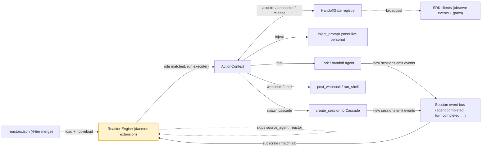

# Reactors

> **Declarative event→condition→action rules that run inside the jaato daemon: they watch each session's event bus and, when a rule matches, fire a Python action script that can spawn sessions, hand off to other agents, inject prompts, post webhooks, or coordinate via gates.**
> **Layer (bottom→top):** a top-tier reactive automation layer that sits *above* sessions and cascades — observing the events they emit and steering them in response · **Lives in:** PREMIUM `jaato-premium/jaato_premium/reactors/` (engine, rules, matcher, action_context, extension, installer, templating, watcher); docs in PUBLIC `jaato/docs/reactor-implementation.md` and `jaato/docs/reactor-tenant-guide.md`.

## What it is

A jaato agent session does its work by emitting a stream of typed events on an internal **event bus** — `agent.created`, `turn.completed`, `tool.call_completed`, `agent.completed`, `context.updated`, and so on. The **Reactor Engine** is a daemon-internal subscriber to that bus. It loads user-authored rules of the shape *"when this event type fires, and this condition holds, run this script"* and dispatches the matching action on a worker thread (`jaato-premium/jaato_premium/reactors/README.md:1-3`, `jaato/docs/reactor-tenant-guide.md:25-34`).

The reactor solves the problem of **event-driven orchestration without client-side glue**. Its primary use case is agent handoff: when one agent finishes, automatically start the next one, seeded with the first's history (implementer → reviewer → deployer) — with no SDK code in the client application (`jaato/docs/reactor-tenant-guide.md:34`, `jaato/docs/reactor-tenant-guide.md:41-55`). It is a jaato-premium feature and is **inactive by default**: a session with no `reactors.json` loads an empty rule list and incurs zero overhead.

Reactors are declarative at the rule layer (JSON) and imperative at the action layer (Python `execute()` functions). Rules are JSON documents; the side effects live in scripts that receive a rich `ActionContext`.

## Where it sits in the stack

Below the reactor is the **Session** and its **event bus** (every session gets one; the reactor subscribes to it via a session hook). Sideways and below sit **Cascades** — multi-stage agent pipelines — which reactors can *trigger* and *steer*: a reactor can spawn a cascade-attached session with `ctx.create_session(..., cascade_driver_id=...)` and become the cascade-client owner (`jaato-premium/jaato_premium/reactors/README.md:158-179`). Above and to the side sit **SDK clients** (Python/TS over IPC or WebSocket): they don't call the reactor, but they observe its effects as ordinary events, and they can subscribe to the daemon-wide **HandoffGate** broadcast channel (`gate.announced`/`gate.released`) to auto-attach to sessions reactors spawn (`jaato-premium/jaato_premium/reactors/README.md:217-227`). The reactor is wired in as a **daemon extension** (`jaato.extensions` entry point) that also owns the gate registry (`jaato-premium/jaato_premium/reactors/extension.py:1-17`, `extension.py:101-188`).

## Responsibilities

- Load and merge reactor rules from a four-tier chain and hot-reload the home file.
- Subscribe to each session's event bus and match incoming events against active rules.
- Build a flat **merged view** of each event so JMESPath `where` clauses can filter on envelope + payload fields.
- Run matched action scripts on a worker pool, isolating exceptions (logged and swallowed).
- Expose the `ActionContext` action surface (fork/spawn/inject/webhook/shell/emit/gate).
- Own the HandoffGate registry for cross-reactor coordination and external discovery.
- Install premium-shipped reactors (rule fragment + script) idempotently at daemon start.

## Key concepts & structure

### Rule model (`rules.py`)
A `Rule` is `id` + `MatchSpec` + `ActionSpec` + `enabled` (`jaato-premium/jaato_premium/reactors/rules.py:14-34`). `MatchSpec` is `event_type` (exact match, required) plus an optional JMESPath `where`. `ActionSpec` is `script` (path, required) plus a `params` dict. `parse_rules` enforces `version == 1` and the required fields, raising `ValueError` otherwise (`rules.py:37-75`).

### Matcher & merged view (`matcher.py`)
`build_merged_view` flattens an event into one dict with three hoist tiers, later winning on collision: (1) envelope fields (`event_id`, `event_type`, `timestamp`, `source_agent`); (2) top-level pydantic fields via `model_dump()` (inserted with `setdefault` so e.g. `SessionTerminatedEvent.reason` becomes matchable); (3) `event.payload` fields, which overwrite tier 2 to preserve the original contract for events like `AgentCompletedEvent` (`matcher.py:18-61`). `matches_where` runs the JMESPath expression and returns `False` (logged) on syntax errors (`matcher.py:64-75`).

### Engine & dispatch (`engine.py`)
`ReactorEngine.on_session_ready` merges rules and subscribes to the session bus with `EventFilter()` (match everything) (`engine.py:105-173`). `_dispatch` runs on the bus thread: it skips reactor-sourced events (`source_agent == "reactor"`) to prevent infinite loops, and for `agent.completed` it suppresses actions when the session's cascade was operator-cancelled (`engine.py:175-213`). Matched rules are submitted to a `SafeThreadPoolExecutor` (default 4 workers) (`engine.py:72-74`, `engine.py:213`). `_run_action` resolves the script via `resolve_script_path`, loads its `execute` symbol, substitutes params, builds the `ActionContext`, optionally wraps the call in AppArmor confinement, and never raises (`engine.py:251-313`).

### Action surface (`action_context.py`)
The `ActionContext` is what a reactor *can do*. Key methods (`jaato-premium/jaato_premium/reactors/README.md:135-146`): `inject_prompt(text)` (wake the session with a synthetic user message); `spawn_subagent(profile, task)` (child of the originating session); `create_session(...)` (independent top-level session, returns a `SpawnResult` with `session_id` + a `ready_event` Future — `action_context.py:21-58`); `fork_from_originating` / `fork_from_session` / `fork_from_waypoint` (the canonical handoffs — seed a new session under `target_agent` from existing history); `post_webhook`, `run_shell`, `emit_event` (publishes with `source_agent="reactor"`), and `gate(name, ...)` (get-or-create a `HandoffGate`). Properties expose `server`, `session_id`, `workspace_path`, `env`, `logger`.

### HandoffGate
A CAS-mutex + intent-metadata primitive solving producer-dedup, cross-reactor handoff, and external observability. `try_acquire(owner)` flips GREEN→RED; `announce(lease, intent)` emits `GateAnnouncedEvent`; `release(lease, outcome)` is idempotent. A built-in `GateAutoCompleter` releases on the spawned session's `agent.completed` when the intent carries `session_id`; a watchdog times out stuck gates; state persists atomically to `~/.jaato/handoff_gates.json` (`jaato-premium/jaato_premium/reactors/README.md:215-312`, `extension.py:157-168`).

### Extension & installer
`ReactorExtension.start()` writes an AppArmor fragment, installs premium-shipped reactors, constructs the gate registry, starts the watchdog + auto-completer, then starts the engine and registers its `on_session_ready` session hook (`extension.py:119-188`). `installer.py` discovers `jaato.premium_reactors` entry points and writes each `PremiumReactor` bundle idempotently to `~/.jaato/reactors/<name>.json` + `~/.jaato/scripts/<name>.py` (`installer.py:38-66`, `installer.py:139-171`).

## Lifecycle / flow

1. Daemon starts → `ReactorExtension.start()` installs premium reactors, wires the gate registry, and starts the `ReactorEngine` (`extension.py:119-188`).
2. Engine loads the **home tier** (`~/.jaato/reactors/*.json` fragments + `~/.jaato/reactors.json`) and starts a 2-second mtime poll watcher on the home single file (`engine.py:77-95`).
3. On each new session, the engine merges home + workspace tiers, filters to enabled rules, and subscribes to the session's event bus (`engine.py:105-173`).
4. A session emits an event → `_dispatch` builds the merged view, skips reactor-sourced and cascade-cancelled cases, then for each rule checks `event_type` and `where` (`engine.py:175-213`).
5. On a match, the action is enqueued on the worker pool; `_run_action` resolves + loads the script (reloaded fresh every dispatch), substitutes params, and calls `execute(params, event, ctx)` (`engine.py:251-309`).
6. The script acts via `ctx` (fork, inject, webhook, gate, …). Exceptions are logged and swallowed.

## Configuration / authoring

Rules live in `reactors.json` (`version: 1`) under `.jaato/`. The merge chain, later-wins-on-same-`id`, is: home fragments → home single file → workspace fragments → workspace single file (`jaato-premium/jaato_premium/reactors/README.md:337-358`, `rules.py:108-120`). The home single file is hot-reloaded every 2s; workspace rules are read once at session start. Scripts resolve via `resolve_script_path`: absolute → `<workspace>/.jaato/<path>` → `~/.jaato/<path>`. Params support `${event.<jmespath>}` and `${env.<NAME>}`; a whole-string single placeholder preserves type (`templating.py:18-39`, `README.md:205-213`).

```json
{
  "version": 1,
  "rules": [
    {
      "id": "implementer-to-reviewer",
      "match": {
        "event_type": "agent.completed",
        "where": "agent_id == 'implementer' && success == `true`"
      },
      "action": {
        "script": "reactors/handoff.py",
        "params": { "target_agent": "reviewer",
                    "message": "The implementer finished. Review the changes above." }
      }
    }
  ]
}
```

```python
# .jaato/reactors/handoff.py
def execute(params, event, ctx):
    result = ctx.fork_from_originating(target_agent=params["target_agent"])
    if result:
        ctx.inject_prompt(params["message"], target_session_id=result["session_id"])
```

(`jaato/docs/reactor-tenant-guide.md:141-173`)

## Relationship to neighboring components

- **Session / event bus (below):** the reactor is just another subscriber on the same bus SDK clients use; it attaches via a session hook and matches everything (`engine.py:162-173`).
- **Cascades (alongside/below):** reactors can trigger and steer cascades — `create_session(..., cascade_driver_id=...)` reuses warm pool slots and routes cascade lifecycle events back to `ReactorExtension._handle_cascade_event` (`README.md:158-179`, `extension.py:200-233`).
- **Personas / agents (steered):** forks resolve `target_agent` from `.jaato/agents/<name>.md` and a `profile` from `.jaato/profiles/<name>.yaml`; `inject_prompt` steers the live persona mid-flight (the drift monitor's nudge) (`README.md:139-140`).
- **SDK clients (above):** never call the reactor directly; they observe its effects as events and can subscribe to gate broadcasts to auto-attach (`jaato/docs/reactor-tenant-guide.md:462-489`).

## Example

The premium **drift_monitor** reactor (`jaato-premium/jaato_premium/drift_monitor/reactor_logic.py`) ships via the `jaato.premium_reactors` entry point and matches `plan.step_updated`, `agent.output`, and `turn.completed`. `agent.output` chunks accumulate the model's reasoning text per session; `plan.step_updated` is the primary scoring trigger (it scores the buffer against the *outgoing* step before applying the transition); `turn.completed` is the fallback for multi-turn steps (`reactor_logic.py:105-181`). When a step's accumulated text scores low against its goal, `_flush_and_score` emits a `drift.measured` event via `ctx.emit_event` and, if flagged, calls `ctx.inject_prompt` with a deliberately conversational nudge ("Heads up — your last turn scored low against the active plan step…") so the live agent self-corrects rather than reading it as a refusal (`reactor_logic.py:69-75`, `reactor_logic.py:184-269`). Per-session `DriftState` survives the per-dispatch script reload by living in the importable module, not the deployed script body (`reactor_logic.py:1-37`, `reactor_logic.py:78-94`).

## Diagram



## Diagram brief (for illustration)

- **Layout:** hub-and-spoke with a left-to-right action fan-out. Center-left is the daemon containing the reactor; right side shows the actions it fires. A thin "config" strip feeds in from the top-left.
- **Boxes:**
  - **Session event bus** (left): a vertical lane labeled "Session event bus" with small event chips stacked inside — `agent.completed`, `turn.completed`, `tool.call_completed`, `context.updated`, `plan.step_updated`.
  - **Reactor Engine** (center, the emphasized box): a rounded box labeled "Reactor Engine (daemon extension)" containing three inner sub-boxes in a row — "Matcher: event_type + JMESPath where", "Merged view (envelope + payload)", "Worker pool (4 threads)".
  - **Rules store** (top-left, feeding in): a small document icon labeled "reactors.json (4-tier merge: home frags → home → ws frags → ws)".
  - **ActionContext** (center-right): a box labeled "ActionContext" that the worker pool hands off to.
  - **Action targets** (right column, four boxes fanning out from ActionContext): "Fork / handoff agent (reviewer→deployer)", "inject_prompt (steer live persona)", "create_session → Cascade", "post_webhook / run_shell".
  - **HandoffGate registry** (bottom-center): a box labeled "HandoffGate registry (~/.jaato/handoff_gates.json)" with a small broadcast icon labeled "gate.announced / gate.released".
  - **SDK clients** (far right, dashed): "SDK clients (observe events + gate broadcasts)".
- **Arrows:**
  - Session event bus → Reactor Engine, labeled "subscribe (match everything)".
  - Rules store → Reactor Engine, labeled "load + hot-reload (2s)".
  - Reactor Engine → ActionContext, labeled "rule matched → run execute()".
  - ActionContext → each of the four Action targets (fan-out), labeled respectively "fork", "inject", "spawn cascade", "webhook/shell".
  - ActionContext ↔ HandoffGate registry, bidirectional, labeled "acquire / announce / release".
  - HandoffGate registry → SDK clients (dashed), labeled "broadcast".
  - A curved dashed self-loop on the Reactor Engine labeled "skips source_agent=reactor (no loops)".
  - "Fork / handoff agent" and "create_session → Cascade" arrows loop back to the Session event bus, labeled "new sessions emit events".
- **Emphasis:** highlight the **Reactor Engine** box (bold border / accent fill); make the event-bus → engine → ActionContext → action-targets path the visual spine.
- **Caption:** "Reactors: declarative event→condition→action rules in the daemon that observe the session bus and fire handoffs, prompt-injections, cascades, and webhooks."

## Source references
- `jaato-premium/jaato_premium/reactors/rules.py:14-75` — `Rule` / `MatchSpec` / `ActionSpec` model, parsing, and `version==1` validation.
- `jaato-premium/jaato_premium/reactors/matcher.py:18-75` — three-tier merged view builder and JMESPath `where` evaluation.
- `jaato-premium/jaato_premium/reactors/engine.py:105-213` — session subscription, `_dispatch` matching, loop/cancel suppression, worker-pool submit.
- `jaato-premium/jaato_premium/reactors/engine.py:251-313` — `_run_action`: script resolution, param substitution, ActionContext build, AppArmor wrap, exception swallowing.
- `jaato-premium/jaato_premium/reactors/extension.py:101-233` — `ReactorExtension` lifecycle (registry, watchdog, engine, session hook) and cascade-as-client handler.
- `jaato-premium/jaato_premium/reactors/installer.py:38-171` — `PremiumReactor` bundle + idempotent install of fragment + script via the `jaato.premium_reactors` entry point.
- `jaato-premium/jaato_premium/reactors/README.md:135-179` — ActionContext method table and cascade-as-client wiring.
- `jaato-premium/jaato_premium/drift_monitor/reactor_logic.py:105-269` — concrete reactor: event routing, scoring, `emit_event`, and `inject_prompt` nudge.
