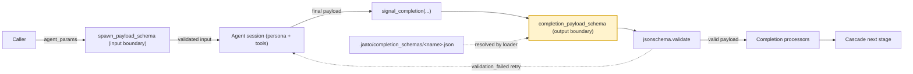

# Completion schemas

> **A JSON Schema, declared on an agent profile as `completion_payload_schema`, that the agent's final structured result must satisfy when it calls `signal_completion`.**
> **Layer (bottom→top):** the output-contract layer — it types the *output* boundary of an agent session, the mirror of the spawn schema that types the *input* boundary · **Lives in:** `jaato/jaato-server/shared/completion_schema_loader.py`, `shared/lifecycle_tools.py`, `shared/plugins/subagent/config.py`; schema files live under `.jaato/completion_schemas/`.

## What it is

An agent typically ends a turn by emitting free-form text. That is fine for a chat session, but useless when the agent is one stage of an automated cascade and the *next* stage needs structured data from it. A completion schema solves this: it declares, as JSON Schema (draft-07), the exact shape of the agent's final result.

A profile sets the field `completion_payload_schema` (in `shared/plugins/subagent/config.py:967` it is `Optional[Union[str, Dict[str, Any]]]`). The value is either an inline schema dict or a string path resolved by `resolve_completion_schema()` through three tiers — absolute, then `<config_root>/<path>` or `<workspace>/.jaato/<path>`, then `~/.jaato/<path>` (`completion_schema_loader.py:104-186`). The canonical convention is a config-root-relative path that already includes the `completion_schemas/` subdir, e.g. `"completion_payload_schema": "completion_schemas/refund.json"` (`completion_schema_loader.py:115-117`).

Declaring the schema does two things. First, it makes the `signal_completion` tool *eligible* for that session. Visibility is governed by `_should_hide_signal_completion`, which has **two independent gates, either of which hides the tool** (`lifecycle_tools.py:449-508`): (1) **no schema declared** → hidden (applies to root *and* subagent sessions); (2) an **interactive-root filter** → a root session reached by an interactive client (`client_type ∈ {TERMINAL, WEB, CHAT}`) hides it, because interactive clients expect the session to stay open for more turns. The corollaries matter for cascades: **headless API clients** (`client_type=API`) and **subagents** keep the tool whenever a schema is declared — which is exactly the cascade/one-shot-orchestrator path. So the rule is: shown iff *a schema is declared* AND *(the session is a subagent OR a non-interactive/API root)*. Second, declaring the schema rewrites that tool's parameters so the schema's top-level properties become the tool's *flat* arguments (no `payload` wrapper), which mitigates the model emitting one giant stringified nested arg (`lifecycle_tools.py:15-21`).

## Where it sits in the stack

Below it is the **profile / persona** layer that declares the field and the `JaatoSession` that resolves it. Above it sit the consumers of the validated result: **completion processors** and **cascade stages**, which gate transitions on a stage producing a valid payload. A completion processor (kb-authored Python, run only after schema validation passes — `lifecycle_tools.py:739-758`) offers **two distinct author surfaces** — a `render` surface that *produces/persists* an artifact and a `validate` surface that *gates/audits* the payload — and a module may expose one or both (see [completion processors](14-completion-processors.md)). Sideways it is symmetric with the **spawn schema** (`spawn_payload_schema`, resolved by `spawn_schema_loader.py`): the spawn schema types what an agent *consumes* via `agent_params`; the completion schema types what it *produces* via `signal_completion`.

## Responsibilities

- Declare the typed shape of an agent's final result (JSON Schema draft-07).
- Resolve from an inline dict or a tiered `.jaato/completion_schemas/` path.
- Drive the `signal_completion` tool's wire parameters and gate its visibility.
- Be validated server-side via `jsonschema.validate` before the completion event fires.
- Provide the contract that cascade stages and completion processors depend on.

## Key concepts & structure

### The profile field — `completion_payload_schema`
Documented at `config.py:908-917`: an inline dict or a path under the `.jaato/completion_schemas/` tier. When set, `signal_completion`'s parameters carry the schema so providers can enforce it at sampling time and `LifecycleTools` validates the payload server-side before emitting `AgentCompletedEvent`. When `None`, the legacy `summary: str` parameter is used. Inheritance follows the scalar-override rule (parents must agree or the child overrides — `config.py:1599-1610`).

### The resolver — `resolve_completion_schema()`
Returns the parsed schema dict, or `None` on any failure (missing file, invalid JSON, non-object root). Failures are logged at WARNING and the caller falls back to the untyped `summary` path (`completion_schema_loader.py:29-101`).

### Enforcement — `signal_completion` and `_execute_signal_completion`
On each call the incoming `args` dict **is** the payload; it is validated with `jsonschema.validate(instance=payload, schema=self._payload_schema)` (`lifecycle_tools.py:713-715`). On `ValidationError` the tool returns `{"error": "validation_failed", ..., "validation_error": ..., "schema_path": ...}` to the model — no event is emitted — so the model can self-correct next turn (`lifecycle_tools.py:716-731`). On success it forwards the validated payload to `hooks.on_agent_completed(payload=...)` and terminates the turn. A session-level idempotency guard makes a second `signal_completion` a no-op, so a manual call cannot double-fire the cascade if the framework already auto-synthesized one (`lifecycle_tools.py:650-666`).

### The accumulator triple — `prepare_completion`, `query_completion`, arg-less `signal_completion`
**Two paths to the same completion.** A capable, large-context model can hold every value it has discovered in working memory and emit the entire structured payload in **one** `signal_completion(<full payload>)` call — *compose-then-signal*. That is the default and the right path whenever the model can reliably produce a large nested object in a single tool emission.

The **accumulate-then-signal** path — `prepare_completion` one field at a time, `query_completion` to inspect, arg-less `signal_completion()` to finish — exists for when one-shot emission **isn't viable**, which happens for two *independent* reasons:

1. **Composition collapse — a model-capability axis.** Small models can't assemble a whole nested object in one tool call: at temp=0, qwen3-14b collapses to `args={}` when forced to emit the entire completion at once, even though it can produce each piece individually (`lifecycle_tools.py:242-257`). Building one field per call sidesteps the collapse.
2. **Near-overflow context at finalize — a runtime-state axis, capability-agnostic.** On a long cascade even a large, capable model can reach a point where forcing its *next* turn to emit `signal_completion` would ship a now-oversized request and 400. Here the accumulator pairs with the `auto_finalize_on_complete` quirk (below): the framework synthesizes the completion from accumulated state **server-side, with no further model round-trip**, ending the turn before the oversized request is built.

Same output contract, two ways in: compose it in one shot when you can, accumulate it field-by-field when one-shot isn't viable — a weak composer (reason 1) *or* a near-full context window at finalize (reason 2, any model).

So **whenever a `completion_payload_schema` is declared**, `get_tool_schemas()` registers two sibling tools alongside `signal_completion` and both are auto-approved (`lifecycle_tools.py:344-437`, `564-574`):

- **`prepare_completion(field_path, value)`** — set exactly **one** field per call into session-tier *accumulated* state. `field_path` is dot-notation with `[idx]` array indices (`service`, `stack_config.language`, `endpoints[0].operation`, `endpoints[2]` to set a whole element). Both args are required *by design* — the earlier single-`partial`-object shape had `{}` as a minimum-cost valid emission, which is exactly the collapse it exists to prevent (`lifecycle_tools.py:979-1016`). The value is validated against the schema's type for that path (with `required[]` relaxed so partials are legal); the call returns `accepted` (the path:value set), `rejected` (path:reason on a type/structure miss), `pending_required_fields_with_descriptions` (what's still missing), and `is_complete` (`lifecycle_tools.py:1018-1192`).
- **`query_completion()`** — read-only inspect of accumulated state. Returns `accumulated`, `pending_required_fields_with_descriptions`, and `is_complete` without mutating anything; for when the model loses track of what it has contributed or wants to confirm completeness before finalizing (`lifecycle_tools.py:415-437`).
- **arg-less `signal_completion()`** — when called with **no args** and accumulated state exists, the framework synthesizes the payload from accumulated, runs the same `jsonschema.validate`, and finalizes. If anything required is still missing it rejects with the same `validation_failed` shape plus `pending_required_fields_with_descriptions`, so the model knows what to `prepare_completion` next (`lifecycle_tools.py:638-707`). The legacy single-shot `signal_completion(<full payload>)` path is unchanged and remains the right call for capable models.

The contract is "readFile-style": transcribe one observation per call across many turns, `query_completion` to check, then arg-less `signal_completion` to finish.

### Auto-complete — `auto_finalize_on_complete` and the composite `is_complete`
`is_complete` is a **composite** of two layers. The **structural floor** is the schema's `required[]` (all present → floor met). On top of it, `phase: "completeness"` completion processors add a **semantic** layer: they inspect the accumulated payload against run-specific signals and return `incomplete[]` messages — surfaced to the model as neutral `still_needed` guidance (no retry penalty, no hard block), which keep `is_complete` False until cleared. The gate runs only once the cheap floor check passes, so it fires ~once near the end rather than per field (`lifecycle_tools.py:877-963`, `1163-1196`). See [completion processors](14-completion-processors.md) for the `finalization` vs `completeness` phase split.

When the composite `is_complete` flips True **and** the profile opts in via the `auto_finalize_on_complete` provider quirk (default off — completeness can be used for guidance alone), the last `prepare_completion` synthesizes `signal_completion()` **in-process, with no model round-trip** (`lifecycle_tools.py:965-977`, `1198-1228`). This is the load-bearing fix for context-overflow-at-finalize: forcing the model's *next* turn to emit `signal_completion` would still ship the now-oversized request and 400; synthesizing server-side sets `_signal_completion_called` so the turn ends *before* the next request is built. The result carries `auto_finalized: True` (and `auto_finalize_rejected` if a finalization processor still blocked it).

### Authoring conventions (from `docs/design/payload-schema-conventions.md`)
- **Always carry `warnings[]` and `errors[]`** — optional string arrays, the sanctioned advisory escape hatches; completion schemas default to `additionalProperties: false` *plus* these two fields (§3.2.1). Their absence caused retry-driven non-determinism when a persona instructed the agent to emit warnings the schema then rejected (§3.2.2).
- **Persona ↔ schema consistency** — grep the `.jaato/agents/<name>.md` persona against the schema: "emit field X" ⇒ X must be declared; "flag any deviation" ⇒ `warnings[]` required (§4).
- **Canonical-hash strip** — in determinism tests, strip `warnings`, `errors` (and `timestamp`, plus per-entry advisory sub-fields) before hashing (§5).
- **Strict mode needs model support** — the schema only constrains the post-hoc validate check *unless* the model supports grammar-constrained sampling (Anthropic `strict: true`, OpenRouter structured-outputs list). jaato's plugins do not auto-set `strict: true`; on unsupported models adherence is best-effort and a cascade depending on `const`/`enum`/`additionalProperties: false` must pick a strict-capable model (`lifecycle_tools.py:33-82`).

## Lifecycle / flow

1. A profile declares `completion_payload_schema`.
2. At session configure, `LifecycleTools` calls `resolve_completion_schema()` and caches the dict.
3. `get_tool_schemas()` exposes `signal_completion` with the schema as its flat parameters (and, when a schema exists, `prepare_completion` / `query_completion` for multi-turn accumulation — `lifecycle_tools.py:344-437`).
4. The agent finalizes one of two ways: **single-shot** — `signal_completion(<fields>)` as its last action; or **accumulator** — repeated `prepare_completion(field_path, value)` calls (optionally `query_completion()` to inspect), then arg-less `signal_completion()` once `is_complete` is True.
5. `_execute_signal_completion` validates the payload (typed or accumulated-synthesized) via `jsonschema`; on failure it returns a structured error and the agent retries within `max_turns`.
6. On success, completion processors run, `AgentCompletedEvent` fires (idempotency-guarded), and the turn terminates. If the profile sets `auto_finalize_on_complete`, step 4's final `prepare_completion` performs steps 5–6 server-side the moment the composite `is_complete` flips — no extra model turn.

## Configuration / authoring

```yaml
# .jaato/profiles/refund.yaml
name: refund
completion_payload_schema: completion_schemas/refund.json   # points to the JSON-Schema file below
```

```json
// .jaato/completion_schemas/refund.json
{
  "$schema": "http://json-schema.org/draft-07/schema#",
  "type": "object",
  "additionalProperties": false,
  "required": ["decision", "amount"],
  "properties": {
    "decision": { "type": "string", "enum": ["approve", "deny"] },
    "amount":   { "type": "number" },
    "warnings": { "type": "array", "items": { "type": "string" } },
    "errors":   { "type": "array", "items": { "type": "string" } }
  }
}
```

## Relationship to neighboring components

The **spawn schema** (`spawn_payload_schema`, `spawn_schema_loader.py`) is the symmetric input boundary: it validates the `agent_params` dict at the spawn boundary *before* the session is created, so caller mistakes fail loud and cheap; the completion schema validates the output and on failure can only let the model retry (`payload-schema-conventions.md` §1, table at lines 67-71). The two loaders are kept deliberately separate so each file-root convention stays visible (`spawn_schema_loader.py:21-24`). Downstream, **completion processors** consume the validated payload, and **cascade stages** use a valid completion payload as the gate for advancing to the next stage.

## Example

A cascade stage `auto_underwriter` declares `completion_payload_schema: "completion_schemas/underwriting.json"` requiring `decision` and `risk_band`. The model finishes and calls `signal_completion(decision="approve", risk_band="B", warnings=["postal code defaulted"])`. The server runs `jsonschema.validate` — it passes (the `warnings[]` escape hatch is declared, so the advisory note isn't rejected). The validated payload flows to `on_agent_completed`, completion processors render the underwriting artifact, and the cascade advances to the pricing stage, which itself was spawned with a *spawn* schema mirroring the keys the underwriter produced. Had `decision` been omitted, validation would have returned `validation_failed` and the underwriter would retry rather than poison the downstream stage.

## Diagram



## Diagram brief (for illustration)

- **Layout:** horizontal "sandwich" flow, left-to-right, with a validation gate emphasized on the right.
- **Boxes:**
  - Left: `Caller` (small).
  - Left-center gate: `spawn_payload_schema` (input boundary) — slim vertical bar.
  - Center: large box `Agent session` (persona + tools).
  - Right-center gate: `completion_payload_schema` (output boundary) — slim vertical bar, **highlighted**.
  - Inside/under the output gate: a small box `jsonschema.validate` and a small box `signal_completion(...)`.
  - Right: stacked consumers `Completion processors` and `Cascade next stage`.
  - Bottom: a file box `.jaato/completion_schemas/<name>.json` with a dashed arrow up to the output gate, labeled "resolved by completion_schema_loader".
- **Arrows:**
  - `Caller` → input gate, label "agent_params".
  - input gate → `Agent session`, label "validated input".
  - `Agent session` → `signal_completion(...)` → output gate, label "final payload".
  - output gate → `jsonschema.validate`; on pass → `Completion processors` → `Cascade next stage` (label "valid payload").
  - From `jsonschema.validate` a curved back-arrow to `Agent session`, label "validation_failed → retry".
- **Emphasis:** highlight the right-side `completion_payload_schema` output gate and the `validation_failed → retry` loop; show the input/output gates as a visually matched pair to convey symmetry.
- **Caption:** "Completion schemas type the output boundary of an agent — validated at `signal_completion` before the payload reaches processors or the next cascade stage."

## Source references
- `jaato-server/shared/completion_schema_loader.py:29-101` — `resolve_completion_schema()`: inline-dict vs string-path, returns `None` on failure.
- `jaato-server/shared/completion_schema_loader.py:104-186` — three-tier path resolution; canonical `completion_schemas/<name>.json` form.
- `jaato-server/shared/plugins/subagent/config.py:908-917, 967` — the `completion_payload_schema` profile field and its docstring.
- `jaato-server/shared/lifecycle_tools.py:713-731` — `jsonschema.validate` of the payload; structured `validation_failed` error on mismatch.
- `jaato-server/shared/lifecycle_tools.py:242-257` — `_accumulated_payload`: the session-tier state behind the `prepare_completion` / `query_completion` / arg-less `signal_completion` triple, and the small-model composition-burden it addresses.
- `jaato-server/shared/lifecycle_tools.py:344-437, 564-574` — registers `prepare_completion` / `query_completion` only when a schema is declared, and auto-approves both.
- `jaato-server/shared/lifecycle_tools.py:638-707` — arg-less `signal_completion`: synthesize from accumulated, validate, or reject with `pending_required_fields_with_descriptions`; `650-666` idempotency guard.
- `jaato-server/shared/lifecycle_tools.py:979-1228` — `_execute_prepare_completion`: one field per call (`field_path`+`value`), path/type validation, composite `is_complete`, and the `auto_finalize_on_complete` in-process synthesis.
- `jaato-server/shared/lifecycle_tools.py:877-963` — `_run_completeness_gate`: `phase: "completeness"` processors contribute `incomplete[]`/`still_needed` to the composite `is_complete` (semantic layer over the `required[]` floor).
- `jaato-server/shared/lifecycle_tools.py:449-508` — `_should_hide_signal_completion`: two gates (no-schema → hide; interactive-root → hide, but `client_type=API` and subagents keep it).
- `jaato-server/shared/lifecycle_tools.py:33-82` — strict-mode is model-dependent; schema is advisory at sampling time without provider support.
- `jaato-server/shared/spawn_schema_loader.py:1-24` — symmetric `spawn_payload_schema` resolver (input boundary).
- `jaato/docs/design/payload-schema-conventions.md:67-71, 168-205, 237-285` — enforcement table, mandatory `warnings[]`/`errors[]`, canonical-hash strip rules.
