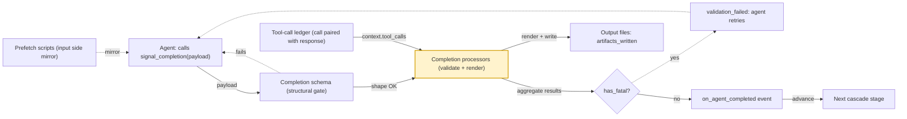

# Completion processors

> **An output-side hook: a profile-declared chunk of kb-authored Python that runs after an agent calls `signal_completion`, taking the validated completion payload and either rendering it to a file, validating its claims against what actually happened, or both.**
> **Layer (bottom→top):** the output-side post-processor — runs *after* the completion payload passes schema validation, *before* the turn's completion event is emitted and before any downstream cascade stage advances · **Lives in:** `jaato` (PUBLIC) · `jaato-server/shared/completion_processors.py`, wired from `jaato-server/shared/lifecycle_tools.py`, configured via `jaato-server/shared/plugins/subagent/config.py`

## What it is

When a jaato agent decides it is done, it calls the framework lifecycle tool `signal_completion` with a typed payload. The framework first checks that payload against the profile's `completion_payload_schema` (a structural JSON-Schema check). That check only proves the *shape* is right — it cannot know whether the files the agent *claimed* to write actually exist, whether the produced text should be persisted to disk, or whether a downstream cascade stage needs a derived artifact. Completion processors fill that gap.

A completion processor is a Python module under `.jaato/scripts/processors/` that exposes one or both of two top-level callables: `render(payload, context) -> str | bytes` produces output content (optionally written to a file), and `validate(payload, context) -> list[str]` returns error strings that, if non-empty, block the completion (`completion_processors.py`). The framework probes which symbols a module defines and dispatches accordingly; a module exposing neither is a kb authoring error surfaced at completion time, never silently (`completion_processors.py`).

This is the symmetric counterpart to prefetch scripts on the input side: prefetch scripts run before a turn to build context, completion processors run after a turn to consume/validate/route the result. Both share the same plumbing — kb Python under `.jaato/scripts/`, resolved via `script_loader`, run at the same trust level as the runner subprocess, not sandboxed (`completion_processors.py`).

## Where it sits in the stack

Directly *below / before* it is the **completion schema** (`completion_payload_schema`): `signal_completion` runs `jsonschema.validate(instance=payload, schema=...)` first, and processors only fire once that passes (`lifecycle_tools.py`, `lifecycle_tools.py`). Directly *above / after* it is the agent's **completion event** and the **cascade** — when all processors pass, `signal_completion` calls the UI hook `on_agent_completed`, which is what lets a multi-stage cascade advance to the next agent (`lifecycle_tools.py`). Sideways, processors consume the session's **tool-call ledger** (every `function_call` paired with its `function_response`) so a validator can cross-check payload claims against what tools actually returned (`completion_processors.py`).

## Responsibilities

- Own the post-completion hook surface: take the schema-validated payload and *do something* with it (transform, persist, audit, validate, gate).
- Render output: when an entry declares an `output:` path template, write the `render` return to disk atomically (`.tmp` + `os.replace`) (`completion_processors.py`).
- Validate semantics: run `validate`, collect error strings, and block completion per the entry's `on_error` policy (`completion_processors.py`).
- Build the tool-call ledger so validators can cross-reference claims vs. reality (`completion_processors.py`).
- Aggregate every processor's outcome — never short-circuit — so the agent sees the full error set on one retry (`completion_processors.py`, `lifecycle_tools.py`).

## Key concepts & structure

### `CompletionProcessor` (the config entry)
The dataclass a profile declares per processor (`config.py`). Fields:
- `script` (required) — kb Python path, resolved via `script_loader`'s tier: absolute → `<config_root>/<path>` → `~/.jaato/<path>` (`config.py`, `script_loader.py`).
- `output` (optional) — a path template with `{field}` placeholders; `None` means run for side-effect / validation only (`config.py`).
- `on_error` — `"fail_completion"` (default) or `"warn"` (`config.py`).
- `description` — human note, ignored at runtime (`config.py`).
- `phase` — `"finalization"` (default) or `"completeness"` (`config.py`).

### `render` and `validate` (the kb author contract)
`render(payload, context)` returns `str`/`bytes`; written to disk when `output:` is set, else logged for audit (`completion_processors.py`). `validate(payload, context)` returns a list of error strings, OR (server 0.6.160+) a `ProcessorResult` TypedDict `{"errors": [...], "warnings": [...], "incomplete": [...]}`: `errors` route through the `on_error` bucket, `warnings` are always advisory, `incomplete` gates completeness (`completion_processors.py`).

### The tool-call ledger (`build_tool_call_ledger`)
Walks `JaatoSession.get_history()`, pairs each `function_call` with its `function_response` by `call_id`, and emits a stable dict per call: `name`, `args`, `result`, `success` (`"error" not in result`), `call_id`, `turn_index`, `enrichment_metadata` (`completion_processors.py`). Unpaired (still-pending) calls surface as `success=False`, `result={"error": "no_response"}` (`completion_processors.py`). A validator reads this via `context.tool_calls`.

### `RenderContext`
The context object passed to both callables, carrying `workspace_path`, `config_root`, `agent_params`, and the pre-computed `tool_calls` ledger (`completion_processors.py`; built by `build_render_context` in `lifecycle_tools.py`).

### `ProcessorInvocationResult`
Outcome of a run, with three (well, four) buckets: `written` (file paths; `""` sentinel for render-only-no-output), `warned`, `failed`, and `incomplete` (`completion_processors.py`). `has_fatal` is true iff `failed` is non-empty.

### Phases: finalization vs. completeness
`phase: "finalization"` (default) processors run only at `signal_completion`. `phase: "completeness"` processors run *during* `prepare_completion` (mid-accumulation), and their `incomplete[]` entries gate the composite `is_complete` verdict without penalty — semantic "still needed" guidance rather than a hard reject (`config.py`, `lifecycle_tools.py`). `invoke_processors` takes a `phase_filter` so each call site runs only its phase (`completion_processors.py`).

## Lifecycle / flow

1. Agent calls `signal_completion` with a payload.
2. Framework runs `jsonschema.validate(payload, completion_payload_schema)`; on failure it returns `validation_failed` and processors never run (`lifecycle_tools.py`).
3. If the schema passes and the profile declares `completion_processors`, the framework lazily loads them once per session via `load_processors` (resolve path → import → probe for `render`/`validate`) (`lifecycle_tools.py`).
4. It builds the tool-call ledger from session history and a `RenderContext` (`lifecycle_tools.py`).
5. It calls `invoke_processors(..., phase_filter="finalization")`. For each processor: `validate` runs first (cheap, no side-effects), then `render` (and a write if `output:` is set). Every processor runs even if a prior one failed (`completion_processors.py`).
6. If any `on_error="fail_completion"` failure fired (`has_fatal`), `signal_completion` returns `{"error": "validation_failed", "processor_errors": [...]}` so the model self-corrects and retries within `max_turns` (`lifecycle_tools.py`).
7. `warn`-policy failures are logged but do not block (`lifecycle_tools.py`).
8. On success, `on_agent_completed` fires; any written paths are reported as `artifacts_written` in the result (`lifecycle_tools.py`).

## Configuration / authoring

A profile (`SubagentProfile` / `.jaato/profiles/*.yaml`) declares a `completion_processors` **list**, parsed by `_parse_completion_processors` (`config.py`). A single profile composes **several processors with different roles** in that one list — they all run per completion and their outcomes aggregate (never short-circuit; `completion_processors.py`).

Each entry needs only `script`; every other field defaults (`CompletionProcessor`, `config.py`):

| field | required? | default | what it controls |
|---|---|---|---|
| `script` | **yes** | — | the kb Python module — *its exposed `render`/`validate` symbols ARE the entry's role* |
| `output` | no | `None` | render target path (`{field}` templated); `None` → side-effect / validation-only |
| `on_error` | no | `fail_completion` | how hard a failure blocks: `fail_completion` (return `validation_failed` → model retries) vs `warn` (log, let completion proceed) |
| `phase` | no | `finalization` | *when* it runs: `finalization` (at `signal_completion`) vs `completeness` (during `prepare_completion`) |
| `description` | no | `None` | human note; runtime-ignored |

The **role** is the surface the module exposes — a **validator** (`validate` → gate/audit) or a **renderer** (`render` → produce/persist), or both. `phase` and `on_error` are *orthogonal modifiers*, not roles: the same validator runs as a soft completeness gate or a hard finalization block depending only on `phase`/`on_error`. Invalid `on_error` or `phase` values don't error — they fall back to the default with a logged warning (`config.py`); a module exposing **neither** `render` nor `validate` is a hard kb-authoring error surfaced at completion time (`completion_processors.py`).

```yaml
completion_processors:
  - script: scripts/processors/discovery_coverage.py   # validator, completeness phase
    phase: completeness                                 #   → still_needed[] soft-gate during accumulation
  - script: scripts/processors/codegen_files_exist.py  # validator, finalization phase (all defaults)
    on_error: fail_completion                           #   → hard-blocks signal_completion on a false claim
  - script: scripts/processors/render_audit.py         # renderer
    output: "out/{case_id}/audit.log"                   #   → persists an artifact (atomic .tmp + rename)
    description: Persist an audit record per case
```

Two validators (one completeness-phase soft gate, one finalization-phase hard gate) **plus** one renderer, in a single profile — distinct roles composed in one list. The script files live under `.jaato/scripts/processors/` and are plain kb Python — yes, processors *are* custom user scripts (`config.py`). Across a parent→child profile cascade, processor lists **concatenate**, so a child inherits the parent's processors and appends its own (`config.py`).

## Relationship to neighboring components

The **completion schema** is the structural gate immediately below; processors are the *semantic* gate that runs only after it passes. **Prefetch scripts** are the mirror-image hook on the input side (pre-turn context building). The **cascade** is what consumes a clean completion: a passing processor run lets `on_agent_completed` fire and the next cascade stage start; a failing one keeps the agent in its own loop. The **tool-call ledger** and `RenderContext` are the bridge that lets a processor compare the agent's claimed output against the actual tool history.

## Example

From the test suite, a validator that catches a fabricated claim. The profile wires `scripts/processors/files_exist.py`; the agent claims it rendered `src/Customer.java`, but the `renderTemplateToFile` tool call for that path actually returned `{"error": "shape validation failed"}`. The validator reads `context.tool_calls`, finds the failed call, and returns an error string:

```python
def validate(payload, context):
    failed = {tc['args'].get('output_path'): tc['result'].get('error')
              for tc in context.tool_calls
              if tc['name'] == 'renderTemplateToFile' and not tc['success']}
    return [f"{op}: failed with {err}"
            for f in payload.get('files', [])
            for op in [f.get('output_path')]
            if op in failed
            for err in [failed[op]]]
```

`signal_completion` then returns `{"error": "validation_failed", "processor_errors": [...]}` containing `src/Customer.java ... shape validation failed`, and the agent is forced to retry instead of finishing on a false claim (`test_completion_processors.py`). A render counterpart writes `f'summary: {payload["summary"]}'` to `report.md` and surfaces it as `artifacts_written` (`test_completion_processors.py`).

## Diagram



## Diagram brief (for illustration)

- **Layout:** horizontal left-to-right flow with one vertical fan-out in the middle (a sequence/pipeline shape).
- **Boxes (left to right):**
  1. `Agent` (rounded) — "calls signal_completion(payload)".
  2. `Completion schema` (rectangle) — "jsonschema.validate vs completion_payload_schema (STRUCTURAL gate)".
  3. `Completion processors` (large highlighted rectangle, the focus) — inside it stack three sub-rows: `validate(payload, context) → list[str]`, `render(payload, context) → str|bytes`, and a small note `loaded from .jaato/scripts/processors/`.
  4. Below/feeding into box 3: a side box `Tool-call ledger` (rounded) — "function_call ↔ function_response paired by call_id; success flag".
  5. To the right of box 3, a decision diamond `has_fatal?`.
  6. From the diamond, two outputs: down-arrow to `validation_failed → agent retries (max_turns)`; right-arrow to `on_agent_completed event`.
  7. Far right: `Next cascade stage` (rectangle) and a small `output file(s) → artifacts_written` cylinder.
- **Arrows:**
  - Agent → Completion schema, label "payload".
  - Completion schema → Completion processors, label "passes (shape OK)".
  - Completion schema → (loop back to Agent), label "fails → validation_failed" (dashed).
  - Tool-call ledger → Completion processors, label "context.tool_calls".
  - Completion processors → has_fatal? label "aggregate all results".
  - has_fatal? → Agent retry, label "yes" (dashed, red).
  - has_fatal? → on_agent_completed, label "no".
  - Completion processors → output cylinder, label "render + output: → write (.tmp+rename)".
  - on_agent_completed → Next cascade stage, label "advance".
- **Emphasis:** highlight box 3 (Completion processors) with a colored border; gray out neighbors. Add a faded "mirror" ghost box labeled "Prefetch scripts (input side)" above the Agent to show the symmetry.
- **Caption:** "Completion processors: the output-side hook that validates, persists, and gates an agent's completion payload — after the schema, before the cascade advances."

## Source references
- `jaato-server/shared/completion_processors.py` — module docstring: the `render`/`validate` kb author contract, output-write behaviour, trust boundary.
- `jaato-server/shared/completion_processors.py` — `build_tool_call_ledger`: pairs calls/responses by `call_id`, the stable ledger dict shape.
- `jaato-server/shared/completion_processors.py` — `load_processors`: path resolution, symbol probing, no-symbol load error.
- `jaato-server/shared/completion_processors.py` — `invoke_processors`: validate-then-render, `ProcessorResult` shapes, phase filter, atomic write, error bucketing.
- `jaato-server/shared/lifecycle_tools.py` — `signal_completion`: schema validate → load → ledger → invoke (finalization) → fatal blocks/retry → `on_agent_completed`.
- `jaato-server/shared/plugins/subagent/config.py` — `CompletionProcessor` dataclass: `script`, `output`, `on_error`, `description`, `phase`.
- `jaato-server/shared/plugins/subagent/config.py` — `_parse_completion_processors`: profile config → entries; field validation/defaults.
- `jaato-server/shared/tests/test_completion_processors.py` — end-to-end: validator reads `context.tool_calls`, blocks a fabricated completion claim.
