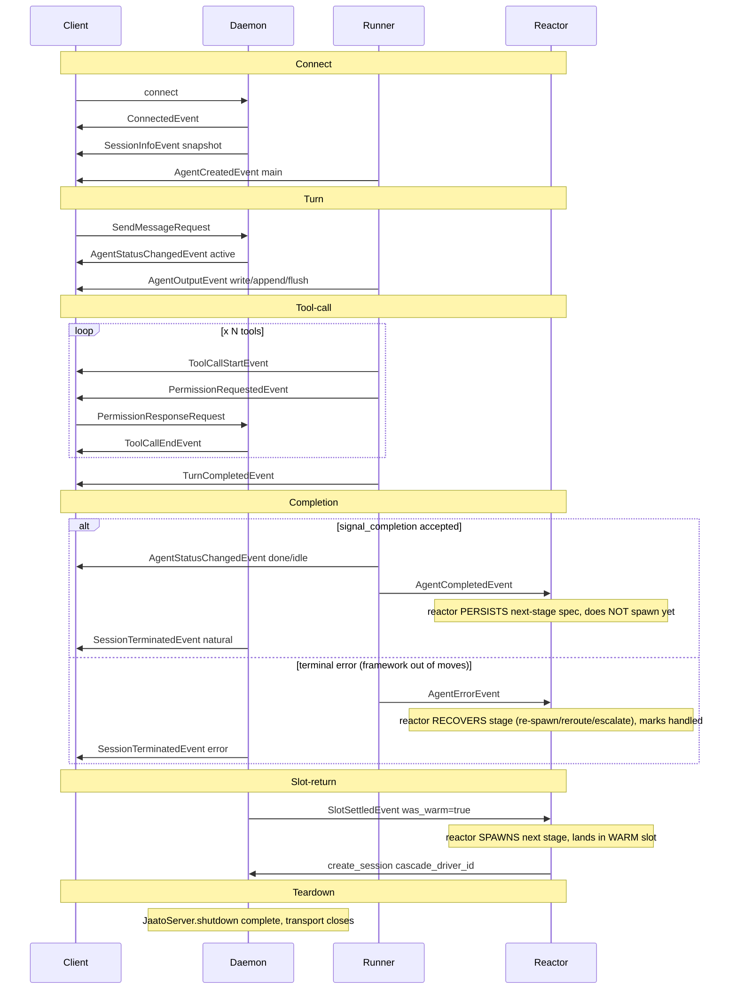

# The Lifecycle & Event Protocol

> **One-sentence definition.** A single typed event stream — ~110 Pydantic `Event` subclasses keyed by a string `EventType` enum, serialized as JSON over IPC/WebSocket — that marks every lifecycle phase of a jaato session and flows daemon ↔ runner ↔ session ↔ clients ↔ reactors, giving cascades and observers one temporal spine to subscribe to.
> **Layer (bottom→top):** a cross-cutting observability/temporal spine spanning every layer · **Lives in:** `jaato/jaato-sdk/jaato_sdk/events.py` (the catalog), emitted from `jaato/jaato-server/server/core.py` + `session_manager.py`.

## What it is

jaato runs the agent runtime as a long-lived **daemon**; clients (a TUI, a web UI, a headless SDK consumer, or a premium **reactor**) connect over a Unix socket (IPC) or a WebSocket. They never call the runtime directly. Instead the runtime emits **events** — and clients send **request events** back. The protocol is the contract: ~110 typed classes, every one a subclass of `Event` (a Pydantic `BaseModel`), each carrying a `type: EventType` discriminator and an auto-generated ISO-8601 `timestamp` (`events.py`).

The events are not just a flat catalog. They mark a **timeline**: connect, session creation, each turn, each tool call, completion, the runner slot returning to its pool, and teardown. The temporal order is load-bearing — a reactor driving a multi-stage **cascade** must spawn the next stage at exactly the right moment to land in a *warm* runner slot (~7s bootstrap) rather than cold-spawn (~30s). That timing decision is encoded entirely in *which event* it waits on.

Pydantic was chosen over plain dataclasses so the same definitions drive JSON Schema export for TypeScript SDK codegen, with a frozen wire format (`events.py`). The wire protocol carries a semver `PROTOCOL_VERSION = "1.0"` (`events.py`); `Event.model_config` sets `extra='ignore'` so an older client silently drops unknown fields from a newer server (`events.py`) — forward compatibility by construction.

All of this is **shipped**. The cascade warm-reuse handoff (`SlotSettledEvent`) and the pre-warm runner pool it gates on are also shipped (server 0.6.144+).

## Where it sits in the stack

The protocol has no single neighbor — it is the spine the whole stack speaks through. *Below* it: the **runner/session** (the `JaatoSession` doing the model loop) and the **daemon** (`JaatoServer` in `core.py`, `SessionManager` for routing), which *produce* events from runtime hooks. *Above* it: **clients** — the TUI, web UIs, headless SDK consumers — which *consume* events to render UI and *produce* request events. *Sideways*: premium **reactors**, which subscribe to the same daemon broadcast channel and act on lifecycle events (e.g. spawn the next cascade stage). The session manager broadcasts each event to every client attached to a session, so multiple observers see the same ordered stream.

## Responsibilities

- Define the typed vocabulary of every observable state change (the `EventType` enum + the `Event` subclasses).
- Carry server→client notifications, client→server requests, and bidirectional request/response handshakes.
- Deliver a full **state snapshot on connect** (`SessionInfoEvent`) so a fresh or reconnecting client needs no replay log.
- Preserve per-client FIFO ordering and a stable wire format across protocol versions.
- Provide cascades/reactors a stall-proof temporal anchor for stage handoff (`SlotSettledEvent`).

## Key concepts & structure

### The event model

`EventType(str, Enum)` (`events.py`) is the discriminator — string values like `"agent.output"`, `"tool.call_start"`, `"slot.settled"`. Every event is an `Event` subclass (`events.py`) that pins its `type` field to one enum member. Serialization is `event.to_dict()` / `to_json()` via `model_dump(mode='json')` so str-enums emit as their string values. The same module holds both **server→client** events and **client→server** requests (the `*Request` classes near `events.py`), plus value objects shared across events (`UsageBreakdown` at `events.py` carried identically by `TurnProgressEvent`, `TurnCompletedEvent`, and `ContextUpdatedEvent`).

### Snapshot-on-connect

`SessionInfoEvent` (`events.py`) is the "full state snapshot" pushed on connect/attach: current session id/name, model provider/model, plus lists the client needs for display and completion (`sessions`, `tools`, `models`, `user_inputs`, `memories`, `sandbox_paths`, `services`, `tool_id_mappings`). This is why reconnection needs no event-replay log — the daemon's `emit_current_state()` re-sends the snapshot (`core.py`) followed by an `AgentCreatedEvent` per tracked agent.

### Lifecycle families (grouped from the catalog)

The ~110 classes group into these families (representative class names, not exhaustive):

- **Connection / session lifecycle** — `ConnectedEvent` (`events.py`, carries `protocol_version` + `server_info`), `SessionInfoEvent`, `SessionRestoredEvent` (disk-restore re-attach, with `pending_tool_call_count`), `SessionTerminatedEvent` (`reason` ∈ `natural`/`client_request`/`stopped`/`error`/`cascade_cancelled`), `SlotSettledEvent` (`events.py`, cascade slot return).
- **Agent / turn lifecycle** — `AgentCreatedEvent`, `AgentStatusChangedEvent` (`status` ∈ `active`/`idle`/`done`/`error`), `AgentOutputEvent` (`mode` ∈ `write`/`append`/`flush`), `TurnProgressEvent`, `TurnCompletedEvent`, `AgentCompletedEvent` (`events.py`, carries typed `payload`), `AgentErrorEvent` (`events.py`, the terminal-error **recovery contract** — fires before teardown so a reactor gets first refusal to recover the failed stage; the error-path mirror of `AgentCompletedEvent`), `ContextUpdatedEvent`.
- **Tool lifecycle** — `ToolCallStartEvent` (`events.py`), `ToolCallEndEvent`, `ToolOutputEvent` (live `tail -f` chunks correlated by `call_id`).
- **Interactive request/response** — `PermissionRequestedEvent`/`PermissionInputModeEvent`/`PermissionResolvedEvent`, `ClarificationRequested/Question/Resolved`, `ReferenceSelectionRequested/Resolved`, `WorkspaceMismatchRequested/Resolved`. Each pairs a server request with a client `*ResponseRequest`.
- **Plan / accounting** — `PlanUpdatedEvent`/`PlanStepUpdatedEvent`/`PlanClearedEvent`, `InstructionBudgetEvent`, `GCConfigEvent`.
- **System / error** — `SystemMessageEvent`, `ErrorEvent`, `RetryEvent`, `InitProgressEvent`.
- **Client→server requests** — `SendMessageRequest` (`events.py`), `PermissionResponseRequest`, `ClarificationResponseRequest`, `StopRequest`, `CommandRequest`, plus typed SDK-parity verbs (`InjectPromptRequest`, `ReplayMessagesRequest`, permission-policy verbs).

## Lifecycle / flow

One session's life, in temporal order (the heart of this doc):

1. **Connect.** Client opens IPC/WS → daemon emits `ConnectedEvent`, then `SessionInfoEvent` (full snapshot). Client is now initialized.
2. **Session created.** `AgentCreatedEvent` for the `main` agent (`agent_id="main"`, `agent_type="main"`).
3. **A turn begins.** Client sends `SendMessageRequest` (client→server). Daemon emits `AgentStatusChangedEvent(status="active")` (`core.py`).
4. **Within the turn** (interleaved): `AgentOutputEvent` chunks (`mode="write"` then `append`), an `AgentOutputEvent(mode="flush")` signalling text is done and tools follow, then for each tool: `ToolCallStartEvent` → optionally `ToolOutputEvent` → optionally a `PermissionRequestedEvent`/`PermissionInputModeEvent` → client `PermissionResponseRequest` → `PermissionResolvedEvent` → `ToolCallEndEvent`. Token accounting arrives via `TurnProgressEvent` + `ContextUpdatedEvent`.
5. **Turn ends.** `TurnCompletedEvent` (NOT terminal — multi-turn flows emit several). For the main agent, the terminal signal is `AgentStatusChangedEvent(status="done"|"idle")`.
6. **Completion.** If the agent's `signal_completion` is **accepted** — its payload passes the `completion_payload_schema` *and* every completion processor — `AgentCompletedEvent` fires (`core.py`) with the typed `payload`. (A rejected call emits no event and returns a self-correction prompt; the agent retries, so a called-but-rejected completion does not advance a cascade.) After post-completion wrap-up drains, `SessionTerminatedEvent(reason="natural")` is emitted (`core.py`).
6b. **Terminal error (recovery path).** If the agent instead hits an error the framework cannot self-resolve — its automatic management (`with_retry` for retryable provider errors, the completion nudge loop) is **exhausted** or never applied — `AgentErrorEvent` fires (`events.py`) at the three framework-out-of-moves sites (model-thread terminal, nudge exhaustion, bootstrap failure), **always before** the back-compat `SessionTerminatedEvent(reason="error")`. It carries `agent_id`/`session_id`, `error_type`, `error_summary`, an optional provider `request_id`, the reactor-level `attempt` count (echoed from `agent_params`, not `with_retry`'s internal count), and an advisory `classification` hint (never a gate). This is the error-path counterpart to step 6's `AgentCompletedEvent`: a reactor with an `AGENT_ERROR` handler gets **first refusal** to recover the stage (re-spawn, reroute to another model/provider, escalate) via `create_session`, then marks the `session_id` handled so the legacy terminated handler no-ops. A cascade with no handler ignores it and the terminated event drives the legacy abort — fully back-compatible. Recovery is **decoupled from transience**: a non-transient error is still stage-recoverable.
7. **Slot settle (cascade only).** At the END of `JaatoServer.shutdown`, after the runner slot has **settled** — returned warm, *or* been torn down on error/cold — `SlotSettledEvent` fires once per cascade stage (`core.py`, gated on `cascade_driver_id`), with `was_warm` reporting which. It fires on **all** teardown paths, so the two-event handoff never stalls on a failed stage.
8. **Teardown.** Transport closes; on reconnect the cycle restarts at step 1 (possibly with `SessionRestoredEvent`).

## Relationship to neighboring components

The **runner/session** produces the per-turn and per-tool events via runtime hooks; the **daemon** (`JaatoServer`) constructs and `emit()`s them and `SessionManager` broadcasts to attached **clients**. **Cascades** and **reactors** subscribe to the same stream — the cascade tie-in below is the reason the event *ordering* matters, not just the event *set*.

## Example

**The cascade handoff: why the event choice is temporal, not cosmetic.**

A cascade is a chain of stages (e.g. `discovery` → `codegen` → `review`), each a separate session, driven by a reactor. Two completion-family events both look like "stage done":

- `AgentCompletedEvent` (`events.py`) fires *early* — when the agent signals completion, while its runner is still up. A reactor handling it only **persists the next-stage spawn spec**; it does not spawn yet, because spawning now would race the slot teardown and **cold-spawn** (~30s).
- `SlotSettledEvent` (`events.py`) fires *late* — once per cascade stage at the very END of `JaatoServer.shutdown`, gated on `cascade_driver_id`, after the slot has **settled** (returned warm, *or* torn down on error/cold), on **all** teardown paths so there is no timeout and no stall. Its `was_warm` flag reports whether the next spawn will reuse the warm slot. A reactor handling it triggers the actual `create_session` — which lands in the warm slot (~7s).

So the temporal rule is: **persist on `AgentCompletedEvent`, spawn on `SlotSettledEvent`.** `SessionTerminatedEvent` fires *earlier still* (before the slot returns), so spawning on it also races the slot and cold-spawns (`events.py`). The right event is the one whose position in the timeline guarantees the warm slot is free. This is the deliverable's centerpiece. *(All shipped; `was_warm`/`pool_slot_pid` are observability fields — the spawn happens either way, the flag only says whether it'll be fast.)*

**The error-path counterpart: `AgentErrorEvent`.** The success path hands the next stage off on completion; the *failure* path hands it off on error. Before this event existed, a terminal stage error was cascade-fatal — `core.py`'s model-thread chokepoint unconditionally emitted `SessionTerminatedEvent(reason="error")` and returned, so a reactor got only a post-mortem and the driver could do nothing but write `cascade_aborted.json`. `AgentErrorEvent` (`events.py`) makes terminal errors **reactor-managed**: it fires once the framework is out of moves (`with_retry` exhausted, nudge loop exhausted, or bootstrap failure), **always before** the terminated event, giving the cascade's `AGENT_ERROR` handler first refusal to recover the stage — re-spawn, reroute to a different model/provider, or escalate — via the same `create_session` path. A handled `session_id` makes the legacy terminated handler no-op; an unhandled one falls through to the legacy abort. Two attempt counters stay separate by design: `with_retry`'s internal per-request count is framework-only and never surfaced, while `AgentErrorEvent.attempt` is the **reactor-level** re-spawn count, echoed verbatim from the spawn's `agent_params["attempt"]` — the reactor (not the framework) owns the cap. So the symmetric rule is: **recover on `AgentErrorEvent`, just as you persist on `AgentCompletedEvent`** — both are the reactor's "stage is done, here's your handoff point" signal, one for success and one for failure.

## Diagram

## Diagram brief (for illustration)

**Layout:** A horizontal, time-ordered **swimlane sequence diagram**. Time flows strictly **left → right**. Four horizontal lanes, top to bottom: **Client**, **Daemon / SessionManager**, **Runner / Session**, **Reactor**. Across the very top, draw six labeled **phase bands** (vertical regions) spanning all lanes: `Connect · Turn · Tool-call · Completion · Slot-return · Teardown`.

**Boxes (lanes):** four labeled lane headers on the left edge — `Client`, `Daemon / SessionManager`, `Runner / Session`, `Reactor`.

**Arrows (each a labeled message between lanes, placed at its temporal x-position within the matching phase band):**
- *Connect band:* Client→Daemon `connect`; Daemon→Client `ConnectedEvent`; Daemon→Client `SessionInfoEvent (snapshot)`; Runner→Client `AgentCreatedEvent (main)`.
- *Turn band:* Client→Daemon `SendMessageRequest`; Daemon→Client `AgentStatusChangedEvent(active)`; Runner→Client `AgentOutputEvent (write/append)`; Runner→Client `AgentOutputEvent(flush)`; Runner→Client `TurnProgressEvent` + `ContextUpdatedEvent`.
- *Tool-call band:* Runner→Client `ToolCallStartEvent`; Runner→Client `PermissionRequestedEvent`; Client→Daemon `PermissionResponseRequest`; Daemon→Client `PermissionResolvedEvent`; Runner→Client `ToolCallEndEvent`. (Show this block as a repeatable loop `[ × N tools ]`.) End the band with Runner→Client `TurnCompletedEvent`.
- *Completion band:* Runner→Client `AgentStatusChangedEvent(done/idle)`; Runner→Reactor **`AgentCompletedEvent`** with a callout label **"reactor PERSISTS next-stage spawn spec (does NOT spawn yet)"**; Daemon→Client `SessionTerminatedEvent(reason=natural)`.
- *Slot-return band:* Daemon (internal note "warm runner slot returns to pool") then Daemon→Reactor **`SlotSettledEvent (was_warm=true)`** with a callout label **"reactor SPAWNS next stage → lands in WARM slot (~7s vs ~30s cold)"**; draw a curved arrow from the Reactor back to the Daemon labeled `create_session(cascade_driver_id)`.
- *Teardown band:* Daemon internal `JaatoServer.shutdown` complete; transport closes.

**Emphasis:** Visually pair and highlight the two completion-family arrows — `AgentCompletedEvent` (persist) and `SlotSettledEvent` (spawn) — with a bracket or connector between them annotated **"event ORDER decides warm vs cold reuse"**. Tint the `SlotSettledEvent` arrow as the hero element. Keep the phase bands subtly shaded to reinforce that x-position = time.

**Caption:** "One session's lifecycle in time: typed events flow daemon ↔ runner ↔ client ↔ reactor — and a cascade spawns the next stage on `SlotSettledEvent`, not `AgentCompletedEvent`, to reuse the warm runner slot."

## Source references
- `jaato/jaato-sdk/jaato_sdk/events.py` — `EventType(str, Enum)`, the wire discriminator (`"agent.output"`, `"slot.settled"`, …).
- `jaato/jaato-sdk/jaato_sdk/events.py` — `Event` Pydantic base (`type`, `timestamp`, `extra='ignore'`, `to_json`).
- `jaato/jaato-sdk/jaato_sdk/events.py` — `ConnectedEvent` / `SessionInfoEvent` (connect + snapshot-on-connect).
- `jaato/jaato-sdk/jaato_sdk/events.py` — `AgentCompletedEvent` (typed `payload`; reactor persists on this).
- `jaato/jaato-sdk/jaato_sdk/events.py` — `EventType.AGENT_ERROR` / `AgentErrorEvent` (terminal-error recovery contract; reactor recovers on this; fires before `SessionTerminatedEvent(reason="error")`).
- `jaato/jaato-server/server/core.py` — `_emit_agent_error` (routes through the `on_agent_error` hook; emitted at the 3 framework-out-of-moves sites: model-thread terminal `core.py`, nudge exhaustion `core.py`, bootstrap failure).
- `jaato/jaato-sdk/jaato_sdk/events.py` — `SlotSettledEvent` (`cascade_driver_id`, `was_warm`; reactor spawns on this; fires once per stage at end of shutdown).
- `jaato/jaato-sdk/jaato_sdk/events.py` — `ToolCallStartEvent` (tool-call lifecycle start; `call_id` correlation).
- `jaato/jaato-sdk/jaato_sdk/events.py` — `SendMessageRequest` (representative client→server request).
- `jaato/jaato-server/server/core.py` — emit sites for `AgentStatusChangedEvent`, `AgentCompletedEvent`, `SessionTerminatedEvent`.
- `jaato/jaato-server/server/core.py` — `SlotSettledEvent` emitted at end of `JaatoServer.shutdown`, gated on `cascade_driver_id`, after warm slot returns.
- `jaato/docs/jaato_event_protocol.md` (Part 9) — authored complete-turn event sequence used to ground turn ordering.
