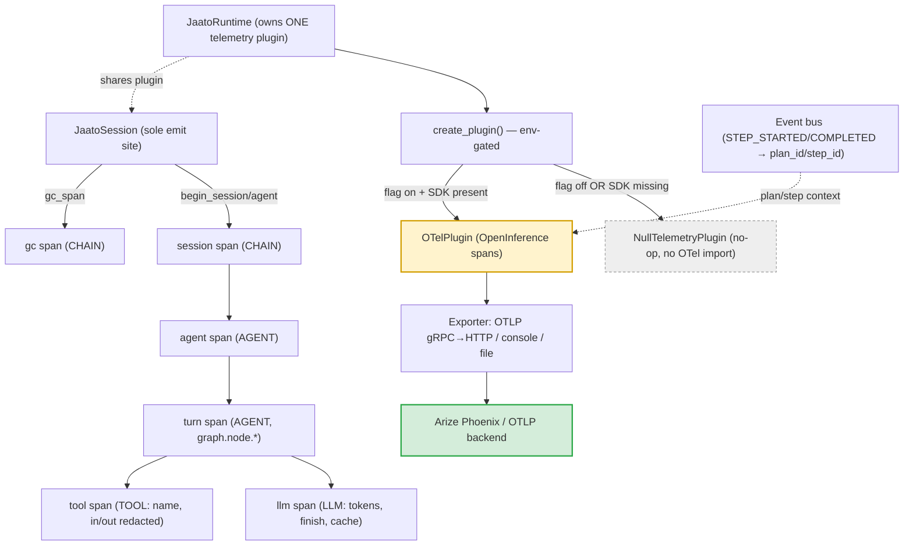

# Telemetry & Tracing (OpenTelemetry → Arize Phoenix)

> **One-sentence definition.** An opt-in, null-object-defaulted OpenTelemetry tracing layer that emits OpenInference-conventioned spans for every session, agent, turn, LLM call, tool call, and GC pass — exported over OTLP (gRPC/HTTP), console, or file to any OpenInference-compatible backend such as a self-hosted Arize Phoenix — with literally zero overhead when disabled.
> **Layer (bottom→top):** a cross-cutting observability concern spanning the whole stack, wired into the runtime and emitted from the session · **Lives in:** `jaato/jaato-server/shared/plugins/telemetry/` (protocol + null + OTel impl) + `jaato/jaato-server/shared/session_telemetry.py` (pure mappers), installed by `jaato/jaato-server/shared/jaato_runtime.py`.

## What it is

A running jaato agent does a lot you cannot see from the outside: it loops over the model, calls tools, retries on provider errors, garbage-collects context when the window fills, and (in a cascade) hands off to the next stage. **Telemetry** makes that timeline observable as a tree of spans you can open in a tracing UI — who called what, how long it took, how many tokens it burned, whether the cache hit, and where it failed.

The design has two non-negotiable properties. First, it is **off by default and free when off**: the runtime installs a `NullTelemetryPlugin` whose every method is a no-op yielding a shared singleton no-op span — no allocations, and critically **no OpenTelemetry import at all** on the disabled path. Second, when on, it speaks **OpenInference** semantic conventions (the `AGENT` / `LLM` / `TOOL` / `CHAIN` span-kind vocabulary), so traces render correctly in **Arize Phoenix** and other OpenInference-aware backends without any jaato-specific adapter on the viewer side.

Activation is a two-condition gate: the env flag `JAATO_TELEMETRY_ENABLED` must be truthy **and** the optional `opentelemetry-*` packages must be importable (installed via `requirements-telemetry.txt`). If the flag is set but the SDK is missing, the factory degrades gracefully back to the null plugin rather than crashing.

## Where it sits in the stack

Telemetry has no single neighbor — it is a spine the whole stack writes into. *Below* it sits the **session** (`JaatoSession`, the model loop), which is the **sole emit site** — it opens and closes every span via the plugin. The **runtime** (`JaatoRuntime`) constructs exactly one telemetry plugin and shares it across sessions. *Sideways*, it subscribes to the **event bus** (the same `EventType` stream documented for the lifecycle protocol) to pick up plan/step context, and it reads the **plugin registry** to label tool spans with their owning plugin. *Outbound*, it ships spans to an external collector — a Phoenix instance, an OTLP gateway, the console, or a JSON file.

## Responsibilities

- Define the `TelemetryPlugin` Protocol — the span-factory surface the session calls.
- Provide a zero-overhead `NullTelemetryPlugin` default so telemetry is free when disabled.
- Implement OpenInference-conventioned spans in `OTelPlugin`, with a **per-instance** `TracerProvider` (not the global one) so multiple runtimes don't collide.
- Build the OTLP exporter (gRPC-first, HTTP fallback), console, or file exporter from env/config.
- Nest spans correctly: a long-lived `session` → `agent` parent, with per-turn / per-LLM / per-tool children, propagated across worker threads for parallel tool calls.
- Host the span-attribute **redactor chain** extension point (documented separately — see `18-redaction`).

## Key concepts & structure

### The `TelemetryPlugin` protocol (`plugin.py:104`)
A `@runtime_checkable` Protocol declaring lifecycle (`initialize`, `shutdown`, `enabled`), two long-lived span openers (`begin_session`/`end_session`, `begin_agent`/`end_agent`), and six `@contextmanager` span factories: `turn_span`, `llm_span`, `tool_span`, `retry_span`, `gc_span`, `permission_span`. Each yields a `SpanContext` (`plugin.py:12`) exposing `set_attribute`, `record_exception`, `set_status_error/ok`, and the OpenInference helpers `set_input_messages` / `set_output_messages` / `set_metadata`.

### The null default (`null_plugin.py:45`)
`NullTelemetryPlugin` implements the whole protocol as no-ops, `enabled` hardwired `False`, every span manager yielding the singleton `_NOOP_SPAN`. This is what the runtime gets unless telemetry is explicitly turned on — so the common path imports no OTel and allocates nothing.

### The OTel implementation (`otel_plugin.py:337`)
`OTelPlugin` lazy-imports the OTel SDK (`_ensure_imports`, `otel_plugin.py:43`) and maps jaato operations onto OpenInference span kinds — string constants `_OI_AGENT/_OI_LLM/_OI_TOOL/_OI_CHAIN` (`otel_plugin.py:36`). `begin_session` opens a `CHAIN` span and `begin_agent` an `AGENT` span beneath it (stored by key so children can parent off them); `turn_span` is an `AGENT` span that also sets `graph.node.*` for Phoenix's DAG view; `llm_span` is `LLM` (model name, token counts, finish reasons, cache outcome); `tool_span` is `TOOL` (name, id, input/output). Live spans use OTel's `start_as_current_span`, so the implicit context stack nests LLM/tool spans under the active turn.

### The exporter (`otel_plugin.py:487`)
`_create_exporter` resolves `none` / `console` / `file` (OTLP-JSON lines) / `otlp`. The OTLP path **tries gRPC first** and **falls back to HTTP** on `ImportError`, reading endpoint and headers from `OTEL_EXPORTER_OTLP_ENDPOINT` / `OTEL_EXPORTER_OTLP_HEADERS`. Spans flow through a `BatchSpanProcessor` (or `SimpleSpanProcessor`), optionally sampled by a `TraceIdRatioBased` sampler.

### Bus-driven plan/step context (`otel_plugin.py:715`)
`subscribe_to_bus` registers the plugin on the event bus: `STEP_STARTED` stamps `plan_id`/`step_id` into a thread-local that rides into every subsequent span; `STEP_COMPLETED/FAILED/SKIPPED` clears it. This is what correlates spans back to a plan step.

## Lifecycle / flow

1. **Construct.** The runtime calls the telemetry factory (`jaato_runtime.py:311`). Flag off or SDK absent → `NullTelemetryPlugin`. Flag on + SDK present → `OTelPlugin`, which builds a per-instance `TracerProvider` + exporter; the runtime subscribes it to the bus (`jaato_runtime.py:320`).
2. **First turn.** The session lazily opens the long-lived `CHAIN` session span and `AGENT` agent span (`_ensure_telemetry_spans`, guarded once).
3. **Per turn.** `turn_span` (AGENT) opens; inside it `llm_span` (LLM) records input messages, token counts, finish reasons, and cache outcome; each function call opens a `tool_span` (TOOL) with input/output (content redacted by default).
4. **Parallel tools.** The parent captures OTel context (`capture_context`) and worker threads re-attach it (`attach_context`) so concurrent tool spans still nest under the turn.
5. **GC.** A `gc_span` (CHAIN) wraps each context-collection pass.
6. **Export.** Spans are context managers, so they close and time automatically; the `BatchSpanProcessor` ships the tree to the backend.

**Honest gaps (call these out, don't paper over them):** `retry_span` and `permission_span` are defined in the protocol but currently have **no emit site** in the session — they are reserved surface. There is **no OpenTelemetry auto-instrumentation** (no `opentelemetry-instrumentation*` deps); every span is created at an explicit jaato emit site. And nothing in non-test code calls `telemetry.shutdown()` — final span flush relies on the `BatchSpanProcessor` at process exit.

## Configuration / authoring

```bash
# Install the optional tracing deps
pip install -r jaato-server/requirements-telemetry.txt

# Turn it on and point it at a self-hosted Arize Phoenix (OTLP gRPC on :4317)
export JAATO_TELEMETRY_ENABLED=true
export JAATO_TELEMETRY_EXPORTER=otlp           # otlp | console | file | none
export OTEL_EXPORTER_OTLP_ENDPOINT=http://localhost:4317
export OTEL_SERVICE_NAME=jaato
# Content (prompts / tool args) is redacted in spans by default; opt out explicitly:
# export JAATO_TELEMETRY_REDACT_CONTENT=false
```

## Relationship to neighboring components

The **runtime** owns and installs the single plugin; the **session** is the only thing that emits, opening spans around its turn / LLM / tool / GC operations. The **event bus** (the lifecycle/event protocol) feeds plan/step ids in via a subscription. The **plugin registry** supplies the owning-plugin label for tool spans. The premium **anonymization layer** (`18-redaction`) plugs **seat 4** of its four-seat design into this plugin's `register_attribute_redactor` hook, scrubbing PII from span attributes before export. Premium can contribute resource attributes via the `jaato.telemetry_resource` entry-point group.

## Diagram



## Diagram brief (for illustration)

- **Layout:** Top band = install/selection; middle = the span tree (a nested hierarchy); bottom = export to an external backend. Read top→bottom.
- **Boxes:**
  - Top: "JaatoRuntime (owns ONE plugin)" → "create_plugin() — env-gated", branching to two mutually-exclusive boxes: **"NullTelemetryPlugin (no-op, NO OTel import)"** (drawn dashed/grey) and **"OTelPlugin (OpenInference)"** (highlighted).
  - A side box "Event bus → plan_id / step_id" feeding OTelPlugin with a dashed arrow.
  - Span tree (nested, indented to show parent→child): "session span — CHAIN" → "agent span — AGENT" → "turn span — AGENT (graph.node.*)" → two children "llm span — LLM (tokens, finish_reason, cache)" and "tool span — TOOL (name, input/output → REDACTED)"; plus a sibling "gc span — CHAIN".
  - Bottom: "Exporter (OTLP gRPC→HTTP / console / file)" → **"Arize Phoenix / OTLP backend"** (highlighted green).
- **Arrows:** factory→null labeled "flag off / SDK missing"; factory→OTel labeled "flag on + SDK present"; OTel→Exporter→Phoenix labeled "BatchSpanProcessor export"; bus→OTel dashed labeled "plan/step context".
- **Emphasis:** Highlight **OTelPlugin** and the **Phoenix** sink; visually mute the **Null** branch (dashed grey) to convey "zero-overhead default". Show the span tree clearly nested.
- **Caption:** "Telemetry: an opt-in OpenInference tracing layer — off and free by default, or a session→agent→turn→llm/tool span tree exported to a self-hosted Arize Phoenix when enabled."

## Source references
- `jaato/jaato-server/shared/plugins/telemetry/plugin.py:104` — `TelemetryPlugin` `@runtime_checkable` Protocol (lifecycle + six span factories); `SpanContext` at `:12`.
- `jaato/jaato-server/shared/plugins/telemetry/null_plugin.py:45` — `NullTelemetryPlugin` zero-overhead default; `_NOOP_SPAN` at `:42`.
- `jaato/jaato-server/shared/plugins/telemetry/otel_plugin.py:36` — OpenInference span-kind constants (`AGENT/LLM/TOOL/CHAIN`); `OTelPlugin` at `:337`; lazy import `_ensure_imports` at `:43`.
- `jaato/jaato-server/shared/plugins/telemetry/otel_plugin.py:487` — `_create_exporter` (gRPC-first, HTTP fallback at `:528`).
- `jaato/jaato-server/shared/plugins/telemetry/otel_plugin.py:715` — `subscribe_to_bus` (plan/step context from the event bus).
- `jaato/jaato-server/shared/plugins/telemetry/__init__.py:46` — `create_plugin()` env-gated null-vs-OTel selection (`JAATO_TELEMETRY_ENABLED`).
- `jaato/jaato-server/requirements-telemetry.txt:4` — optional `opentelemetry-*` dependency pins.
- `jaato/jaato-server/shared/jaato_runtime.py:311` — runtime installs the plugin; `:320` subscribes it to the bus.
- `jaato/jaato-server/shared/jaato_session.py:3554` — `turn_span` emit site (LLM `:4554`, tool `:5475`, gc `:3764`).
- `jaato/jaato-server/shared/session_telemetry.py:28` — pure `response_to_openinference` mapper (history mapper `:61`, cache classifier `:107`).
