# Data Redaction & Anonymization

> **One-sentence definition.** A homegrown, pluggable chain of per-attribute and per-message transformer callbacks that rewrites sensitive content at two chokepoints — outbound telemetry span attributes and the session's canonical conversation history — so prompts, tool arguments, and PII never reach traces or persisted history in raw form.
> **Layer (bottom→top):** a cross-cutting data-protection concern; the *outbound* half of the codebase's secrets-in / data-out symmetry · **Lives in:** `jaato/jaato-server/shared/plugins/telemetry/otel_plugin.py` (the span redactor chain) + `jaato/jaato-server/shared/session_history.py` (the history transformer pair).

## What it is

Once you turn on tracing (see `17-telemetry`), every prompt, every tool argument, and every model output is a candidate to leave the process as a span attribute headed for an external backend. Some of that content is sensitive — bearer tokens pasted into a tool call, customer PII in a prompt, secrets in an output. **Redaction** is the layer that scrubs those values *before* they cross a trust boundary.

The important thing to state plainly: **this is not Presidio.** A test helper in the codebase spells out the intent — it builds a trivial "redact PII" stand-in *"without pulling in Presidio,"* because the framework's job is to own the **chokepoints and the chain semantics**, not to ship a PII engine. The default redactor chain is **empty**; what jaato provides is (a) a coarse, built-in, length-preserving blanking of known-sensitive attributes, and (b) a registration API where a real recognizer — Presidio-grade or otherwise — can be plugged in.

There are two independent surfaces. The **telemetry redactor chain** scrubs span attributes on their way out to a tracing backend. The **session-history transformer pair** rewrites `Message` objects on their way *into* canonical history (and can un-rewrite them for a trusted display/audit read). They share a philosophy but have different shapes and live in different files.

## Where it sits in the stack

The telemetry redactor lives *inside* the **telemetry plugin** (`17-telemetry`): it is a feature of the OTel span wrapper, run at the single `set_attribute` chokepoint every span attribute passes through. With the null telemetry plugin, redactor registration is accepted and ignored (no spans are produced, so nothing to scrub). The history transformer lives on **`SessionHistory`**, the canonical message container owned by the **session**. *Sideways*, redaction is the **outbound** mirror of the **secrets layer** (`19-secrets`): secrets are resolved so they never leak *in* (only safe provenance is ever recorded), and redaction ensures content never leaks *out* to traces.

## Responsibilities

- Provide a single chokepoint where every outbound span attribute can be inspected and rewritten.
- Apply a built-in, length-preserving blanking of known-sensitive attributes by default (gated by a flag).
- Expose a registration API (`register_attribute_redactor`) as the extension point for a real PII/anonymization backend — the chain runs over **every** attribute, so one registration covers all ~20+ emit sites.
- Provide a parallel write-side / read-side transformer pair on canonical history so PII can be pseudonymized at rest and reversed only for trusted readers.
- Default to safe-and-empty: redact content coarsely out of the box, run no PII engine unless one is registered.

## Key concepts & structure

### The single chokepoint: `_SpanWrapper.set_attribute` (`otel_plugin.py:219`)
Every span attribute — whether set directly or via `set_input_messages` / `set_output_messages` / `set_metadata`, which all delegate here — passes through this one method. That is what lets a single redactor registration cover the entire surface without per-site instrumentation.

### Two layers inside the chokepoint
1. **Built-in length-preserving blanking** (`otel_plugin.py:230`). When `redact_content` is on, attributes in `_SENSITIVE_ATTRS = {"input.value", "output.value"}` (and message-content / tool-argument paths) are replaced with `"[REDACTED: N chars]"` — the value is gone, only a length hint survives. Tool-call **function names and roles are never blanked** (they're needed to read the trace).
2. **The registered redactor chain** (`otel_plugin.py:247`). After blanking, `for fn in self._redactors: value = fn(key, value)` runs over **every** attribute regardless of the flag. The chain is empty by default.

### The redactor shape and chain ordering
A telemetry redactor is `Callable[[str, Any], Any]` — it receives `(attribute_key, value)` and returns the value to actually set. Redactors stack in **registration order**, each seeing the previous one's output (tests assert a `[first, second]` registration yields `"[2][1]x"`). For the two built-in-blanked keys, the chain sees the *already-blanked* form; for all other keys it sees the raw value.

### `register_attribute_redactor` — the extension point (`otel_plugin.py:372`)
This is "seat 4" of a four-seat pseudonymization design. It simply appends to the chain. A consumer wanting Presidio-grade recognition writes a callable wrapping a Presidio analyzer/anonymizer and registers it **once**, typically from a session hook or daemon extension `start()` so it is wired before any span is created. **This API exists; a concrete PII engine does not** — that is the consumer's to bring.

### The session-history transformer pair (`session_history.py:22`)
Orthogonal, and a different shape: `MessageTransformer = Callable[[Message], Message]`. `set_inbound_transformer(fn)` runs on every message at `append()`/`replace()`, *before* it lands in canonical history — pseudonymize PII so the stored copy never holds raw values. `set_raw_view_transformer(fn)` runs per-message in the `messages_raw` property for the trusted-reader / audit path — un-pseudonymize for display, without ever mutating the stored canonical copy. The two are coupled (if at all) only by closures over the consumer's own pseudonym table; the framework holds no such state. Surfaced on the session as `set_history_inbound_transformer` / `set_history_raw_view_transformer`.

### The `redact_content` flag
Defaults to `True` (env `JAATO_TELEMETRY_REDACT_CONTENT`). It controls **only** the coarse built-in blanking of `input.value`/`output.value` and message/tool-arg content; the registered chain is independent and always fires.

## Lifecycle / flow

1. **Wire (once).** A consumer calls `plugin.register_attribute_redactor(fn)` at process/session start — appended to the per-process chain, before any span exists. (Or `session.set_history_inbound_transformer(fn)` for the history surface.)
2. **Span attribute set.** Session/plugin code calls `wrapper.set_attribute(...)` (directly or via the message/metadata helpers). For sensitive keys with `redact_content=True`, built-in blanking runs first; then the redactor chain runs; then the real OTel span receives the final value.
3. **Export.** The span ships to the OTLP/Phoenix backend already scrubbed.
4. **History (parallel).** On every `append()`, the inbound transformer rewrites the `Message` before it joins canonical history; a trusted reader of `messages_raw` gets the un-rewritten view, the stored copy untouched.

## Relationship to neighboring components

Redaction is a feature of the **telemetry plugin** (`17-telemetry`) — it has no spans to scrub without it, and it is a no-op under the null telemetry plugin. It is the **outbound** counterpart to the **secrets layer** (`19-secrets`), which guarantees credentials never leak *inbound* (only `token_len`/`token_prefix` provenance is ever recorded). The **session** owns the history transformer pair on `SessionHistory`. Related but distinct scrubbing surfaces elsewhere — auth-header redaction in the service connector, traceback path sanitization on the runner RPC channel, and session-env non-leakage in the envelope — share the same discipline but are separate mechanisms.

## Example

A model emits a tool call whose arguments JSON contains an auth token: `{"url": "...", "token": "sk-live-abc123"}`. Telemetry records the turn via `set_output_messages([...])`:

1. The tool's **function name is set verbatim** (you need it to read the trace), but the arguments string hits the sensitive path: because `redact_content=True`, it becomes `"[REDACTED: 41 chars]"` — the raw token is gone.
2. The set still flows through `set_attribute`, so the **registered chain also runs**. A Presidio-style redactor wired via `register_attribute_redactor` is the catch-all for any token that *wasn't* on the coarse `_SENSITIVE_ATTRS` list — e.g. it could rewrite an email `alice@example.com` → `<EMAIL_1>` in free-text content.
3. The Phoenix span attribute `...tool_call.function.arguments` holds `[REDACTED: 41 chars]`, never `sk-live-abc123`. (This default is asserted end-to-end in the plugin tests: `"[REDACTED:"` present, roles and tool names untouched.)

## Diagram

```mermaid
flowchart TD
    subgraph OUT["Outbound — telemetry span attributes"]
        callers["~20+ emit sites: set_input_messages / set_output_messages / set_metadata / set_attribute"]
        choke["_SpanWrapper.set_attribute (single chokepoint)"]
        builtin["built-in blanking (redact_content): input.value/output.value → '[REDACTED: N chars]' (names/roles kept)"]
        chain["registered redactor chain (empty by default) — runs on EVERY attribute"]
        ext["register_attribute_redactor() ← Presidio / custom PII engine plugs in HERE"]
        span["OTel span → Phoenix (scrubbed)"]
    end

    subgraph IN["Inbound — canonical history"]
        msg["Message (may carry PII)"]
        inb["set_inbound_transformer (append/replace)"]
        canon["canonical history (pseudonymized at rest)"]
        rawv["messages_raw + set_raw_view_transformer (trusted reader / audit)"]
    end

    callers --> choke --> builtin --> chain --> span
    ext -.->|"register once at start"| chain
    msg --> inb --> canon
    canon --> rawv

    style choke fill:#fff3cd,stroke:#d39e00,stroke-width:2px
    style ext fill:#f8d7da,stroke:#c82333,stroke-width:2px,stroke-dasharray:4 3
    style span fill:#d4edda,stroke:#28a745,stroke-width:2px
```

## Diagram brief (for illustration)

- **Layout:** Two parallel lanes. Top lane "Outbound (telemetry)" flows left→right into a single funnel; bottom lane "Inbound (history)" flows left→right into storage. Emphasize the single funnel on the outbound lane.
- **Boxes (outbound):** a cluster of "~20+ emit sites (set_input_messages / set_output_messages / set_metadata)" → a **funnel box "_SpanWrapper.set_attribute — single chokepoint"** (highlighted) → "built-in blanking (redact_content): input/output.value → '[REDACTED: N chars]'; tool names & roles kept" → "registered redactor chain — empty by default, runs on EVERY attribute" → "OTel span → Phoenix (scrubbed)" (highlighted green). A dashed red callout box **"register_attribute_redactor() — Presidio / custom PII engine plugs in HERE"** pointing into the chain.
- **Boxes (inbound):** "Message (may carry PII)" → "set_inbound_transformer (at append/replace)" → "canonical history — pseudonymized at rest" → a side branch "messages_raw + set_raw_view_transformer (trusted reader / audit)".
- **Arrows:** straight flow arrows along each lane; one dashed arrow from the extension-point callout into the chain labeled "register once at start".
- **Emphasis:** The **single chokepoint funnel** (one registration covers everything) and the **dashed "Presidio plugs in here" callout** (it's an extension point, not a bundled engine). Tint the scrubbed Phoenix span green.
- **Caption:** "Redaction: one chokepoint per direction — span attributes scrubbed before Phoenix, messages pseudonymized before canonical history. The PII engine (Presidio or custom) is a pluggable extension point, not bundled."

## Source references
- `jaato/jaato-server/shared/plugins/telemetry/otel_plugin.py:219` — `_SpanWrapper.set_attribute`: the single chokepoint (built-in blanking `:230`, redactor chain loop `:247`).
- `jaato/jaato-server/shared/plugins/telemetry/otel_plugin.py:202` — `_SENSITIVE_ATTRS = {"input.value","output.value"}` (coarse blanking set).
- `jaato/jaato-server/shared/plugins/telemetry/otel_plugin.py:285` — `set_input_messages`/`set_output_messages`/`set_metadata` all route through `set_attribute`.
- `jaato/jaato-server/shared/plugins/telemetry/otel_plugin.py:372` — `register_attribute_redactor` (the extension point); `_attribute_redactors` chain field `:368`; `redact_content` default `True` `:352`.
- `jaato/jaato-server/shared/plugins/telemetry/plugin.py:391` — `register_attribute_redactor` on the `TelemetryPlugin` protocol ("seat 4", single-registration claim).
- `jaato/jaato-server/shared/plugins/telemetry/null_plugin.py:160` — no-op redactor registration under the null plugin.
- `jaato/jaato-server/shared/tests/test_session_history.py:397` — the *"without pulling in Presidio"* comment + `_redact_text` stand-in.
- `jaato/jaato-server/shared/session_history.py:82` — `set_inbound_transformer`; `set_raw_view_transformer` `:98`; `messages_raw` `:190`.
- `jaato/jaato-server/shared/jaato_session.py:7278` — session-level `set_history_inbound_transformer` / `set_history_raw_view_transformer`.
- `jaato/jaato-server/shared/plugins/telemetry/tests/test_attribute_redactors.py:31` — chain semantics: unset=identity, registration-order chaining, after-built-in ordering, all-paths coverage.
