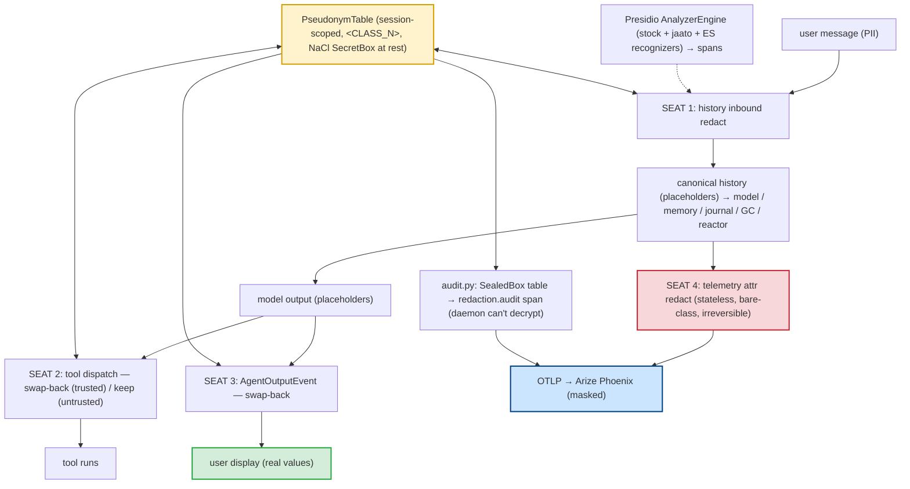

# Data Anonymization (Pseudonymization — Presidio + NaCl)

> **One-sentence definition.** A session-scoped pseudonymization substrate that uses **Presidio** to recognize PII and **NaCl (libsodium/pynacl)** to encrypt the placeholder↔raw mapping at rest — wired into the daemon at **four narrow architectural seats** so the model and traces see masked placeholders (`<EMAIL_1>`, `<PERSON_2>`), while trusted tools and the user's own display get the real values swapped back.
> **Layer (bottom→top):** a cross-cutting data-protection subsystem; PREMIUM, plugging into four public extension seams · **Lives in:** PREMIUM `jaato-premium/jaato_premium/pseudonymization/` (`extension.py`, `recognizers.py`, `pseudonym_table.py`, `redaction.py`, `keys.py`, `audit.py`, `tool_dispatch.py`, `message_walk.py`) wiring into PUBLIC seams in `jaato/jaato-server/shared/session_history.py`, `…/plugins/telemetry/otel_plugin.py`, and `…/server/core.py`.

## What it is

Conversation data is full of PII — names, emails, national IDs, bearer tokens, home-directory paths. Sending it verbatim to a model provider, a tracing backend like Arize Phoenix, or a third-party tool widens the exposure surface every time. **Pseudonymization** shrinks it: detect sensitive spans, replace each with a stable placeholder, and keep the reverse mapping in a session-scoped, encrypted table that only the daemon (and only for the live session) can use to swap real values back when they're genuinely needed.

Detection is **Presidio** (`presidio-analyzer`): a configured `AnalyzerEngine` with the stock recognizer set (PERSON, EMAIL_ADDRESS, PHONE_NUMBER, CREDIT_CARD, IP_ADDRESS, US_SSN, IBAN_CODE, …) plus jaato-specific `PatternRecognizer`s for session IDs, workspace paths, and `Bearer` tokens — and a Spanish profile (DNI / NIE / IBAN-ES / phone, on the `es_core_news_lg` spaCy model) selectable per session. Crypto is **NaCl**: the pseudonym table serializes to a `SecretBox` AEAD blob at rest, and an optional tamper-evident audit trail is `SealedBox`-encrypted to an offline auditor's public key.

A 2026 design verification concluded the event bus is the **wrong** place to do this — sensitive conversation content doesn't flow through the bus. The right shape is **four narrow hooks anchored to seams the data actually crosses**: history, tool dispatch, user-display output, and telemetry. The public framework exposes those four extension points; the premium `PseudonymizationExtension` occupies them.

This is a PREMIUM daemon extension. It auto-loads when `jaato-premium[pseudonymization]` is installed, and can be turned off per session with `JAATO_REDACTION_ENABLED=off`.

## Where it sits in the stack

It is a **daemon extension** (entry point `pseudonymization = …extension:create_extension`) that installs per-session hooks on four existing seams. *Below* it are those seams in the public core — `SessionHistory`, the tool executor, the outbound `AgentOutputEvent` path, and the telemetry plugin's span wrapper. *Above / sideways* sit everything that reads conversation state: the **memory** plugin, the **session journal**, the **GC** summarizer, **reactors**, and **telemetry** — all of which go through the canonical history accessor and therefore see the redacted view for free. It is the richer sibling of the **secrets** layer (`19-secrets`): secrets ensure credentials never leak *in*; this ensures PII is masked *out* (to model, tools, traces) and reversed only at trusted boundaries.

## Responsibilities

- Recognize PII spans with Presidio (stock + jaato-specific + per-language recognizers).
- Maintain a **session-scoped** bidirectional placeholder↔raw `PseudonymTable`, idempotent on re-occurrence, AEAD-encrypted at rest.
- Occupy the **four seats**: redact inbound history (seat 1), swap back for trusted tools (seat 2), swap back for user display (seat 3), redact telemetry span attributes (seat 4).
- Encrypt the table at rest with the daemon master key (so forked/resumed sessions can decrypt inherited tables); emit an optional sealed-box audit trail the daemon itself cannot decrypt.
- Default to safe: trust is opt-in-by-code (raw accessors / tool allowlist), telemetry is always redacted, the table dies with the session.

## Key concepts & structure

### The four seats (`extension.py:194`, `_on_session_ready`)
On every freshly-set-up session the extension wires four transformers anchored to real seams:

- **Seat 1 — history container redaction.** `set_history_inbound_transformer` pseudonymizes each message **on append** (so canonical history stores placeholders); `set_history_raw_view_transformer` gives **trusted callers** the raw view via an explicit accessor. Trust becomes "I called the raw accessor," not a config flag. This single seat covers memory, journal, GC, reactor, and telemetry-history reads at once.
- **Seat 2 — tool dispatch swap-back** (`tool_dispatch.py`). Before a tool runs, `swap_back_args` restores real values — tools are **trusted by default** (they need real paths/values to work). Operators list exceptions in `JAATO_REDACTION_UNTRUSTED_TOOLS` (those keep placeholders — for tools that ship args to external sinks). Tool **results** always pass back through `redact_result`, so new sensitive values discovered in output get fresh placeholders before they reach history. *(Wired only when the tool executor exposes its args/result-transformer seam.)*
- **Seat 3 — outbound user-display swap-back.** Every `AgentOutputEvent` leaving the daemon is swapped back so the **user sees their own data**. The user owns the data, so this boundary is implicitly trusted — the only non-symmetric (un-redacting) inbound→outbound direction. *(Wired only when the server exposes its outbound-event-transformer seam.)*
- **Seat 4 — telemetry attribute redaction** (`attribute_redactor.py:47`). Registered once globally via the public `register_attribute_redactor` hook (see `17-telemetry`). It is **stateless and irreversible** — no `PseudonymTable`, just bare-class masks (`<EMAIL_ADDRESS>`, `<PERSON>`), because a global redactor can't consult a per-session table and cross-span correlation would itself be a re-identification surface. It **bypasses** any `redaction.audit.*` attribute (already encrypted).

*(Source caveat: the `extension.py` module/class docstrings still say "wiring seat 1 / seats 2–4 in subsequent iterations" — that's **stale**; all four seats wire in `_on_session_ready` today. Don't let the docstring talk you out of the code.)*

### Recognition: Presidio analyzer + jaato recognizers (`recognizers.py`)
`build_default_analyzer(language=…)` builds the `AnalyzerEngine`; `jaato_recognizers()` adds `session_id_recognizer` (`YYYYMMDD_HHMMSS`), `workspace_path_recognizer` (absolute paths under `/home/<user>/` **or** macOS `/Users/<user>/`), and `bearer_token_recognizer` (`Bearer <token>`). `language="es"` swaps to `es_core_news_lg`, drops US recognizers that false-positive on Spanish shapes, and adds DNI / NIE / IBAN-ES / phone. `analyze_to_spans` turns analyzer hits into `Span(start, end, class_name)`. Analyzers are cached per language.

### Placeholders & the pseudonym table (`redaction.py`, `pseudonym_table.py`)
Placeholders are `<CLASS_N>` (`PLACEHOLDER_RE = <([A-Z][A-Z0-9_]*)_(\d+)>`); `redact_text` applies spans, `swap_back_text` reverses them. `PseudonymTable` is a session-scoped bidirectional map with per-class counters, idempotent `add` (re-occurrence returns the existing token), and `serialize_encrypted()` → a NaCl `SecretBox` AEAD blob stored as opaque bytes via the framework's session-attached-state. It dies with the session — **no cross-session re-identification**.

### Keys & sealed-box audit (`keys.py`, `audit.py`)
A 32-byte daemon **master key** lives at `~/.jaato/redaction-key` (mode 0600). The pseudonym table is encrypted at rest with that **master key directly** (`extension.py:448` passes `session_key=self._master_key`), so a forked or resumed session can decrypt a table it inherited — the source encrypts and the target decrypts with the same key. (The per-session `HMAC-SHA256(master, session_id)` derivation in `keys.py` is **legacy-fallback-only** now, used to decrypt pre-master-key journals.) On meaningful table mutations, `emit_audit_span` emits a `redaction.audit` span carrying the **full table sealed-box-encrypted** (`AUDIT_SCHEME = "nacl-sealedbox-v1"`, X25519 + XChaCha20-Poly1305) to the pubkey in `JAATO_REDACTION_AUDIT_PUBKEY`. An offline private-key holder reconstructs table evolution from telemetry alone — **the daemon cannot decrypt its own audit trail**, so daemon compromise leaves history confidential.

## Lifecycle / flow

1. **Install / load.** `pip install 'jaato-premium[pseudonymization]'` pulls `pynacl` + `presidio-analyzer`; the daemon auto-loads `PseudonymizationExtension` (import fails fast with an actionable message if the extra is missing). Per session, `JAATO_REDACTION_ENABLED` (workspace `.env` → `os.environ` → default true) decides whether to wire.
2. **Session ready.** `_on_session_ready` builds/caches the analyzer for the session's language, loads-or-creates the session `PseudonymTable`, and installs seats 1–4.
3. **Inbound.** A user message is appended → seat 1 runs Presidio → spans → `redact_text` → placeholders land in canonical history; the model context is redacted.
4. **Tool call.** Seat 2 swaps placeholders back to raw for trusted tools (or leaves them for untrusted ones); the result is re-redacted on the way back.
5. **User output.** Seat 3 swaps placeholders back in the outbound `AgentOutputEvent` so the user sees real values.
6. **Telemetry.** Seat 4 masks PII in span attributes (bare-class, irreversible) before they reach the OTLP exporter; audit spans carry the encrypted table.
7. **Teardown.** The session ends; the table (and its swap-back power) dies with it.

## Configuration / authoring

```bash
pip install 'jaato-premium[pseudonymization]'
python -m spacy download en_core_web_lg     # or es_core_news_lg for Spanish

export JAATO_REDACTION_ENABLED=true                 # off|0|no|false to disable (per session via workspace .env)
export JAATO_REDACTION_LANGUAGE=es                  # default "en"
export JAATO_REDACTION_UNTRUSTED_TOOLS=webhook,http # tools that should KEEP placeholders in args
export JAATO_REDACTION_AUDIT_PUBKEY=/etc/jaato/audit.pub   # opt-in sealed-box audit (unset → none)
```

## Relationship to neighboring components

Seat 4 plugs into the **telemetry** plugin's public `register_attribute_redactor` hook (`17-telemetry`); seat 1 into `SessionHistory`'s inbound / raw-view transformer pair; seat 3 into the **lifecycle/event** outbound path (`16-lifecycle-and-events`); seat 2 into the tool executor. Because memory, journal, GC, and **reactors** all read through the canonical history accessor, seat 1 redacts them in one place. It is the outbound-protection counterpart to **secrets** (`19-secrets`), and like the secret resolvers it is shipped **out-of-tree** (premium) and reached through public extension points — the open-source core provides the seams, premium provides the Presidio+NaCl implementation.

## Example

A user writes "email the invoice to alice@acme.com for DNI 12345678Z." **(Seat 1)** Presidio tags `alice@acme.com` (EMAIL_ADDRESS) and `12345678Z` (ES_DNI); the table maps them to `<EMAIL_1>` / `<ES_DNI_1>`; canonical history (and thus the model context) stores the placeholders. **(Seat 2)** The model calls `send_email(to="<EMAIL_1>", …)`; because `send_email` is trusted (not in `JAATO_REDACTION_UNTRUSTED_TOOLS`), seat 2 swaps `<EMAIL_1>` back to `alice@acme.com` before the tool runs. **(Seat 3)** The assistant's reply "I've emailed alice@acme.com" streams out: the stored text held `<EMAIL_1>`, and seat 3 swaps it back so the user sees the real address. **(Seat 4)** The tool span's `tool.input.value` is masked to `<EMAIL_ADDRESS>` (bare class, irreversible) before it reaches Phoenix; if audit is enabled, a `redaction.audit` span carries the sealed-box-encrypted table. The session ends and the table — the only thing that could re-link `<EMAIL_1>` to `alice@acme.com` — is gone.

## Diagram



## Diagram brief (for illustration)

- **Layout:** A central **PseudonymTable** hub feeding four labeled seat-boxes arranged around the data flow; Presidio as the recognizer feeding the inbound seat. Inbound on the left, the four seats as gates, outbound sinks on the right.
- **Boxes:** "Presidio AnalyzerEngine (stock + jaato + ES recognizers)"; a highlighted center hub **"PseudonymTable — session-scoped, &lt;CLASS_N&gt;, NaCl SecretBox at rest"**; "user message (PII)"; four seat gates labeled **SEAT 1 history-inbound-redact**, **SEAT 2 tool-dispatch swap-back (trusted) / keep (untrusted)**, **SEAT 3 AgentOutputEvent swap-back**, **SEAT 4 telemetry redact (stateless, bare-class, irreversible)**; sinks "canonical history → model/memory/journal/GC/reactor", "tool runs", "user display (real values)" (green), "OTLP → Arize Phoenix (masked)" (blue), "audit: SealedBox table → redaction.audit span (daemon can't decrypt)".
- **Arrows:** user→Seat1→history→model; Presidio dashed→Seat1; table↔Seat1, table↔Seat2, table→Seat3 (un-redact), table→audit; model→Seat2→tool; model→Seat3→display; history→Seat4→Phoenix; audit→Phoenix.
- **Emphasis:** The **PseudonymTable hub** (the secret that makes swap-back possible, encrypted at rest, dies with the session) and the contrast between **reversible seats 1–3** (consult the table) and the **irreversible, stateless Seat 4** (red, bare-class masks). Note "trusted by default" on Seat 2 and "user owns the data" on Seat 3.
- **Caption:** "Four-seat pseudonymization: Presidio detects PII, a session-scoped NaCl-encrypted table maps it to placeholders — masked for the model and traces, swapped back only for trusted tools and the user's own display."

## Source references
- `jaato-premium/jaato_premium/pseudonymization/extension.py:156` — `PseudonymizationExtension`; `_on_session_ready` wiring all four seats `:194` (seat 1 `:240`/`:243`, seat 3 `:247`, seat 2 `:255`–`:281`, seat 4 `:281`/`_wire_seat4` `:368`).
- `jaato-premium/jaato_premium/pseudonymization/recognizers.py:210` — `build_default_analyzer`; `jaato_recognizers` `:112`; `analyze_to_spans` `:292`.
- `jaato-premium/jaato_premium/pseudonymization/redaction.py:40` — `PLACEHOLDER_RE` (`<CLASS_N>`); `redact_text` `:43`; `swap_back_text` `:79`.
- `jaato-premium/jaato_premium/pseudonymization/pseudonym_table.py:69` — `PseudonymTable.add` (idempotent); `serialize_encrypted` (NaCl `SecretBox`) `:118`; `get_raw` `:97`.
- `jaato-premium/jaato_premium/pseudonymization/keys.py:29` — `load_or_create_master_key` (`~/.jaato/redaction-key`, 0600). The table is encrypted with the **master key directly** (`extension.py:448`, `session_key=self._master_key`) so forked/resumed sessions can decrypt inherited tables; `derive_session_key` (HMAC-SHA256, `keys.py:84`) is **legacy-fallback-only** for pre-master-key journals.
- `jaato-premium/jaato_premium/pseudonymization/audit.py:46` — `emit_audit_span`; `AUDIT_SCHEME = "nacl-sealedbox-v1"` (X25519 SealedBox) `:32`.
- `jaato-premium/jaato_premium/pseudonymization/attribute_redactor.py:47` — `redact_attribute` (seat 4: stateless, bare-class, bypasses `redaction.audit.*`).
- `jaato-premium/jaato_premium/pseudonymization/tool_dispatch.py` — `swap_back_args` / `redact_result` (seat 2; `JAATO_REDACTION_UNTRUSTED_TOOLS`).
- `jaato-premium/docs/design/pseudonymization-four-seat.md` — the four-seat design (why the event bus is the wrong seat).
- `jaato-premium/pyproject.toml:48` — optional extra `pseudonymization = ["pynacl>=1.5","presidio-analyzer>=2.2"]`; daemon-extension entry point `:78`.
- `jaato/jaato-server/shared/session_history.py:82` — PUBLIC seat-1 seam (`set_inbound_transformer` / `set_raw_view_transformer`); `jaato/jaato-server/shared/plugins/telemetry/otel_plugin.py:372` — PUBLIC seat-4 seam (`register_attribute_redactor`).
