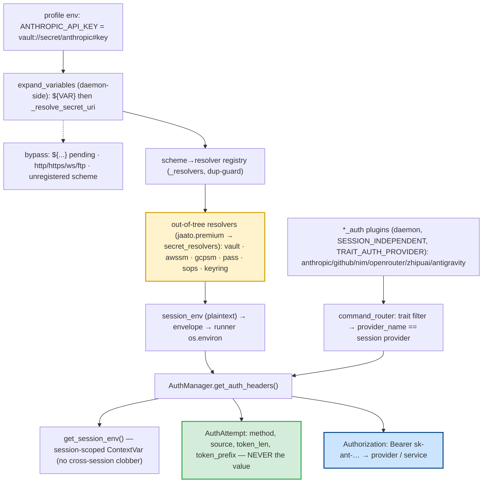

# Secrets & API-Key Management

> **One-sentence definition.** A three-pronged credential layer: a **pluggable secret-URI resolver registry** that turns `scheme://path#key` references into plaintext via out-of-tree backends (Vault, AWS/GCP Secrets Manager, `pass`, …), a **per-provider interactive auth plugin family** (`*_auth`) that acquires and stores model-provider credentials, and a **leak-proof discipline** in the service connector that resolves credentials session-scoped while ever recording only safe provenance — never the secret value.
> **Layer (bottom→top):** a cross-cutting security concern feeding profiles, model providers, and service calls; the *inbound* half of the secrets-in / data-out symmetry · **Lives in:** `jaato/jaato-server/shared/plugins/subagent/config.py` (resolver registry) + `jaato/jaato-server/shared/plugins/{anthropic,github,nim,openrouter,zhipuai,antigravity}_auth/` (auth plugins) + `jaato/jaato-server/shared/plugins/service_connector/auth.py` (the discipline).

## What it is

An agent needs credentials — an `ANTHROPIC_API_KEY` to reach the model, a bearer token to call a service. The naïve approach (plaintext keys in a config file or `os.environ`) is both insecure and racy when many sessions share one daemon. jaato solves this in three distinct ways.

First, **you never have to write a secret in config**. A profile/env value can be a **secret URI** like `vault://secret/anthropic#key` or `pass://jaato/openrouter/api-key`. At session build, the daemon resolves it to plaintext through a **pluggable resolver** keyed by scheme. The framework owns the protocol, the registry, and the dispatch; the actual backends (Vault, AWS `awssm`, GCP `gcpsm`, Unix `pass`, `sops`, `keyring`) are **out-of-tree, entry-point-only** plugins, so the open-source core ships no opinion about your secret store.

Second, for the model providers themselves, a family of **`*_auth` plugins** handles interactive login — OAuth (PKCE or device-code) for subscription/OAuth providers, API-key validation-and-store for the rest. These load at daemon startup (before any session exists) so `… login` commands are available immediately.

Third, every credential read goes through a **leak-proof discipline**: a session-scoped lookup that prevents concurrent sessions from clobbering each other's environment, and a provenance object that records *where* a credential came from and *what shape* it has (length, 4-char prefix) — but **never the value itself**, so a 401 can be diagnosed without a secret ever entering a log.

## Where it sits in the stack

*Below* the secrets layer is the host environment (env files, OS keychains, external secret stores). *Above* it are **profiles** (`07-profiles`), whose `env` map carries the secret URIs, and **model providers** (`06-model-providers`), which consume the resolved keys. *Sideways*, it touches the **plugin system** (`05-plugins`) — auth plugins are daemon-tier tool plugins marked with the `TRAIT_AUTH_PROVIDER` trait — and the **workspace/runner boundary** (`15-workspace`): the daemon resolves secret URIs because the AppArmor-confined runner cannot exec a secret-store binary like `pass`. It is the **inbound** mirror of the **anonymization layer** (`18-redaction`): secrets are resolved so they never leak in; pseudonymization ensures PII never leaks out (to model, tools, or traces).

## Responsibilities

- Define the `SecretResolver` protocol and discover backends via entry points into a scheme→resolver registry (with a duplicate-scheme guard).
- Dispatch `scheme://path#key` values to the right resolver, while **bypassing** standard network schemes and pending `${VAR}` substitutions.
- Resolve secrets **daemon-side** (the confined runner can't) and ship only the plaintext result in the session envelope.
- Provide per-provider interactive auth (`*_auth`) and let the server match an authed provider to a session by `provider_name`.
- Read credentials **session-scoped** (a `ContextVar`, not bare `os.environ`) and never carry the secret value beyond the header it produces — only `token_len` / `token_prefix` provenance.

## Key concepts & structure

### The secret-URI grammar and `SecretResolver` protocol (`config.py`)
`_SECRET_URI_RE` matches `scheme://path[#key]` — a lowercase scheme, a path, an optional `#key` fragment. The `SecretResolver` Protocol declares a `schemes` property (a `FrozenSet[str]`, e.g. `{"vault"}` or a multi-scheme `{"awssm","gcpsm"}`) and `resolve(scheme, path, key) -> str`. Failures raise `SecretResolutionError` carrying `.uri` and `.reason`.

### Entry-point discovery + scheme registry (`config.py`)
`_discover_secret_resolvers()` reads the `jaato.premium` → `secret_resolvers` entry point group, loads each zero-arg factory, and populates a process-global `_resolvers` dict (scheme → instance), cached for the process. A second resolver claiming an already-registered scheme is **rejected with a warning** (first registration wins). The resolver *implementations* are not in the open-source tree — the entry-point group is **reserved but empty** here; backends ship with jaato-premium.

### Dispatch with three bypasses (`config.py`)
`_resolve_secret_uri(value)` returns the value unchanged if it (1) still contains a pending `${VAR}` (env expansion runs downstream), (2) uses a standard network scheme — `_NETWORK_SCHEMES = {http, https, ws, wss, ftp, ftps}` — so a URL is never mistaken for a secret, or (3) names an unregistered scheme (logs a warning, returns literal). The network bypass exists because of a real pre-0.6.57 bug where `http://127.0.0.1:${PORT}` was wrongly treated as a secret URI and short-circuited the downstream env-var expansion. Resolution applies only when the **entire** string is a URI.

### The `*_auth` plugin family + `TRAIT_AUTH_PROVIDER` (`base.py`)
Six plugins, each `PLUGIN_KIND="tool"`, `PLUGIN_TIER="daemon"`, `SESSION_INDEPENDENT=True` (loaded at startup so login works before any provider connection). Each carries `plugin_traits={TRAIT_AUTH_PROVIDER}` and a `provider_name`:

| Plugin | `provider_name` | Auth kind |
|--------|-----------------|-----------|
| `anthropic_auth` | `anthropic` | OAuth PKCE (Pro/Max) + API-key fallback |
| `antigravity_auth` | `antigravity` | Google OAuth (PKCE; OAuth-only) |
| `github_auth` | `github_models` | OAuth **device-code** flow |
| `nim_auth` | `nim` | API-key (validate + store) |
| `openrouter_auth` | `openrouter` | API-key (validate + store) |
| `zhipuai_auth` | `zhipuai` | API-key (validate + store) |

The server matches an authed plugin to a session by **trait filter (`TRAIT_AUTH_PROVIDER`) → `provider_name` string equality** against the session's active provider (`core.py`). (A separate `command_router._hint_available_auth_providers`, `command_router.py`, only *lists* login commands when session creation fails — no equality check there.)

### The leak-proof discipline (`service_connector/auth.py`)
Credential reads go through `get_session_env()` — a session-scoped `ContextVar` (checked before `os.environ`) so concurrent sessions never clobber each other's values. Each resolution produces an immutable `AuthAttempt`: it holds the `AuthSource` provenance (`method`, `kind` ∈ `env`/`uri`/`unset`, `env_var`, `uri`, `rotation_hint`) plus — only for secret-like methods — `token_len` and `token_prefix` (first 4 chars). **The secret value is never a field.** This is what lets a 401 carry an actionable diagnosis ("the token from `pass://X` is stale — rotate with `pass edit X`") instead of "Bad credentials." OAuth tokens are cached by service with a 60-second expiry buffer.

## Lifecycle / flow

**Config value → provider header.**
1. The daemon reads the workspace `.env` and runs `expand_variables` (defined `config.py`, called from `core.py`): Phase 1 expands `${VAR}` (context → session-env → `os.environ`); Phase 2 calls `_resolve_secret_uri`, which discovers resolvers and invokes the matching one (e.g. `vault.resolve("secret/anthropic", key="key")` → `sk-ant-…`). **This happens daemon-side** because only the unconfined daemon can exec `pass`/`vault`; the AppArmor-confined runner cannot.
2. The fully-resolved value lands in `self._session_env` and ships to the runner in the session envelope, applied to `os.environ` unchanged — no resolver discovery, no `pass` exec runner-side.
3. At request time a service call goes through `AuthManager.get_auth_headers()`; `_resolve_credential` reads the key (URI → `_resolve_secret_uri`, or bare name → `get_session_env`), puts it in the header, and appends an `AuthAttempt` with only len/prefix provenance.

**Interactive auth.** `anthropic-auth login` runs the PKCE flow (build URL + persist verifier, then `anthropic-auth code <code>` exchanges for tokens stored in the system keychain); GitHub uses the device-code variant. On success the daemon emits a post-auth-setup offer, matching the plugin's `provider_name` to the active session.

## Configuration / authoring

```yaml
# profile.yaml — env values may be plaintext, ${VAR}, or a secret URI
env:
  ANTHROPIC_API_KEY: "vault://secret/anthropic#key"     # HashiCorp Vault
  OPENROUTER_API_KEY: "pass://jaato/openrouter/api-key" # Unix password-store
  SERVICE_BASE: "http://127.0.0.1:${SERVICE_PORT}"       # network scheme — NOT treated as a secret
```
```text
# Interactive provider login (commands available at daemon startup):
anthropic-auth login        # OAuth PKCE → paste code → anthropic-auth code <code>
github-auth login           # OAuth device-code flow
openrouter-auth login       # API-key validate + store
```

## Relationship to neighboring components

**Profiles** (`07-profiles`) carry the secret URIs in their `env` map. **Model providers** (`06-model-providers`) consume the resolved keys; each `*_auth` plugin's `verify_credentials()` defers to the matching provider's `env.py`/`oauth.py`. A key can also be supplied **per provider** as `plugin_configs.<provider>.api_key: pass://…` (not just via `.env`): it rides in `ProviderConfig(extra=…)` through `verify_auth` (`jaato_runtime.py`) and is promoted out of `extra` at connect time, resolving through the same secret-URI machinery. The **plugin system** (`05-plugins`) discovers auth plugins by `PLUGIN_KIND`/`PLUGIN_TIER`/`SESSION_INDEPENDENT` and the `TRAIT_AUTH_PROVIDER` trait. The **workspace/runner boundary** (`15-workspace`) is *why* resolution is daemon-side: the confined runner can't reach a secret store. Redaction (`18-redaction`) is the outbound mirror that keeps these resolved values out of traces.

## Example

Profile `researcher` sets `provider: anthropic` and `.env` has `ANTHROPIC_API_KEY=vault://secret/anthropic#key`. **(a)** The daemon reads `.env`; `expand_variables` runs `${}` expansion then `_resolve_secret_uri`, which finds the out-of-tree `vault` resolver (registered via `jaato.premium → secret_resolvers`) whose `resolve("secret/anthropic", key="key")` returns `sk-ant-api03-…`. **(b)** The plaintext lands in `self._session_env`, ships to the runner via the envelope, and is applied to `os.environ`. **(c)** If the key were missing, session creation fails and the daemon lists `anthropic-auth login`; the user runs the PKCE flow, tokens land in the keychain, and a post-auth offer matches `provider_name == "anthropic"`. **(d)** At request time `AuthManager` emits `Authorization: Bearer sk-ant-…` and records `AuthAttempt(token_len=108, token_prefix="sk-a")` — never the full secret; a 401 attaches that attempt plus a `pass edit`/`vault` rotation hint.

## Diagram



## Diagram brief (for illustration)

- **Layout:** Two feeder columns merging into a request path. Left column = secret-URI resolution (top→bottom); right column = interactive auth; both converge on `AuthManager` → outbound header at the bottom.
- **Boxes (left/resolution):** "profile env: ANTHROPIC_API_KEY = vault://secret/anthropic#key" → "expand_variables — DAEMON-SIDE (${VAR} then _resolve_secret_uri)" with a dashed side-box "bypass: pending ${…} · http/https/ws/ftp · unregistered scheme" → "scheme→resolver registry (dup-guard)" → **"out-of-tree resolvers: vault · awssm · gcpsm · pass · sops · keyring"** (highlighted, drawn as a plug-in card) → "session_env (plaintext) → envelope → runner os.environ".
- **Boxes (right/auth):** "*_auth plugins (daemon, SESSION_INDEPENDENT, TRAIT_AUTH_PROVIDER)" → "command_router: trait filter → provider_name == session provider".
- **Boxes (request path):** "AuthManager.get_auth_headers()" → branches to "get_session_env() — session-scoped ContextVar" and **"AuthAttempt: method, token_len, token_prefix — NEVER the value"** (highlighted green) → "Authorization: Bearer sk-ant-… → provider/service" (highlighted blue).
- **Arrows:** straight flows; one dashed arrow from `expand_variables` to the bypass side-box. Label the resolution column "resolved DAEMON-SIDE (confined runner can't exec pass/vault)".
- **Emphasis:** The **out-of-tree resolver card** (pluggable, one per scheme) and the **AuthAttempt "never the value"** box (the leak-proof discipline). Note daemon-side resolution.
- **Caption:** "Secrets: `scheme://path#key` references resolved daemon-side by pluggable backends, per-provider OAuth/API-key auth plugins, and an AuthAttempt that records provenance — never the secret itself."

## Source references
- `jaato/jaato-server/shared/plugins/subagent/config.py` — `_SECRET_URI_RE` (`scheme://path#key`); `SecretResolver` protocol.
- `jaato/jaato-server/shared/plugins/subagent/config.py` — `_discover_secret_resolvers()` + `_resolvers` registry + duplicate-scheme guard.
- `jaato/jaato-server/shared/plugins/subagent/config.py` — `_resolve_secret_uri()` + `_NETWORK_SCHEMES` bypass + pre-0.6.57 rationale.
- `jaato/jaato-server/shared/plugins/subagent/config.py` — two-phase `_expand_string()` (`${VAR}` then secret URI).
- `jaato/jaato-server/server/core.py` — daemon-side secret resolution (confined runner can't exec `pass`/`vault`); calls `expand_variables` (defined in `…/plugins/subagent/config.py`).
- `jaato/jaato-sdk/jaato_sdk/plugins/base.py` — `TRAIT_AUTH_PROVIDER = "auth_provider"`.
- `jaato/jaato-server/shared/plugins/anthropic_auth/plugin.py` — `provider_name`, PKCE flow; `github_auth/plugin.py` — device-code `_cmd_login`.
- `jaato/jaato-server/server/core.py` — trait filter + `provider_name` string-equality match; `command_router.py` — `_hint_available_auth_providers` (lists login commands on failure, no equality).
- `jaato/jaato-server/shared/plugins/service_connector/auth.py` — `AuthAttempt`/`AuthSource` (safe provenance, no value); `_SECRET_LIKE_METHODS`.
- `jaato/jaato-server/shared/plugins/service_connector/auth.py` — `_resolve_credential()` (URI vs `get_session_env`); OAuth lifecycle.
- `jaato/jaato-server/shared/session_context.py` — `_session_env` ContextVar; `get_session_env()`.
