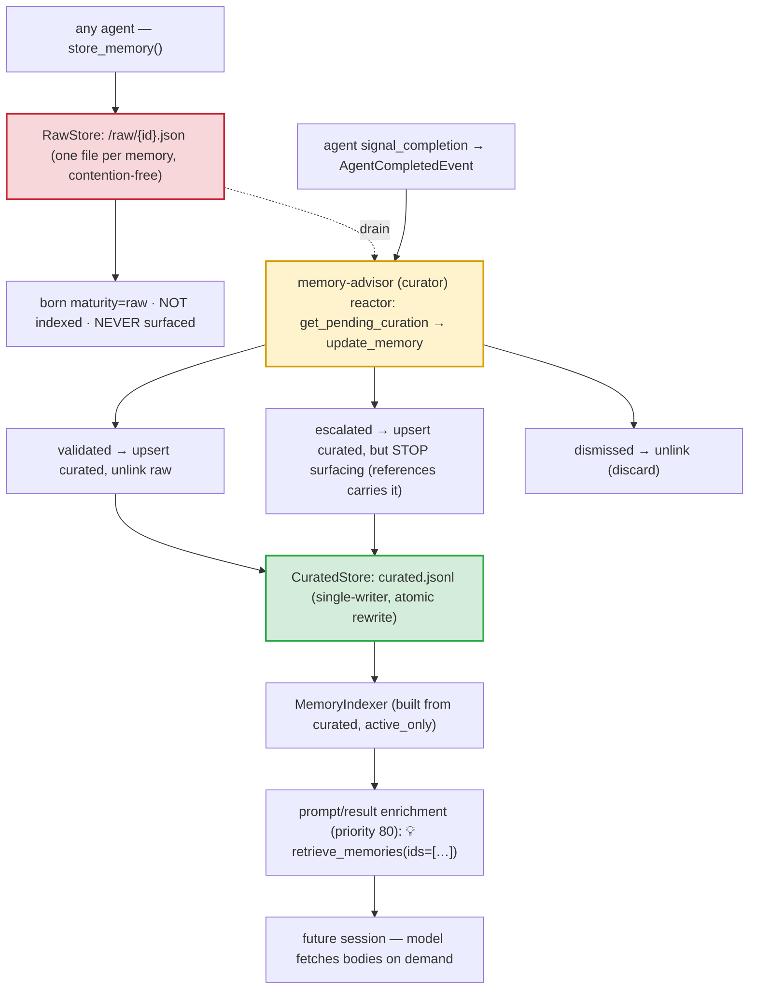

# Memory — Authoring & Curation ("The School")

> **One-sentence definition.** A knowledge-curation lifecycle in which working agents author **raw** memories during sessions and an **advisor/curator** agent later drains, validates, escalates, or dismisses them — so only vetted knowledge is ever surfaced back into future prompts.
> **Layer (bottom→top):** a tool-tier plugin that also participates in the prompt-enrichment pipeline; runner-side with `~/.jaato` filesystem access · **Lives in:** `jaato/jaato-server/shared/plugins/memory/` (`plugin.py`, `storage.py`, `models.py`, `indexer.py`).

## What it is

A bare agent forgets everything between sessions. A naïve "memory" feature — let the model write notes and inject them back — fails the other way: the store fills with half-formed, redundant, or wrong notes, and surfacing all of them poisons future prompts. jaato's memory subsystem, nicknamed **"The School,"** splits the problem into **authoring** and **curation** so that writing a memory and *trusting* a memory are two different acts performed by two different actors.

During a session, **any agent can author** a memory by calling `store_memory`. That memory is born **raw** — unreviewed, and deliberately **never surfaced** into prompts. Raw memories accumulate in a write-cheap queue.

Later, a dedicated **curator** (the "memory-advisor" agent) **drains the raw queue**: it reviews each raw memory and decides to **validate** it (keep it as real memory), **escalate** it (promote it — it stops surfacing as a memory, the knowledge is meant to live as a reference), or **dismiss** it (discard). Only validated (and still-raw-but-matched) memories ever get indexed and injected back into future prompts. The result is a maturity gradient where the cost of a bad note is bounded: it sits in the raw queue, invisible, until a curator vouches for it.

## Where it sits in the stack

Memory is a **tool plugin** (`05-plugins`) that *also* subscribes to the prompt-enrichment pipeline. *Below* it is the workspace filesystem (`15-workspace`): two on-disk stores under `~/.jaato/memories/`. *Above* it sits the **session**, which calls its tools and runs its enrichment each turn. *Sideways*, it is driven like a cascade stage — curation is a **reactor** triggered off the authoring agent's `AgentCompletedEvent` (`16-lifecycle-and-events`), the same mechanism cascades use to chain stages. The curator's behavior is defined by a **persona/profile** (`08-personas`, `07-profiles`) that exposes the discoverable mutator tools.

## Responsibilities

- Let any agent author a memory (`store_memory`) — always born **raw**, never indexed at write time.
- Store raw memories in a **contention-free** queue (one file per memory) and curated memories in a **single-writer** atomic store.
- Give the curator tools to review and re-classify (`update_memory`, `delete_memory`), implementing the maturity transitions.
- Maintain the maturity lifecycle: `raw → validated → escalated`, with `↘ dismissed`.
- Surface **only active** memories back into prompts (priority-80 enrichment), injecting compact ID hints, never full bodies.

## Key concepts & structure

### The two stores (`storage.py`)
**`RawStore`** (`storage.py:85`) is a **file-per-memory** queue under `<base>/raw/{id}.json`: each `add()` writes one JSON file via tempfile+rename, so concurrent producers never contend — each writer owns its own file. Raw memories are **never indexed and never surfaced**. **`CuratedStore`** (`storage.py:160`) is a **single JSONL** at `<base>/curated.jsonl`, single-writer (the curator), every write a full atomic rewrite via tempfile+rename. The `MemoryStore` facade composes both: `save()` always routes to raw; `load_curated()` feeds enrichment; `update()` performs the draining/routing.

### The maturity lifecycle (`models.py:22`)
Four state constants — `MATURITY_RAW`, `MATURITY_VALIDATED`, `MATURITY_ESCALATED`, `MATURITY_DISMISSED`. Semantics: **raw** = fresh, unreviewed; **validated** = the curator kept it; **escalated** = promoted to a reference entry and *no longer surfaced* as a memory (the reference takes over); **dismissed** = rejected and hidden. The surfacing filter is `ACTIVE_MATURITIES = {raw, validated}` (exposed via `Memory.is_active`) — so both escalated and dismissed are excluded from prompts.

### The draining rules (`storage.py:311`)
`MemoryStore.update()` is where curation actually happens: a **raw** memory marked validated/escalated is **upserted into the curated store, then its raw file is unlinked** (consolidate); a **raw** memory marked **dismissed** is simply unlinked with no curated trace (discard); a **curated** memory marked dismissed is removed from the curated store.

### The write tool vs the curator tools (`plugin.py`)
`store_memory` (`plugin.py:338`) is a **core** tool any agent sees; `_execute_store` always stamps `maturity=raw`, routes to the raw queue, and **skips the index**. `update_memory` / `delete_memory` (`plugin.py:485`) are **discoverable** mutators the curator uses to apply maturity transitions.

### Surfacing: enrichment + indexer (`plugin.py:739`, `indexer.py:172`)
The plugin subscribes to prompt enrichment at **priority 80** (late, so it sees the fully-enriched prompt) and to tool-result enrichment at 80. Both funnel through `_enrich_text`, which queries `MemoryIndexer.find_matches_in_text(...)` (built from `load_curated()` only, `active_only=True`) and appends a compact "💡 Available Memories — retrieve_memories(ids=[…])" hint showing only id + description, never the body. A per-session `_surfaced_memory_ids` set dedups so the same hint isn't re-injected every tool call.

## Lifecycle / flow

1. **Author (raw write).** An agent calls `store_memory`; `_execute_store` builds `Memory(maturity=raw, source_agent=…)` and calls `MemoryStore.save()` → `RawStore.add()` writes `<base>/raw/{id}.json` atomically. **Not indexed** — it will not surface yet.
2. **Trigger curation.** The authoring agent finishes; `signal_completion` emits `AgentCompletedEvent`, which the memory-advisor reactor consumes (`lifecycle_tools.py:1`).
3. **Drain.** The curator lists the raw queue (`get_pending_curation` → `RawStore.list_all()`, tolerant of concurrent deletion).
4. **Decide via `update_memory`:**
   - **validated** → upserted into curated, raw file unlinked; index rebuilt from curated.
   - **dismissed (raw)** → raw file unlinked, no curated trace (discard).
   - **escalated** → upserted into curated, but the maturity filter then **stops it surfacing** as a memory (references is meant to carry it).
   - **dismissed (curated)** → removed from the curated store.
5. **Surface.** On future prompts/tool-results, priority-80 enrichment matches active curated memories and injects `retrieve_memories(ids=[…])`; the model fetches the bodies on demand.

> **Design-vs-code note (flag it, don't smooth it over).** The design doc specifies dedicated `validate_memory` / `escalate_memory` tools and an `escalated_to` lineage field that would actually *create* a references entry. In the **current code** none of those symbols exist — escalation is performed by setting `maturity="escalated"` via `update_memory`, and the **enrichment-suppression** of escalated memories is wired, but the **reference-promotion bridge is aspirational**.

## Configuration / authoring

```yaml
# profile.yaml — memory is opt-in per profile
plugins: [memory, ...]      # only profiles listing memory get ~/.jaato/memories rw AppArmor grants
```
On-disk layout (under `storage_path`, default `~/.jaato/memories/`):
```text
memories/
├── raw/                 # one JSON file per raw memory — contention-free authoring queue
│   ├── mem_20260618_a…json
│   └── mem_20260618_b…json
└── curated.jsonl        # single-writer JSONL — the curator's vetted store (atomic rewrites)
```

## Relationship to neighboring components

Memory is a tool + enrichment **plugin** (`05-plugins`); its priority-80 enrichment runs *after* the **references** plugin (priority 20) — which is exactly why escalated memories drop out of memory enrichment: their knowledge is meant to surface earlier, via references. Curation is **reactor-driven** off `AgentCompletedEvent` (`16-lifecycle-and-events`), the same completion mechanism that chains **cascades** (`09-cascades`). The curator's identity is a **persona/profile** (`08-personas`, `07-profiles`) exposing the discoverable `update_memory`/`delete_memory` tools; each memory is stamped with its authoring agent's `source_agent`/`source_session`.

## Example

1. A `gen-references` agent explains an OAuth flow and calls `store_memory(description="OAuth2 PKCE flow", tags=["oauth_pkce_flow"], confidence=0.9)`. `_execute_store` writes `~/.jaato/memories/raw/mem_…json` with `maturity="raw"`, `source_agent="agent:gen-references"`. It is **not indexed** — no prompt surfaces it yet.
2. The agent signals completion → the memory-advisor reactor fires.
3. The advisor lists raw, judges it valuable, and calls `update_memory(id=…, maturity="validated")`. `MemoryStore.update()` upserts it into `curated.jsonl` (atomic rewrite) and unlinks the raw file; the indexer rebuilds from curated.
4. Next session, a prompt mentioning "oauth pkce flow" triggers priority-80 enrichment: `_enrich_text` matches the now-curated active memory and injects `retrieve_memories(ids=['mem_…'])`. The model fetches the body.
5. If the advisor later sets `maturity="escalated"`, the memory stays in `curated.jsonl` but `find_matches_in_text(active_only=True)` filters it out — it stops surfacing as a memory, by design ceding to references.

## Diagram



## Diagram brief (for illustration)

- **Layout:** Left→right pipeline with a curation gate in the middle. Authoring on the left, curator gate center, surfacing on the right.
- **Boxes (authoring):** "any agent → store_memory()" → **"RawStore — raw/{id}.json (one file per memory, contention-free)"** (tinted red/quarantine) with a callout "born maturity=raw · NOT indexed · NEVER surfaced".
- **Boxes (gate):** "agent signal_completion → AgentCompletedEvent" feeding **"memory-advisor / curator (reactor): get_pending_curation → update_memory"** (highlighted amber). A dashed "drain" arrow from RawStore into the curator. Three decision branches out: "validated → upsert curated + unlink raw", "escalated → upsert curated, STOP surfacing (references carries it)", "dismissed → unlink (discard)".
- **Boxes (surfacing):** **"CuratedStore — curated.jsonl (single-writer, atomic rewrite)"** (tinted green) → "MemoryIndexer (curated only, active_only)" → "enrichment priority 80: 💡 retrieve_memories(ids=[…])" → "future session — model fetches bodies on demand".
- **Arrows:** solid pipeline arrows; dashed "drain" from RawStore to curator; three labeled branches from the curator.
- **Emphasis:** The **raw (quarantine, never surfaced)** vs **curated (vetted, surfaced)** split, and the **curator reactor** as the gate between them. Show that raw is invisible to prompts and only curated reaches the model.
- **Caption:** "Memory / The School: any agent authors raw (quarantined, never surfaced); a curator reactor drains and validates/escalates/dismisses; only active curated memories are indexed and hinted back into future prompts."

## Source references
- `jaato/jaato-server/shared/plugins/memory/models.py:22` — maturity constants + `ACTIVE_MATURITIES`; `Memory.is_active` `:89`.
- `jaato/jaato-server/shared/plugins/memory/storage.py:85` — `RawStore` file-per-memory + atomic `add`.
- `jaato/jaato-server/shared/plugins/memory/storage.py:160` — `CuratedStore` single-writer JSONL + atomic rewrite.
- `jaato/jaato-server/shared/plugins/memory/storage.py:311` — `MemoryStore.update()` drain/consolidate/discard routing.
- `jaato/jaato-server/shared/plugins/memory/plugin.py:338` — `store_memory` schema (authoring tool, born raw).
- `jaato/jaato-server/shared/plugins/memory/plugin.py:485` — `update_memory`/`delete_memory` (curator mutators).
- `jaato/jaato-server/shared/plugins/memory/plugin.py:996` — `_execute_store` forces `maturity=raw`, routes to raw queue, skips index.
- `jaato/jaato-server/shared/plugins/memory/plugin.py:739` — enrichment priority 80; index built from curated only `:244`.
- `jaato/jaato-server/shared/plugins/memory/indexer.py:172` — `find_matches_in_text` with `active_only` maturity filter.
- `jaato/jaato-server/shared/lifecycle_tools.py:1` — `signal_completion` → memory-advisor reactor trigger.
- `jaato/jaato-server/shared/plugins/memory/tests/test_storage_layout.py:148` — confirms raw landing, validate→curated, dismiss-unlinks.
