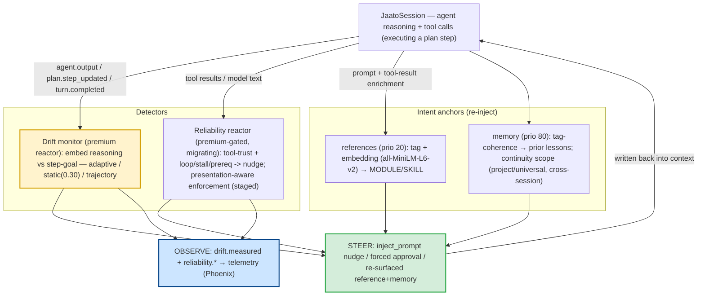

# Resilience: Behavior-Drift Detection & Steering

> **One-sentence definition.** A family of mechanisms that watch a running agent for **drift** — straying from its plan/intent, either *semantically* (its reasoning moves away from the active goal) or *behaviorally* (loops, stalls, flaky tools, skipped prerequisites) — and **steer it back** by injecting a corrective nudge or re-surfacing the right reference/memory, while emitting observable drift signals.
> **Layer (bottom→top):** a cross-cutting resilience concern observing the event/turn stream and writing back into the model context · **Lives in:** PREMIUM `jaato-premium/jaato_premium/drift_monitor/` (the drift reactor) + PUBLIC `jaato/jaato-server/shared/plugins/reliability/` (the reliability *logic*; its *wiring* is migrating to an event-driven reactor — design in `jaato/docs/design/reliability-event-driven-migration.md`), `…/plugins/memory/`, `…/plugins/references/`.

## What it is

A long-running or multi-stage agent rarely fails by crashing — it fails by **wandering**. It opens a plan step "add retry logic," then three tool calls later it's refactoring an unrelated module; or it gets stuck re-reading the same file, re-calling a flaky API, or announcing work it never does. None of that trips an exception, so nothing stops it. **Drift resilience** is the set of always-on mechanisms that notice the wandering and nudge the agent back on course.

There are **two complementary detectors** and **two intent-anchors**:

1. **The drift monitor** (premium) measures *semantic* drift: it embeds the agent's reasoning each plan step and scores its cosine similarity to the **step's goal**; when the score drops, it nudges.
2. **The reliability mechanism** (public logic, migrating from a dead in-process plugin to an event-driven reactor) detects *behavioral* drift: failing/flaky tools (adaptive trust escalation) and stall/loop patterns (repetition, introspection loops, read-only stalls, announce-no-action, error-retry loops, prerequisite violations) → corrective nudges, with presentation-aware enforcement.
3. **Memory continuity scopes** keep intent coherent *across sessions* — a scoped, cross-session memory store so an agent resumes where its prior self left off.
4. **Tag/embedding detection & injection** keeps intent coherent *within a session* — the memory and references enrichers re-surface the right prior lesson or curated MODULE/SKILL the moment the conversation drifts toward it.

All four converge on the same lever: **write intent back into the model's context** (a nudge, a re-injected reference, a resurfaced memory) and **emit a signal** (a `drift.measured` event, a `reliability.*` observability event) so the drift is visible in traces.

## Where it sits in the stack

These mechanisms sit *above* the session and observe its output. The **drift monitor** is a **reactor** (`11-reactors`): it subscribes to the daemon event bus (`16-lifecycle-and-events`) and reacts to `plan.step_updated` / `agent.output` / `turn.completed`. The **reliability mechanism** is migrating to the *same* shape — an event-driven reactor over the tool/turn bus events (with a thin in-path permission read-hook only for the interactive forced-prompt). **Memory** and **references** are enrichment plugins (`05-plugins`) in the prompt/tool-result pipeline. They all write back through `inject_prompt` / enrichment hints, and they all feed **telemetry** (`17-telemetry`). Two of them lean on the *same* embedding model (`all-MiniLM-L6-v2`) as the **references** semantic matcher.

## Responsibilities

- **Detect semantic drift**: embed reasoning vs. plan-step goal, flag on adaptive / static / trajectory conditions (drift monitor).
- **Detect behavioral drift**: track tool failures → adaptive trust; detect loop/stall/prerequisite patterns (reliability reactor).
- **Steer**: inject a non-blocking conversational nudge; for an escalated tool, force a permission prompt (interactive) or open an async-approval gate (headless); re-surface the relevant reference/memory.
- **Persist intent across sessions** via scoped, cross-session memory (continuity scopes).
- **Observe**: emit `drift.measured` and `reliability.*` events so drift is visible in traces, never silent.

## Key concepts & structure

### 1. Drift monitor — semantic distance from the plan-step goal (premium reactor)
A **premium-shipped reactor**: the `jaato_premium.reactors` installer writes a rule fragment to `~/.jaato/reactors/drift_monitor.json` and a thin action shim to `~/.jaato/scripts/drift_monitor.py` at reactor-extension start (`ReactorExtension.start()`, idempotent); the real logic lives in `jaato_premium.drift_monitor.reactor_logic.handle_event`, kept alive in the import cache across the framework's per-dispatch script reload so per-session state survives between turns (`reactor_logic.py:105`; registered via the `jaato.premium_reactors` entry point, `registration.py:67`).

It scores from three event types (`reactor_logic.py` docstring): `agent.output` chunks **accumulate** the model's streaming reasoning into a per-session buffer; `plan.step_updated` is the **primary** scoring trigger — it scores the buffer against the **current** step's goal *before* applying the transition (agents routinely open and close several steps within one turn, so per-step scoring attributes reasoning to the right step); `turn.completed` is the fallback for multi-turn steps. Scoring (`_flush_and_score`, `reactor_logic.py:184`): embed the buffer (sentence-transformers `all-MiniLM-L6-v2`, `embeddings.py:14`), `cosine_similarity` to the step-goal embedding (`scoring.py:12`, `state.py:141`).

`DriftState.is_drifting` (`state.py:149`) flags on **three conditions**: (1) **adaptive** — score below `mean − DEVIATION_FACTOR·std` of the first `BASELINE_TURNS` turns; (2) **static** — score `< HARD_THRESHOLD = 0.30`; (3) **trajectory** — the last `TRAJECTORY_WINDOW = 3` turn-scores monotonically declining (`scoring.py:48`). Thresholds are framework constants, not configurable in v1 (`state.py:45-48`). On **every** score it emits a `drift.measured` event (step id, score, flagged, flag type) so telemetry sees the signal even when not flagged (`_emit_drift_measured`, `reactor_logic.py:226`); on a flag it injects a conversational nudge via `ctx.inject_prompt` — *"…your last turn scored low against the active plan step… if this is an intentional pivot, mark the step complete or update the plan; otherwise return to the step's goal"* (`_nudge`, `reactor_logic.py:249`, `_DRIFT_NUDGE` `:69`). `complete_step` also runs a **strategic-drift** check across completed steps against the overall plan goal (`state.py:123`, `:261`).

### 2. Reliability — behavioral patterns & tool-trust (migrating: in-process plugin → event-driven reactor)
The reliability mechanism is the *behavioral* counterpart to the drift monitor, and its **logic is public** (`shared/plugins/reliability/`): an **adaptive tool-trust ledger** — every tool result keys a `FailureKey` (`types.py:104`) and an `EscalationRule` (`types.py:349`) transitions a tool `TRUSTED→ESCALATED→RECOVERING` (`TrustState`, `types.py:36`) — and a **`PatternDetector`** (`patterns.py:26`) for repetitive calls, introspection loops, read-only stalls, announce-no-action, error-retry loops, and prerequisite-policy violations (e.g. `setStepStatus` before `createPlan`).

**The wiring is being migrated.** The original in-process `ReliabilityPlugin` (`plugin.py:63`) is **dead in the shipped daemon** — it needs *three* bespoke wirings no production path calls (plugin attach via `configure_plugins(reliability_plugin=…)` `jaato_runtime.py:722`; nudge sinks via `set_nudge_callbacks`; forced-approval via `wrap_permission_plugin`), so its nudges silently no-op and even its `reliability …` commands are never registered. The fix mirrors the drift monitor: move the *wiring* (not the logic) to a **tenant-authored, premium-gated event-driven reactor** (`jaato.premium_reactors`). The reactor subscribes to bus events — `tool.call_started`, `tool.call_completed`, `agent.output`, `turn.completed`, `plan.step_updated` — reuses the public `PatternDetector`/types, steers via a **non-blocking `ctx.inject_prompt` nudge**, and emits `reliability.escalated` / `reliability.pattern_detected` (the bus `EventType` enum, `event_bus.py:90`) for observability — collapsing the three dead wirings into one entry point and replacing the dead nudge callbacks with the wired `inject_prompt`.

**Enforcement becomes presentation-aware** (the genuinely new capability). The escalation *decision* is the reactor's (both session types); only the *action* branches on `PresentationContext.client_type`. **Interactive** sessions (`TERMINAL`/`WEB`/`CHAT`) keep the **synchronous forced-permission-prompt** — a thin in-path read-hook, gated on interactive `client_type`, writes an "escalated tools" set the permission check reads and returns "ask." **Headless/cascade** sessions (`API`) must **never block on a human** (the cardinal invariant — a synchronous prompt would hang a cascade exactly like the `run_ephemeral_session` hang bug), so they steer **async** in tiers: **T1** auto-deny + nudge; **T2** `ctx.post_webhook` out-of-band notify (email/Slack to a reviewer not in-session); **T3** `ctx.gate` **async-approval gate** — it *suspends* the cascade (not a thread-block), notifies the human, and on their out-of-band approval **resumes by forking the parked session's history** (`create_headless_session(initial_history=…)`, the same `interrogate_session` fork-from-history primitive) and retrying the tool. A **TTL watchdog auto-releases** the gate on timeout (default deny), so a human who never answers can't hang the cascade. This is the headless analog of an interactive permission prompt — impossible today.

> **Impl status (this doc is conceptual / target architecture).** Phase 1 substrate has **landed** in jaato-server: the `reliability.escalated` / `reliability.pattern_detected` bus event types (`event_bus.py:90`) and a framework-computed `is_error_result` on `tool.call_completed` (`events.py:606`, so a "success-but-error-body" result still counts as a failure), plus a **reference reactor** (`jaato/docs/design/examples/reliability_reactor/`, Phase 1 = detect + nudge) demonstrating the authoring pattern. Whether premium ships a packaged `jaato_premium/reliability/` reactor or leaves it purely tenant-authored is still **open** (the reference reactor is the starting point), and **Phase 2 presentation-aware enforcement** (interactive forced-prompt + headless T1→T2→T3 gate) is **designed and staged**, not yet shipped. Source of truth: `jaato/docs/design/reliability-event-driven-migration.md`. The trust ledger is now **per-session** (reactor-native) — a deliberate change from the plugin's global ledger.

### 3. Memory continuity scopes — intent that survives across sessions
Each memory carries a `scope` ∈ `{SCOPE_PROJECT, SCOPE_UNIVERSAL}` (`memory/models.py:35`). Project-scope memories live in the **workspace** store (`.jaato/memories.jsonl`); universal-scope ones route to a fixed **global** store `~/.jaato/memories.jsonl` shared by all agents and sessions (`plugin.py:1013`, `:256`). Each is stamped with `source_agent`/`source_session` (`plugin.py:1009`). This is the cross-session intent anchor: an agent tags a consolidated lesson with a stable scope, and a later session — even in another workspace, for universal scope — re-surfaces it automatically, so the agent "remembers prior runs" without an explicit lookup (`docs/design/agent-continuity.md`).

### 4. Tag/embedding detection & reference/memory injection — intent re-surfaced mid-session
Two enrichers re-inject intent at every turn boundary (prompt *and* tool-result), in priority order:
- **References (priority 20, early)** anchors the agent to *authoritative instructions*. It is **hybrid** (`references/plugin.py:5071`): a **tag-coherence** pass (the shared `shared.tag_coherence` engine) plus **vector-embedding cosine similarity** (threshold `0.75`) from an external `jaato.embedding` provider (`embedding_types.py`) — whose model is *not* hardcoded (typically the same `all-MiniLM-L6-v2` the drift monitor uses, but provider-supplied). Embeddings both **veto** false tag hits (threshold `0.4`) and **add** semantic-only hits, surfacing the right MODULE.md/SKILL.md (or a `selectReferences` hint) the moment the conversation drifts toward its topic — even with no explicit `@mention`.
- **Memory (priority 80, late)** anchors the agent to *accumulated experience*. Its indexer is **tag/keyword only** — no embeddings — using the same `shared.tag_coherence` engine (`memory/indexer.py:172`); it injects a lightweight `💡 Available Memories → retrieve_memories(ids=[…])` hint (id + description only) for memories whose tags cohere in the now-enriched text.

### How they compose
Drift monitor = *semantic* detector (distance from goal). Reliability = *behavioral* detector (loops/trust). Continuity scopes = *cross-session* anchor. Tag/embedding injection = *in-session* anchor. All four steer with the **same primitive — write intent into the context** — and all four are **observable** (drift events, reliability telemetry). The drift monitor and references typically share the same embedding model (the references provider usually ships `all-MiniLM-L6-v2`, which the drift monitor hardcodes), so "semantic relevance" tends to be computed the same way for detection and for steering.

## Lifecycle / flow

A semantic-drift episode, end to end:
1. **Baseline.** The agent opens plan step "add retry logic"; `plan.step_updated` → drift monitor `set_step` records the goal embedding. The first `BASELINE_TURNS = 3` turns establish an adaptive threshold.
2. **Accumulate.** `agent.output` chunks buffer the model's reasoning per session.
3. **Score.** On the next `plan.step_updated` (or `turn.completed`), `_flush_and_score` embeds the buffer and cosine-scores it against the step goal.
4. **Detect.** `is_drifting` flags (adaptive / static `<0.30` / trajectory decline). `drift.measured` is emitted either way (telemetry sees the signal).
5. **Steer.** On a flag, `inject_prompt` pushes the nudge into the session; concurrently, **references/memory** enrichment may re-surface the retry-logic MODULE or a prior retry lesson. If the agent is *also* looping or hammering a flaky tool, the **reliability reactor** layers its own non-blocking nudge and (on escalation) a forced prompt (interactive) or async-approval gate (headless) — see §2 for its migration/impl status.
6. **Resolve.** The agent either returns to the goal (scores recover) or explicitly pivots (marks the step complete / updates the plan), which re-baselines the next epoch.

## Configuration / authoring

```jsonc
// Drift monitor: premium reactor, auto-installed; override the rule in ~/.jaato/reactors.json.
// Thresholds (HARD_THRESHOLD 0.30, BASELINE_TURNS 3, DEVIATION_FACTOR 2.0, TRAJECTORY_WINDOW 3)
// are framework constants — not configurable in v1.

// Reliability: .jaato/reliability-policies.json (or plugin_configs.reliability in a profile).
// NOTE: the in-process plugin that consumed this is dead/unwired; the policy schema is being
// carried into the event-driven reliability reactor (loaded at reactor init). See §2.
{ "pattern_detection": { "repetitive_call_threshold": 3, "max_reads_before_action": 5 },
  "prerequisite_policies": [ { "policy_id": "plan_before_step",
    "prerequisite_tool": "createPlan", "gated_tools": ["setStepStatus"] } ] }
```
```yaml
# Memory continuity + embedding injection (per profile)
plugins: [memory, references]
# memory scope is set per store_memory call: scope: project | universal
# references embeddings need a jaato.embedding provider (premium) + embedding_config.json
```

## Relationship to neighboring components

The **drift monitor** is a **reactor** (`11-reactors`) on the **event bus** (`16-lifecycle-and-events`), reacting to plan/turn events emitted by the **session**, and its `drift.measured` events feed **telemetry** (`17-telemetry`). The **reliability** mechanism (as a reactor) subscribes to the **tool/turn bus events**, reuses the public reliability logic, gates **completion/plan** tools (`13`/`14`) via prerequisite policies, and emits `reliability.escalated`/`reliability.pattern_detected` bus events; its interactive forced-prompt path touches the **permission** system, its headless path the **gate**/`webhook` primitives. **Memory** (`20-memory`) and **references** (`05-plugins`) are the enrichment anchors; both reuse the `all-MiniLM-L6-v2`/`shared.tag_coherence` machinery. Drift steering targets the **plan** the agent is executing — the same plan a **cascade** stage (`09`/`10`) runs against.

## Example

A `codegen` agent is on plan step *"add exponential-backoff retry to the payment client."* It writes the retry, then drifts into reformatting unrelated logging code. **(Drift monitor)** `agent.output` buffered its reasoning; the next `plan.step_updated` triggers `_flush_and_score`, which embeds the buffer and scores `0.22` against the step goal — below `HARD_THRESHOLD 0.30` → **static** flag. `drift.measured(score=0.22, flagged=true, flag_type="static")` is emitted; `inject_prompt` pushes *"…your last turn scored low against 'add exponential-backoff retry'… return to the step's goal or update the plan."* **(References)** because the reasoning is semantically near a `resilience-patterns` MODULE, the priority-20 semantic pass (cosine `0.81 ≥ 0.75`) injects that reference's guidance. **(Reliability reactor)** the three repeated read-only file calls also trip a read-only-stall pattern → a non-blocking `inject_prompt` nudge; had a tool *failed* three times, it would escalate — a forced permission prompt in an interactive session, or (in this headless cascade) an async-approval gate. The agent course-corrects back to the retry work — or marks the step complete and updates the plan, re-baselining the drift epoch.

## Diagram



## Diagram brief (for illustration)

- **Layout:** A central feedback loop. The **JaatoSession** (agent executing a plan step) at the top; a **Detectors** band and an **Intent-anchors** band feeding a single **STEER** node that loops back into the session; an **OBSERVE** sink off to the side.
- **Boxes:** top "JaatoSession — agent reasoning + tool calls (plan step)". Detectors band (two): **"Drift monitor (premium reactor): embed reasoning vs step-goal — adaptive / static 0.30 / trajectory"** (highlighted) and "Reliability reactor (premium-gated, migrating): tool-trust + loop/stall/prereq → nudge; presentation-aware enforcement (staged)". Intent-anchors band (two): "references (prio 20): tag + embedding (all-MiniLM-L6-v2) → MODULE/SKILL" and "memory (prio 80): tag-coherence → prior lessons; continuity scope project/universal, cross-session". A green **"STEER: inject_prompt nudge / forced approval / re-surfaced reference+memory"** node. A blue **"OBSERVE: drift.measured + reliability.* → telemetry/Phoenix"** sink.
- **Arrows:** Session→drift monitor labeled "agent.output / plan.step_updated / turn.completed"; Session→reliability labeled "tool results / model text"; Session→references/memory labeled "enrichment (prompt + tool-result)". All four detectors/anchors → STEER; STEER →(loops back)→ Session labeled "written back into context". Drift monitor + reliability → OBSERVE.
- **Emphasis:** The **closed feedback loop** (detect → steer → back into the session) is the hero; highlight the **drift monitor** (the active semantic detector) and the green **STEER** node. Show OBSERVE as a tap, not a gate. Note "migrating plugin→reactor; enforcement staged" on the reliability box.
- **Caption:** "Drift resilience: semantic (drift monitor) and behavioral (reliability) detectors plus in-session and cross-session intent anchors (references/memory) form a closed loop — detect the agent wandering from its plan, steer it back by writing intent into the context, and emit the drift signal to telemetry."

## Source references
- `jaato-premium/jaato_premium/drift_monitor/reactor_logic.py:105` — `handle_event` (event routing); `_flush_and_score` `:184` (embed + score + detect + nudge); `_emit_drift_measured` `:226`; `_nudge` / `_DRIFT_NUDGE` `:249`/`:69`.
- `jaato-premium/jaato_premium/drift_monitor/state.py:149` — `DriftState.is_drifting` (adaptive / static / trajectory); thresholds `:45-48`; `score_text` `:141`; `complete_step`/`_check_strategic_drift` `:123`/`:261`.
- `jaato-premium/jaato_premium/drift_monitor/scoring.py:12` — `cosine_similarity`; `compute_adaptive_baseline` `:25`; `detect_trajectory_decline` `:48`.
- `jaato-premium/jaato_premium/drift_monitor/embeddings.py:14` — `MODEL_NAME = "all-MiniLM-L6-v2"`; `SentenceTransformerProvider` `:24`. Registration via `jaato.premium_reactors` (`registration.py:67`).
- `jaato/jaato-server/shared/plugins/reliability/` — the public reliability **logic** the reactor reuses: `FailureKey`/`EscalationRule`/`TrustState` (`types.py:104`/`:349`/`:36`), `PatternDetector` (`patterns.py:26`). The in-process `ReliabilityPlugin` (`plugin.py:63`) is **dead** — its three activation seams (`configure_plugins(reliability_plugin=…)` `jaato_runtime.py:722`; `set_nudge_callbacks`; `wrap_permission_plugin` `plugin.py:3110`) are never called outside tests (daemon `core.py:2087` passes 3 args).
- `jaato/jaato-sdk/jaato_sdk/event_bus.py:90` — `RELIABILITY_ESCALATED`/`RELIABILITY_PATTERN_DETECTED` bus event types (substrate, #318); `is_error_result` on `tool.call_completed` (`jaato-sdk/jaato_sdk/events.py:606`, #319).
- `jaato/docs/design/reliability-event-driven-migration.md` — the migration design (source of truth: §2 synchronicity split · §5 presentation-aware enforcement · §6 phasing · §9 T3 async-approval gate); reference Phase-1 reactor at `jaato/docs/design/examples/reliability_reactor/` (#320, reference-only).
- `jaato/jaato-server/shared/plugins/memory/models.py:35` — `SCOPE_PROJECT`/`SCOPE_UNIVERSAL`; scope→store routing `plugin.py:1013`; global store `~/.jaato/memories.jsonl` `plugin.py:256`; source stamping `plugin.py:1009`. (Stores are JSONL files, remapped to a `.jaato/memories/` dir for the raw/curated split — see doc 20.)
- `jaato/jaato-server/shared/plugins/memory/indexer.py:172` — `find_matches_in_text` (tag-coherence, no embeddings); memory enrichment priority 80 (`plugin.py:739`).
- `jaato/jaato-server/shared/plugins/references/plugin.py:5071` — hybrid `_enrich_content` (tag pass + semantic veto 0.4 + semantic add 0.75); references priority 20 (`:4695`); embedding types/discovery `references/embedding_types.py`.
- `jaato-premium/drift-monitor-event-analysis.md`, `jaato-premium/agent-drift-embeddings.md` — drift design docs (event-source analysis; embedding rationale).
