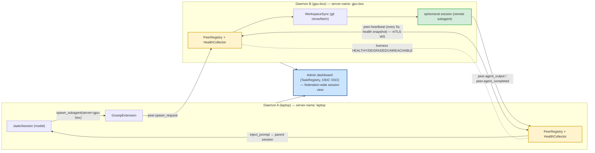

# The Gossip Protocol (Daemon Federation)

> **One-sentence definition.** A multi-server clustering layer that federates independent jaato **daemons** into a mesh — they discover each other from a `servers.json` peer list, exchange periodic **health heartbeats** (tracking each peer's liveness), **delegate subagents to remote peers** (`spawn_subagent(server="gpu-box", …)`) with **git-based workspace sync**, and present one **admin dashboard** across the whole federation — all carried over the public SDK's `peer.*` event family.
> **Layer (bottom→top):** a top-tier federation layer *above* individual daemons; PREMIUM, plugging into public seams · **Lives in:** PREMIUM `jaato-premium/jaato_premium/gossip/` (peer registry, health, remote-spawn, workspace-sync, auth/TLS, dashboard, extension) wiring into PUBLIC seams in `jaato/jaato-sdk/jaato_sdk/events.py` (the `PEER_*` events) and `jaato/jaato-server/server/__main__.py` / `websocket.py` (extension + connection hooks).

## What it is

A single jaato **daemon** (`01-daemon`) is bounded by one host: its CPU/RAM, its GPU (or lack of one), its workspace. **Gossip** lifts that ceiling by letting several daemons — a laptop, a CI box, a GPU server — act as **one federation**. Each daemon still runs its own sessions, but they *gossip*: every few seconds each broadcasts a heartbeat carrying a health snapshot, so every node knows which peers are alive, degraded, or unreachable. On top of that liveness substrate sit the payoffs: a model on the laptop can **delegate a subagent to the GPU box** (`spawn_subagent(server="gpu-box")`), the remote daemon runs it on a **git-synced copy of the same workspace**, and a single dashboard shows every session across every node.

It is **opt-in and inert by default**: with no `~/.jaato/servers.json`, none of the gossip code activates. It is **premium-shipped** — a daemon extension — but it rides entirely on **public seams**: the `peer.*` event types are pre-registered in the open SDK (so any client can deserialize them, even though only premium *produces* them), and the daemon exposes generic extension/connection hooks the gossip extension plugs into.

The protocol grew in phases, still visible in the code: **Phase 1** peer discovery + heartbeat + liveness; **Phase 3** remote subagent delegation; **Phase 5** git workspace sync. (The Phase-4 codebase split that moved the gossip initializer into jaato-premium is already done — `init_gossip` now lives in the premium package.)

## Where it sits in the stack

Gossip sits *above* the **daemon** (`01-daemon`) and its **session manager** — it federates daemons, it doesn't replace them. *Below/sideways* it speaks to the daemon's **WebSocket server** (peer connections are intercepted and routed by the extension) and the **session manager** (it creates ephemeral sessions for remote spawns and reads health). It extends the **subagent** plugin (registering a remote-spawn handler so `spawn_subagent(server=…)` routes off-box) and the **event protocol** (`16-lifecycle-and-events`) — the `peer.*` events are its wire format. It is loaded like any **daemon extension** (the same `jaato.extensions` mechanism the reactor engine uses, `11-reactors`), and its health identity feeds **telemetry** (`17-telemetry`).

## Responsibilities

- **Discover & track peers**: maintain outbound WS connections to each `servers.json` peer; run the liveness state machine (`HEALTHY`/`DEGRADED`/`UNREACHABLE`).
- **Gossip health**: broadcast periodic heartbeats carrying a CPU/RAM/session-count snapshot; ingest peers' heartbeats.
- **Delegate remotely**: route `spawn_subagent(server=…)` to a peer, run it there as an ephemeral session, and stream its output back into the parent session.
- **Replicate workspace**: git-sync the parent's codebase to the remote before the subagent runs, and cherry-pick its changes back.
- **Secure & observe the mesh**: mTLS between peers, OIDC SSO for the dashboard, and a federation-wide session view.

## Key concepts & structure

### The wire protocol — the `peer.*` events (public SDK)
The federation speaks in eight event types pre-registered in the **public** SDK (`events.py:270-277`): `PEER_HEARTBEAT`, `PEER_SPAWN_REQUEST`, `PEER_SPAWN_ACCEPTED`, `PEER_SPAWN_REJECTED`, `PEER_AGENT_OUTPUT`, `PEER_AGENT_COMPLETED`, `PEER_STOP_REQUEST`, `PEER_STOP_ACKNOWLEDGED`. They are server-to-server (not client-facing); the public SDK carries the type definitions so any client *can* deserialize them, but **production is gated on premium being installed**.

### One public seam + an internal init contract
There is exactly **one public entry-point seam**: `jaato.extensions` → `gossip` → `create_extension` (`extension.py:658`). The daemon's `_load_extensions()` (`jaato/jaato-server/server/__main__.py:907`) discovers and starts it like any daemon extension.

Inside the extension, a second contract wires the subsystem — but by **direct call, not entry-point discovery** (there is no `jaato.gossip` entry point anywhere). The extension imports and calls `init_gossip(ctx: GossipContext) -> GossipResult` (`extension.py:94` import, `:122` call; defined `gossip_init.py:21`). `GossipContext` hands over the `session_manager`, the `--web-socket`/`--ipc-socket`/`--server-name` CLI args, the parsed `servers.json`, and TLS config (`gossip_interface.py:19`); `GossipResult` returns the `peer_registry`, `health_collector`, `remote_handler`, and `server_reliability` (`gossip_interface.py:44`). Both `init_gossip` and the interface now live in the premium package (the Phase-4 split is done).

### `PeerRegistry` — discovery, heartbeat, liveness (`peers.py:98`)
The heart of Phase 1. Constructed from parsed `servers.json`; `start(health_collector)` (`peers.py:162`) spawns an outbound connection loop per peer plus the heartbeat broadcaster. `PeerState` ∈ `HEALTHY`/`DEGRADED`/`UNREACHABLE` (`peers.py:48`). The `_heartbeat_loop` (`peers.py:322`) broadcasts every `heartbeat_interval_seconds` (default `5.0`); `_check_peer_liveness` (`peers.py:411`) escalates a peer to `DEGRADED` after `degraded_after_missed` (3) and `UNREACHABLE` after `unreachable_after_missed` (5) missed heartbeats (`GossipConfig`, `peers.py:57`). Inbound peer sockets are handed off by the WS server to `handle_peer_connection` (`peers.py:223`); `send_to_peer(name, event)` (`peers.py:465`) routes an event to a specific peer.

### `ServerHealthCollector` (`health.py:31`)
Produces a periodic `ServerHealthSnapshot` (`health.py:18`) — CPU, memory, session/agent counts (via `psutil`) — that the registry embeds in each outbound heartbeat, so liveness carries *load* information, not just "alive."

### `RemoteSpawnHandler` — remote subagent delegation (`remote_spawn.py:45`)
Phase 3, two roles. **Origin** — the daemon entry `execute_spawn` (`remote_spawn.py:236`) bridges the synchronous tool call into the async protocol via `run_coroutine_threadsafe`, calling `request_remote_spawn` (`remote_spawn.py:152`) which builds a `PeerSpawnRequestEvent`, sends it via `PeerRegistry.send_to_peer`, tracks the pending request, and forwards the peer's response events (`accepted`/`rejected`/`output`/`completed`) into the parent session via `inject_prompt_to_session` (per-delta streaming, `:396`/`:414`). **Remote** — `_on_spawn_request` (`remote_spawn.py:636`) receives the request and `_run_remote_subagent` (`:693`) runs it as an **ephemeral session** via `SessionManager.run_ephemeral_session` (`:786` → `session_manager.py:7683` → `create_headless_session` `:4690`), streaming `peer.agent_output`/`peer.agent_completed` back to the origin. The handler is wired onto the **subagent** plugin via `register_remote_handler` so `spawn_subagent(server="gpu-box")` transparently goes off-box.

### `WorkspaceSync` — git-based replication (`workspace_sync.py:69`)
Phase 5. So a remote subagent operates on the *same* codebase: **origin prepare** detects git info and pushes uncommitted changes on a temp branch; **remote sync** clones or fetches under `~/.jaato/remote_workspaces` (`workspace_sync.py:30`); **pull-back** pushes the subagent's changes and cherry-picks them onto the origin. All via `subprocess` git with timeouts.

### Reliability, security, dashboard
`ServerReliabilityTracker` (`server_reliability.py`) tracks per-peer failures (reusing the reliability `EscalationRule`) to route around flaky nodes. `auth.py`/`tls.py`/`ws_auth_proxy.py` provide **mTLS** between peers and **OIDC SSO** (authlib + signed HMAC-SHA256 session cookies) for the dashboard. `TaskRegistry` (`task_registry.py:39`) + the `dashboard/` web app (a `<jaato-task>` web component, Vite frontend, `docker_launcher.py`) give a federation-wide view of every session.

### `GossipExtension` — the wiring (`extension.py:59`)
Binds everything through **four generic public hooks** (`extension.py:7`): (1) daemon `start()`/`stop()` lifecycle (`extension.py:278`/`:375`); (2) a **WS connection interceptor** that routes inbound peer connections; (3) a **session hook** `_on_session_ready` (`extension.py:456`) that, per session, registers it in the `TaskRegistry`, wires the environment aspect, and calls `subagent_plugin.register_remote_handler(...)`; (4) the per-session **remote handler / custom aspects**. `start()` (`extension.py:278`) launches the peer registry, the health HTTP endpoint, the WS peer handler, and the dashboard.

## Lifecycle / flow

A remote spawn, end to end:
1. **Boot.** Each daemon loads the gossip extension (`_load_extensions`); if `~/.jaato/servers.json` exists, `init_gossip` builds the `PeerRegistry`/`HealthCollector`/`RemoteSpawnHandler` and `start()` opens outbound WS connections to peers.
2. **Gossip.** Every `heartbeat_interval_seconds`, each daemon broadcasts a `peer.heartbeat` with its health snapshot; `_check_peer_liveness` keeps each peer's `PeerState` current.
3. **Delegate.** On daemon A the model calls `spawn_subagent(server="gpu-box", …)`; `request_remote_spawn` sends a `peer.spawn_request` to gpu-box.
4. **Sync + run.** gpu-box `WorkspaceSync` clones/fetches the parent workspace; `_on_spawn_request` → `_run_remote_subagent` opens an **ephemeral session** (`run_ephemeral_session` → `create_headless_session`) and runs the subagent, replying `peer.spawn_accepted` then streaming `peer.agent_output`.
5. **Return.** On `peer.agent_completed`, the origin pulls back the git changes and `inject_prompt_to_session` feeds the result into the parent session — as if the subagent had run locally.
6. **Observe.** Throughout, the dashboard's `TaskRegistry` shows sessions across both daemons; heartbeats and reliability route around a node that goes `UNREACHABLE`.

## Configuration / authoring

`~/.jaato/servers.json` (peer list + gossip tuning; plus optional `tls` and `auth` sections):
```jsonc
{
  "servers": [
    {"name": "gpu-box", "transport": "ws", "address": "ws://gpu-box:8080", "tags": ["gpu"]},
    {"name": "ci-box",  "transport": "ws", "address": "ws://ci-box:8080",  "tags": ["ci"]}
  ],
  "gossip": { "heartbeat_interval_seconds": 5, "degraded_after_missed": 3, "unreachable_after_missed": 5 },
  "tls":  { "cert": "…", "key": "…", "ca": "…" },          // mTLS between peers (optional)
  "auth": { "issuer": "https://idp.example.com/realms/jaato", "client_id": "…" }  // dashboard OIDC (optional)
}
```
With no `servers.json`, gossip is completely inert (`peers.py:9`). `transport` is `ws` (the `ipc` value is reserved/skipped). The daemon is launched with `--server-name <name>` so peers can address it.

## Relationship to neighboring components

Gossip federates **daemons** (`01-daemon`) and their **session managers**, intercepting peer connections on the daemon **WebSocket** server. It extends the **subagent** plugin (remote-spawn handler) and is loaded via the **daemon-extension** mechanism shared with **reactors** (`11-reactors`). Its `peer.*` wire format is part of the **event protocol** (`16-lifecycle-and-events`), where these events are catalogued as "peer channel events (server-to-server gossip)." Remote subagents become **ephemeral sessions** (cousins of cascade stages, `10-cascade-stages`) on the remote runner. Health identity feeds **telemetry** (`17-telemetry`) via the `jaato.telemetry_resource` contribution.

## Example

`servers.json` on a laptop lists `gpu-box`. The laptop daemon boots, loads the gossip extension, opens a WS to gpu-box, and both start trading `peer.heartbeat`s (5 s); gpu-box shows `HEALTHY` with low load. A coding agent on the laptop needs a CUDA build and calls `spawn_subagent(server="gpu-box", agent="builder", prompt="compile the kernels")`. the laptop's `execute_spawn`→`request_remote_spawn` emits a `peer.spawn_request`; gpu-box's `_on_spawn_request` triggers `WorkspaceSync` to fetch the laptop's repo (uncommitted work pushed on a temp branch), then `_run_remote_subagent` opens an ephemeral session and runs `builder`, streaming `peer.agent_output` back — which the laptop injects into the parent session live. On `peer.agent_completed`, the laptop cherry-picks the built artifacts back onto its working branch. The dashboard shows both sessions; if gpu-box misses 5 heartbeats mid-build it flips to `UNREACHABLE` and the reliability tracker surfaces the failure.

## Diagram



## Diagram brief (for illustration)

- **Layout:** Two daemon boxes side by side (a mesh of 2, generalizing to N), a heartbeat link between them, a remote-spawn flow arcing left→right→back, and a dashboard beneath spanning both.
- **Boxes:** **Daemon A (laptop)** containing "JaatoSession (model)", "PeerRegistry + HealthCollector" (highlighted), "GossipExtension". **Daemon B (gpu-box)** containing "PeerRegistry + HealthCollector" (highlighted), "WorkspaceSync (git clone/fetch)", "ephemeral session (remote subagent)" (green). A wide bottom box **"Admin dashboard — TaskRegistry + OIDC SSO, federation-wide session view"** (blue).
- **Arrows:** a bidirectional **"peer.heartbeat (every 5 s, health snapshot) — mTLS WS"** between the two PeerRegistries, plus a dashed **"liveness: HEALTHY / DEGRADED / UNREACHABLE"** tie. Session A→GossipExtension "spawn_subagent(server=gpu-box)"; Extension→B "peer.spawn_request"; B→WorkspaceSync→ephemeral session; ephemeral→A "peer.agent_output / peer.agent_completed"; A→Session "inject_prompt → parent". Both daemons → dashboard.
- **Emphasis:** The **heartbeat mesh** (the always-on substrate) and the **remote-spawn round-trip** (the payoff) — show the request going out and output streaming back into the *same* parent session. Highlight the two PeerRegistries (the federation core) and the green remote ephemeral session.
- **Caption:** "Gossip: independent jaato daemons federate over a heartbeat mesh (liveness + health), then delegate subagents to remote peers on a git-synced workspace — output streaming back into the parent session — all behind mTLS and one dashboard."

## Source references
- `jaato/jaato-sdk/jaato_sdk/events.py:270` — the `PEER_*` event family (`peer.heartbeat` … `peer.stop_acknowledged`), the public wire protocol (server-to-server; premium-produced).
- `jaato-premium/jaato_premium/gossip/__init__.py:1` — package overview; entry point `jaato.extensions → gossip → create_extension`.
- `jaato-premium/jaato_premium/gossip/peers.py:98` — `PeerRegistry`; `PeerState` `:48`, `GossipConfig` (heartbeat 5 s / 3 / 5) `:57`, `_heartbeat_loop` `:322`, `_check_peer_liveness` `:411`, `send_to_peer` `:465`, `handle_peer_connection` `:223`.
- `jaato-premium/jaato_premium/gossip/health.py:31` — `ServerHealthCollector` (CPU/mem/session snapshot for heartbeats).
- `jaato-premium/jaato_premium/gossip/remote_spawn.py:45` — `RemoteSpawnHandler`. Origin: `execute_spawn` (daemon entry, `run_coroutine_threadsafe`) `:236` → `request_remote_spawn` `:152`. Remote: `_on_spawn_request` `:636` → `_run_remote_subagent` `:693` → `run_ephemeral_session` (`session_manager.py:7683` → `create_headless_session` `:4690`).
- `jaato-premium/jaato_premium/gossip/workspace_sync.py:69` — `WorkspaceSync`: `prepare_delegation` (origin) `:145`, `sync_workspace` (remote clone/fetch) `:250`, `apply_modifications` (cherry-pick pull-back) `:403`; base `~/.jaato/remote_workspaces` `:30`.
- `jaato-premium/jaato_premium/gossip/extension.py:59` — `GossipExtension` (four hooks); `start` `:278`, `_on_session_ready` + `register_remote_handler` `:456`/`:502`, `create_extension` `:658`.
- `jaato-premium/jaato_premium/gossip/gossip_interface.py:19` — `GossipContext` / `GossipResult` `:44` (internal init contract, called directly from `extension.py:94`/`:122` — **not** an entry point; no `jaato.gossip` entry point exists). Initializer `gossip_init.py:21`.
- `jaato-premium/jaato_premium/gossip/auth.py:76` — `SSOAuth` (OIDC + signed cookies) for the dashboard; `task_registry.py:39` — `TaskRegistry`; `server_reliability.py` — per-peer `ServerReliabilityTracker`.
- `jaato/jaato-server/server/__main__.py:907` — `_load_extensions()` (loads the gossip daemon extension); peer-connection handoff in `server/websocket.py:1321-1329` (`_handle_client` from `:1310`).
- `jaato-premium/tests/e2e_gossip/servers-a.json` — a real two-server `servers.json` (peer list + gossip tuning).
