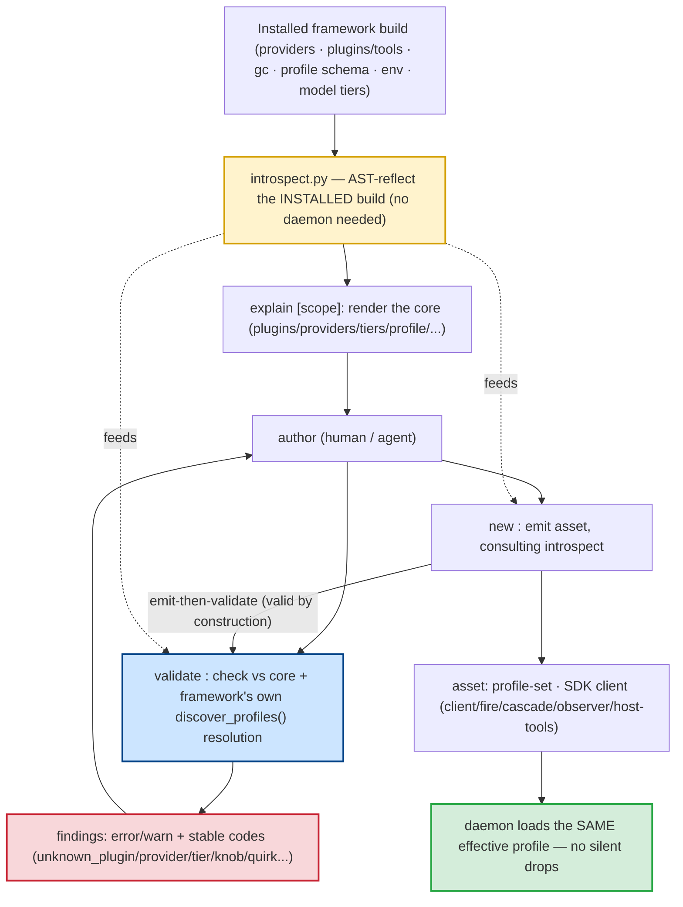

# jaato-scaffold (Authoring, Validation & Scaffolding CLI)

> **One-sentence definition.** A command-line tool that **introspects the actually-installed framework build** and exposes three verbs over one introspection core — `explain` (what does this framework offer?), `validate` (is my hand-authored asset correct against it?), and `new` (scaffold an asset, then run it straight back through `validate`) — so the silent-ignore failures that make jaato assets hard to author (a mistyped `api_params.temprature` dropped without a word at runtime) become loud, immediate errors.
> **Layer (bottom→top):** a developer/authoring tool *beside* the stack, not a runtime component — it reflects the framework rather than running inside it · **Lives in:** PUBLIC `jaato/jaato-server/shared/scaffold/` (`__main__.py` CLI, `introspect.py` core, `explain.py`, `validate.py`, `build.py`, `_client_templates.py`); console script `jaato-scaffold` (`jaato-server/pyproject.toml`).

## What it is

Almost everything you author for jaato — a **profile** (`07-profiles`), a **profile-set**, a **persona** (`08-personas`), a **completion schema** (`13-completion-schemas`), an **SDK client** (`04-runtime-session-client`) — is hand-written YAML/Python that the daemon consumes *leniently*. Lenient is the problem: a profile that names a plugin that doesn't exist, a provider knob under the wrong layer, a quirk the provider doesn't read, a tier pointing at an unknown provider — these are **silently dropped at runtime**, and the agent just behaves subtly wrong. `api_params.temprature` (typo) doesn't error; it's ignored, and your "deterministic" agent runs at the default temperature.

`jaato-scaffold` exists to **surface those silent failures before they reach a session**. Its trick is that it doesn't hardcode what's valid — it **introspects whatever framework build is installed in the current Python env**: it AST-reflects and imports the providers, plugins/tools, GC strategies, the profile schema, env vars, and model tiers that *this* build actually ships. So it stays correct as the framework evolves, and you run it in the **same env as the daemon you target**.

One introspection core feeds three verbs. **`explain`** renders the core ("what can I use here?"). **`validate`** checks a hand-authored asset against the core ("is this right?"). **`new`** emits an asset and immediately runs it back through `validate` — so scaffolded output is **valid by construction**, with no separate "is the generated thing ok?" code path. It is the construction companion to nearly every other doc in this deck.

## Where it sits in the stack

It sits *beside* the stack, not in it: a CLI that **reflects** the installed framework rather than serving requests. *Below* it (as the thing it introspects) is the entire server package — `shared/plugins/` (providers, tools, GC), `shared/plugins/subagent/config.py` (the profile schema + `discover_profiles` resolution), the model-tier system. *Above* it is the **author** — a human or agent building `.jaato/` assets. It deliberately **reuses the framework's own profile resolution** (`discover_profiles()`), so it validates the same *effective* profile the daemon would resolve — flattening `inherits:` and applying the `JAATO_PROFILE_SET` / `force_profile_set` overlay exactly as the runtime does.

## Responsibilities

- **Introspect the installed build** (not a hardcoded list): providers + their knobs/env vars/modalities, plugins/tools (+ `core`/`discoverable` discoverability and tier), GC strategies, the profile schema + field constraints, env vars, model tiers, profile-sets.
- **`explain`** any scope: `plugins · plugin <name> · providers · provider <name> · gc · env · transports · clients · runtime · tiers · sets · profile`.
- **`validate`** a profile/workspace/set against the core, reusing the framework's own resolution, emitting stable machine-coded errors/warnings.
- **`new`** an asset (profile-set or SDK-client archetype), consulting introspect while emitting and re-validating the result.
- **Fail loud, never guess**: required inputs must be supplied; an unknown provider is a hard error, not a fallback.

## Key concepts & structure

### The introspection core (`introspect.py`)
The single source of truth all three verbs render/check against. It discovers from the *installed* package — `providers()` (`introspect.py`, each `ProviderInfo` with its knobs/env/modalities), `plugins()` (each `PluginInfo`/`ToolInfo` with `discoverability` and tier), `gc_strategies()`, `profile_schema()` (each `ProfileField` + constraint), `env_vars()` (categorized per provider), plus the model-tier and profile-set surfaces. Much of it is **AST-parsed** (reading provider constant maps, plugin dirs, env reads) so introspection is side-effect-free and doesn't require a running daemon.

### `explain` — render the core by scope (`explain.py`)
The "what does *this* framework offer?" verb: `jaato-scaffold explain plugins`, `explain provider openrouter`, `explain tiers`, `explain profile`. It renders the introspect core for the chosen scope (with `--json` for machine consumption). `explain tiers`/`sets` surface the **V2 cross-provider model-tier** system (a profile whose vision tier is a *different* provider than its text executor); `explain plugins` shows each tool's `core`/`disc` badge (the deferred-loading split). This is how an author discovers the exact knob/plugin/provider names to write.

### `validate` — check an asset against the core (`validate.py`)
The shared check layer (both `validate` and `new` use it). It first resolves the asset through the **framework's own** `discover_profiles()` — flattening `inherits:` and applying the profile-set overlay — so it checks the *effective* profile the daemon would build, then layers introspect-driven checks on top. Findings carry a severity (`error`/`warn`/`info`) and a **stable machine `code`**: `unknown_provider`, `unknown_plugin`, `unknown_tier`, `unknown_provider` for a V2 tier, `unknown_tool`, `unknown_knob` per config layer, `unknown_quirk`, `unknown_gc`, `missing_model`, plus env checks (`JAATO_PROVIDER`/`JAATO_PROFILE_SET`) and **AST-only** prefetch-directive checks (no script execution — `validate` is side-effect-free). These are exactly the silent-ignore failures the tool exists to surface.

### `new` — scaffold, then re-validate (`build.py`)
The defining property: **whatever `new` emits, it runs straight back through `validate`** (the same validator) — "valid by construction," no separate generated-asset path; a generator bug that emits an unknown knob fails *loud at scaffold time* instead of being dropped at runtime (`build.py` `run`). It also **consults introspect while emitting** — it only writes knobs the target provider actually declares (e.g. `api_key` is emitted only if the provider has that top-level knob), so emit can't author something validate would reject. Emitted base profiles carry `plugins: []` + a pointer to `explain plugins` rather than a guessed plugin set. Archetypes (`build.py`): **`profile-set`** (a provider_model set of agent profiles) and the SDK-client archetypes **`client`** (single API session), **`fire`** (fire-and-forget), **`cascade`** (multi-stage driver reusing one warm slot via `cascade_driver_id`), **`observer`** (read-only live cascade tracer), **`host-tools`** (client-exposed host tools). Orthogonal to the archetype, **`--transport {ipc,ws,in_process}`** selects the client the template emits — `IPCClient` (local daemon over a Unix socket, default), `WSClient` (remote daemon; `--url` + optional `--token`/`--ca` for a *scoped* wss:// cert — needs `pip install 'jaato-sdk[ws]'`), or `InProcessClient` (`from jaato import InProcessClient` — embedded, **no daemon or socket**); on a daemon transport **`--recoverable`** swaps in the auto-reconnect variant (`IPCRecoveryClient` / `WSRecoveryClient`, survives daemon restarts). All three ride the **same facade** (`jaato.session(mode="ipc"|"ws"|"in_process")` → `Session.ask`/`.complete`/`.stream`), and `explain transports` renders the three-mode matrix. Every emitted file also carries a **provenance line** — the exact `jaato-scaffold` command that produced it — so a scaffold is reproducible.

### Known-good recipes baked into templates (`_client_templates.py`)
The client templates encode load-bearing recipes a hand-author would miss — e.g. `IPCClient(client_type=ClientType.API)` is **load-bearing** because the daemon keeps `signal_completion` for `API` clients but strips it for `TERMINAL`/`WEB`/`CHAT` (`_client_templates.py`); the cold-autostart connect timeout (~30–60s); the cascade slot-reuse `cascade_driver_id`. So a generated client doesn't repeat the mistakes the templates were distilled from.

## Lifecycle / flow

An authoring loop:
1. **Discover.** `jaato-scaffold explain providers` / `explain plugins` / `explain profile` — learn the exact provider, plugin, and field names *this* build offers.
2. **Scaffold.** `jaato-scaffold new profile-set --workspace . --provider openrouter --model … --agents researcher,writer` — emits the set, then **auto-validates** it; you get a valid skeleton (with `plugins: []` to fill in from `explain plugins`).
3. **Author.** Hand-edit: add plugins, tiers, completion schemas, personas.
4. **Validate.** `jaato-scaffold validate . --set <name>` — resolves the effective profile (inherits + set overlay) like the daemon and flags every `unknown_*` / `missing_*` with a machine code; fix until clean.
5. **Run.** The asset now loads in the daemon with no silent drops.

## Configuration / authoring

```bash
# Run in the SAME Python env as the target daemon (it introspects the installed build).
jaato-scaffold explain plugins                 # tools + core/disc badges
jaato-scaffold explain provider openrouter     # that provider's knobs + env vars
jaato-scaffold explain tiers                    # V2 cross-provider model tiers

jaato-scaffold new profile-set --workspace . \
    --provider openrouter --model anthropic/claude-sonnet-4.5 \
    --agents researcher,writer                  # emits + auto-validates a set

jaato-scaffold explain transports               # the three-mode matrix (in_process/ipc/ws) + recovery

jaato-scaffold new client    --workspace . --transport in_process   # embedded InProcessClient — no daemon
jaato-scaffold new client    --workspace . --transport ws --url wss://host:8080 --recoverable   # WSRecoveryClient
jaato-scaffold new cascade   --workspace . --recoverable   # IPCRecoveryClient driver (ipc, the default)
jaato-scaffold validate . --set openrouter_claude-sonnet --json   # machine-coded findings
```

## Relationship to neighboring components

`jaato-scaffold` is the authoring companion to most of the deck: it introspects **plugins** (`05`), **model providers** (`06`) and their knobs, **profiles** (`07`) and their schema/resolution, **completion-schema** (`13`) and prefetch (`12`) directives, and the **model-tier** system; it scaffolds **profile-sets** and **SDK clients** (`04`) plus **cascade** (`09`/`10`) drivers/observers. Crucially it reuses the framework's own `discover_profiles()` resolution (`07-profiles`), so it validates exactly what the **daemon** (`01`) would build — catching the class of bug where an inheritance/overlay drops a field silently.

## Example

An author wants a tiered profile-set on OpenRouter. `jaato-scaffold explain tiers` shows tier syntax and that a vision tier may name a different provider. They run `jaato-scaffold new profile-set --workspace . --provider openrouter --model anthropic/claude-sonnet-4.5 --agents triage` → it emits `.jaato/profiles/.../triage.yaml` and **immediately validates it** (clean, `plugins: []`). They hand-add a vision tier `provider: google_genai` and a plugin `web_serch` (typo), then `jaato-scaffold validate . --set openrouter_claude-sonnet`: it resolves the effective profile via the framework's own loader and returns `error unknown_plugin: 'web_serch' (did you mean web_search?)` and confirms the cross-provider tier names a real provider. They fix the typo, re-validate clean, and the set loads in the daemon with no silent drops — instead of discovering at runtime that "web_serch" was quietly ignored and the agent never got web search.

## Diagram



## Diagram brief (for illustration)

- **Layout:** A hub-and-spoke around the introspection core, with an authoring feedback loop. The installed framework feeds the core (top); three verbs radiate from the core; the author loops through explain→new→validate; a valid asset reaches the daemon (bottom).
- **Boxes:** top "Installed framework build (providers · plugins · gc · profile schema · env · tiers)" → **"introspect.py — AST-reflect the INSTALLED build (no daemon needed)"** (highlighted hub). Three verb boxes off the hub: "explain [scope] — render the core", **"validate <asset> — check vs core + the framework's OWN discover_profiles() resolution"** (highlighted blue), "new <archetype> — emit, consulting introspect". An "author (human/agent)" node looping: author→explain, author→new, author→validate. A red "findings: error/warn + stable codes (unknown_plugin/provider/tier/knob/quirk)" box from validate back to author. An "asset (profile-set / SDK client: client·fire·cascade·observer·host-tools)" box from new. A green "daemon loads the SAME effective profile — no silent drops" sink.
- **Arrows:** framework→core; core→each verb; new→validate labeled **"emit-then-validate (valid by construction)"**; validate→findings→author (the fix loop); asset→daemon; dashed core→validate and core→new labeled "feeds". 
- **Emphasis:** The **introspection core** (one source of truth for all three verbs) and the **emit-then-validate loop** (new routes through the same validator). Contrast the red "silent failures made loud" findings with the green "no silent drops" daemon outcome.
- **Caption:** "jaato-scaffold: one core that reflects the *installed* framework, three verbs over it — explain (discover), validate (check the effective profile the daemon would build), new (scaffold then re-validate) — turning silently-ignored authoring mistakes into loud, machine-coded errors."

## Source references
- `jaato/jaato-server/shared/scaffold/__main__.py` — the CLI: `explain`, `validate`, `new` subparsers + args; console script `jaato-server/pyproject.toml` (`shared.scaffold.__main__:main`).
- `jaato/jaato-server/shared/scaffold/introspect.py` — the introspection core: `providers()`, `plugins()`, `profile_schema()`, `gc_strategies()`, `env_vars()` (AST-reflects the installed build).
- `jaato/jaato-server/shared/scaffold/explain.py` — `explain` renders the core by scope (`plugins…tiers…profile`, `--json`).
- `jaato/jaato-server/shared/scaffold/validate.py` — shared validator; reuses framework `discover_profiles()` (inherits + `JAATO_PROFILE_SET` overlay) to check the *effective* profile.
- `jaato/jaato-server/shared/scaffold/validate.py` — machine-coded checks: `unknown_provider`/`plugin`/`tier`/`tool`/`knob`/`quirk`/`gc`, `missing_model`; env; AST-only prefetch.
- `jaato/jaato-server/shared/scaffold/build.py` — `new`: emit-then-validate (valid by construction), introspect-consulting emit, archetypes (`profile-set`/`client`/`fire`/`cascade`/`observer`/`host-tools`).
- `jaato/jaato-server/shared/scaffold/_client_templates.py` — known-good client recipes (`ClientType.API` keeps `signal_completion`; cold-autostart timeout; cascade `cascade_driver_id`); `--transport {ipc,ws,in_process}` → `IPCClient`/`WSClient`/`InProcessClient`, `--recoverable` → `IPCRecoveryClient`/`WSRecoveryClient` on the daemon transports.
- `jaato/jaato-server/shared/tests/test_scaffold_*.py` — smoke, tiers, discovery-gated, explain-descriptions tests.
